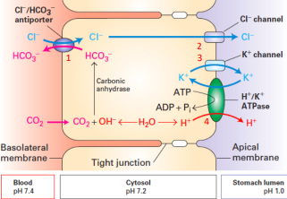

# 第40章 動物的身體 (The Animal Body)

## 40.1 動物的形態與功能在各個組織層級都是相關的 (Animal form and function are correlated at all levels of organization)

### 動物大小和形狀的演化 (Evolution of Animal Size and Shape)

- **物理定律限制演化**：物理定律（physical laws）制約了動物形態的演化範圍
  - 力學、擴散、運動和熱交換的物理定律限制了動物可能的形態
  - 例如：水的密度約為空氣的1000倍，黏性也更大 → 游泳動物的體表凸起會造成更大的阻力

- **流線型趨同演化**：快速游泳的脊椎動物都演化出紡錘型（fusiform）身體
  - 鮪魚（tuna）、企鵝（penguin）、海豹（seal）都有兩端漸細的流線型身體
  - 這是趨同演化（convergent evolution）的例子 → 面對相同環境挑戰時演化出相似的適應

- **體型大小的限制**：
  - 隨著體型增大，需要更粗壯的骨骼來維持支撐
  - 運動所需的肌肉佔身體總質量的比例也會增加
  - 某些體型下，移動能力會受到限制

### 與環境的交換 (Exchange with the Environment)

- **表面積與體積比**：
  - 單細胞生物（如變形蟲 amoeba）有足夠的膜表面積進行物質交換
  - 多細胞動物的細胞數增加會降低外表面積與總體積的比率
  - 鯨魚的外表面積與體積比是水蚤的數十萬分之一

- **簡單體制的直接交換**：
  - 水螅（hydra）：囊狀身體，體壁只有兩層細胞厚
  - 胃血管腔（gastrovascular cavity）向外界開放 → 內外層細胞都能直接與池水接觸
  - 扁形動物（如絛蟲 tapeworm）：扁平形狀使大部分細胞直接接觸環境

- **複雜體制的特化交換表面**：
  - 大多數動物的交換表面位於體內，保護脆弱組織並維持流線型身體輪廓
  - 分支或摺疊大大增加表面積：
    - 肺部：海綿狀結構提供廣大的濕潤表面進行氣體交換
    - 小腸：指狀突起（絨毛 villi）擴大營養吸收表面積
    - 腎臟：血液在球狀結構中的長而狹窄血管表面過濾

- **內部體液系統**：
  - 組織間液（interstitial fluid）：填充細胞間的空間
  - 循環液體（如血液）：在組織間液與循環液之間交換，使全身細胞都能獲得營養並排除廢物

### 身體計畫的階層組織 (Hierarchical Organization of Body Plans)

- **組織層級**：
  - 細胞（cells）→ 組織（tissues）→ 器官（organs）→ 器官系統（organ systems）
  - 組織：外觀相似且功能共同的細胞群
  - 器官：不同類型組織組成的功能單位
  - 器官系統：共同工作的器官群，提供額外的組織和協調層級

- **哺乳動物的11個器官系統**：
  1. **消化系統**（Digestive system）：食物處理（攝取、消化、吸收、排除）
  2. **循環系統**（Circulatory system）：物質的內部分配
  3. **呼吸系統**（Respiratory system）：氣體交換（吸收氧氣、排出二氧化碳）
  4. **免疫和淋巴系統**（Immune and lymphatic system）：身體防禦
  5. **排泄系統**（Excretory system）：代謝廢物處理、血液滲透平衡調節
  6. **內分泌系統**（Endocrine system）：協調身體活動（如消化和代謝）
  7. **生殖系統**（Reproductive system）：配子產生、受精、胚胎發育支持
  8. **神經系統**（Nervous system）：協調身體活動、刺激偵測和反應
  9. **外皮系統**（Integumentary system）：保護、體溫調節
  10. **骨骼系統**（Skeletal system）：身體支撐、內部器官保護、運動
  11. **肌肉系統**（Muscular system）：移動和其他運動

### 四種主要動物組織類型 (Four Main Types of Animal Tissues)

#### 1. 上皮組織 (Epithelial Tissue)

- **特徵**：
  - 細胞緊密排列成片狀，常有緊密連接（tight junctions）
  - 作為屏障，防止機械傷害、病原體和液體流失
  - 形成與環境的活躍介面（如鼻道上皮對嗅覺至關重要）

- **極性**（Polarity）：
  - 頂端表面（apical surface）：面向腔道或器官外部
  - 基底表面（basal surface）：與頂端表面相對

- **主要類型**：
  - **單層鱗狀上皮**（Simple squamous epithelium）：
    - 單層扁平細胞，功能為擴散物質交換
    - 位於血管和肺泡內襯
  
  - **單層柱狀上皮**（Simple columnar epithelium）：
    - 磚形細胞，專門用於分泌或主動吸收
    - 位於腸道內襯，分泌消化液並吸收營養
  
  - **立方上皮**（Cuboidal epithelium）：
    - 骰子狀細胞，專門用於分泌
    - 組成腎小管和許多腺體（如甲狀腺、唾腺）的上皮
  
  - **複層鱗狀上皮**（Stratified squamous epithelium）：
    - 多層結構，快速再生
    - 位於易受磨損的表面（如外皮、口腔、肛門、陰道內襯）
  
  - **偽複層柱狀上皮**（Pseudostratified columnar epithelium）：
    - 單層但細胞高度和核位置不同
    - 有纖毛的細胞形成呼吸道的黏膜

#### 2. 結締組織 (Connective Tissue)

- **特徵**：
  - 細胞稀疏分散在細胞外基質（extracellular matrix）中
  - 基質由纖維網絡嵌入液體、膠狀或固體基礎中組成
  - 含有纖維母細胞（fibroblasts）分泌纖維蛋白，巨噬細胞（macrophages）吞噬外來顆粒

- **三種纖維類型**：
  - **膠原纖維**（Collagenous fibers）：提供強度和柔韌性
  - **網狀纖維**（Reticular fibers）：將結締組織連接到鄰近組織
  - **彈性纖維**（Elastic fibers）：使組織具有彈性

- **主要類型**：
  - **疏鬆結締組織**（Loose connective tissue）：
    - 脊椎動物體內最廣泛的結締組織
    - 將上皮與下層組織結合，固定器官位置
  
  - **纖維結締組織**（Fibrous connective tissue）：
    - 富含膠原纖維
    - 存在於肌腱（連接肌肉與骨骼）和韌帶（連接關節處的骨骼）
  
  - **脂肪組織**（Adipose tissue）：
    - 特化的疏鬆結締組織，儲存脂肪
    - 墊襯和隔離身體，儲存能量
  
  - **血液**（Blood）：
    - 液體細胞外基質稱為血漿（plasma）
    - 含紅血球（攜帶氧氣）、白血球（防禦功能）、血小板（協助凝血）
  
  - **軟骨**（Cartilage）：
    - 膠原纖維嵌入軟骨素硫酸鹽（chondroitin sulfate）中
    - 軟骨細胞（chondrocytes）分泌膠原和軟骨素硫酸鹽
  
  - **骨骼**（Bone）：
    - 礦化的結締組織
    - 骨母細胞（osteoblasts）沉積膠原基質
    - 鈣、鎂、磷酸鹽離子在基質中形成硬礦物質
    - 顯微結構由骨單位（osteons）組成

#### 3. 肌肉組織 (Muscle Tissue)

- **共同特徵**：
  - 所有肌肉細胞含有肌動蛋白（actin）和肌凝蛋白（myosin）絲
  - 使肌肉能夠收縮

- **三種類型**：
  - **骨骼肌**（Skeletal muscle）：
    - 又稱橫紋肌（striated muscle）
    - 負責隨意運動
    - 由肌纖維束組成，每個肌纖維有多個細胞核
    - 肌小節（sarcomeres）的排列使細胞呈條紋狀
  
  - **平滑肌**（Smooth muscle）：
    - 無橫紋，紡錘形細胞
    - 存在於消化道、膀胱、動脈等內部器官壁
    - 負責不隨意運動（如胃部攪動、動脈收縮）
  
  - **心肌**（Cardiac muscle）：
    - 形成心臟的收縮壁
    - 像骨骼肌一樣有橫紋
    - 分支纖維通過閏盤（intercalated disks）相互連接
    - 閏盤傳遞細胞間信號，幫助同步心臟收縮

#### 4. 神經組織 (Nervous Tissue)

- **功能**：接收、處理和傳遞信息

- **組成**：
  - **神經元**（Neurons）：
    - 神經系統的基本單位
    - 通過細胞體和樹突（dendrites）接收神經衝動
    - 通過軸突（axons）傳遞衝動到其他神經元、肌肉或腺體
    - 軸突常捆綁成神經（nerves）
  
  - **神經膠質細胞**（Glial cells）：
    - 支持細胞，幫助滋養、絕緣和補充神經元
    - 某些情況下調節神經元功能

### 協調與控制 (Coordination and Control)

- **兩大協調系統**：
  
  1. **內分泌系統**（Endocrine system）：
     - 信號分子（激素 hormones）釋放到血液中
     - 激素通過血流傳播到全身
     - 只有具有特定受體的細胞才會響應
     - 傳遞較慢（需要幾秒鐘）但效果持久（幾分鐘到幾小時）
  
  2. **神經系統**（Nervous system）：
     - 神經衝動（nerve impulses）沿著專用路徑傳遞
     - 傳遞極快（僅需幾分之一秒）
     - 效果短暫（持續幾分之一秒）
     - 通過信號路徑傳遞信息（如不同音調激活耳朵中連接到大腦不同位置的神經元）

- **系統間的協調**：
  - 兩系統常密切協調工作
  - 內分泌系統適合協調影響全身的漸進變化（如生長、發育、生殖、代謝、消化）
  - 神經系統適合指導對環境的即時快速反應（如反射和快速運動）

## 40.2 反饋控制在許多動物中維持內部環境 (Feedback control maintains the internal environment in many animals)

### 調節與順應 (Regulating and Conforming)

- **調節者**（Regulator）：
  - 使用內部機制控制內部變化，即使面對外部波動
  - 例如：河獺（river otter）的體溫基本上不受周圍水溫影響

- **順應者**（Conformer）：
  - 允許內部條件隨外部環境變化而改變
  - 例如：大口黑鱸（largemouth bass）的體溫隨水溫變化

- **混合策略**：
  - 動物可能對某些內部條件順應環境，但調節其他條件
  - 例如：鱸魚順應水溫，但調節血液和組織間液中的溶質濃度

### 恆定性 (Homeostasis)

- **定義**：維持內部平衡，即使外部環境顯著變化時也保持相對恆定的內部環境

- **人體恆定性的例子**：
  - 體溫：約37°C (98.6°F)
  - 血液pH：7.4 ± 0.1
  - 血糖濃度：70-110 mg/100 mL血液

### 恆定性的機制 (Mechanisms of Homeostasis)

- **控制系統組成**：
  - **設定點**（Set point）：變量的目標值（如室溫20°C）
  - **感測器**（Sensor）：監測變量的裝置
  - **控制中心**（Control center）：處理信息並觸發反應
  - **反應**（Response）：幫助變量回到設定點的生理活動

- **負反饋**（Negative feedback）：
  - 反應減少觸發它的刺激
  - 在恆定性中起主要作用
  - 例如：運動產生熱量 → 體溫升高 → 神經系統觸發出汗 → 汗液蒸發冷卻身體

- **正反饋**（Positive feedback）：
  - 放大刺激的控制機制
  - 不在恆定性中起主要作用，但幫助推動過程完成
  - 例如：分娩時子宮收縮 → 壓力增加 → 更強烈的收縮 → 嬰兒出生

### 恆定性的改變 (Alterations in Homeostasis)

- **生命階段的調節變化**：
  - 青春期的激素平衡劇烈轉變
  - 女性月經週期的激素水平變化

- **晝夜節律**（Circadian rhythm）：
  - 約每24小時發生的生理變化
  - 人體溫度每24小時週期性升降超過0.6°C (1°F)
  - 由生物時鐘維持，即使在最小化活動、室溫和光照變化時仍存在
  - 2017年諾貝爾生理學或醫學獎頒給研究晝夜節律分子機制的科學家

- **適應性改變**（Acclimatization）：
  - 動物對外部環境變化的生理調整
  - 例如：麋鹿從海平面移到高山時的適應
    - 低氧濃度刺激更快更深的呼吸
    - 更多CO₂通過呼氣流失，血液pH升高
    - 幾天後腎功能改變，排出更鹼性的尿液，使血液pH恢復正常

## 40.3 體溫調節的恆定過程涉及形態、功能和行為 (Homeostatic processes for thermoregulation involve form, function, and behavior)

### 內溫性與外溫性 (Endothermy and Ectothermy)

- **內溫動物**（Endothermic animals）：
  - 主要通過代謝產生的熱量保暖
  - 包括人類、其他哺乳動物、鳥類
  - 某些魚類、昆蟲和少數非鳥類爬行動物也主要是內溫性的
  - 能在環境溫度大幅波動時維持穩定體溫

- **外溫動物**（Ectothermic animals）：
  - 主要從外部來源獲得熱量
  - 包括兩棲動物、許多非鳥類爬行動物和魚類、大多數無脊椎動物
  - 通過行為調整體溫（如尋找陰涼處或曬太陽）
  - 通常消耗比同等大小內溫動物少得多的食物

### 體溫變化 (Variation in Body Temperature)

- **變溫動物**（Poikilotherm）：體溫隨環境變化
- **恆溫動物**（Homeotherm）：體溫相對恆定

- 注意：外溫性≠變溫性，內溫性≠恆溫性
  - 某些外溫海洋魚類和無脊椎動物棲息在溫度穩定的水域，體溫變化比哺乳動物還小
  - 某些內溫動物體溫變化很大（如蝙蝠冬眠時體溫從40°C降到接近0°C）

### 平衡熱量得失 (Balancing Heat Loss and Gain)

- **四種熱交換過程**：
  
  1. **輻射**（Radiation）：
     - 所有高於絕對零度的物體發射電磁波
     - 蜥蜴從太陽吸收輻射熱，並向周圍空氣輻射少量能量
  
  2. **蒸發**（Evaporation）：
     - 從液體表面移除熱量，部分分子變成氣體
     - 從暴露在環境中的濕潤表面蒸發水分有強烈的冷卻效果
  
  3. **對流**（Convection）：
     - 空氣或液體流過表面時的熱傳遞
     - 如微風導致蜥蜴乾燥皮膚的熱量流失
  
  4. **傳導**（Conduction）：
     - 接觸物體分子間的熱傳遞
     - 如蜥蜴坐在熱岩石上

### 體溫調節的適應 (Adaptations for Thermoregulation)

#### 1. 隔熱 (Insulation)

- **表面隔熱**：毛髮和羽毛
- **皮下隔熱**：脂肪組織形成的脂肪層
- **防水物質**：分泌油脂保護羽毛或毛皮的隔熱能力

- **調整隔熱層**：
  - 陸地哺乳動物和鳥類通過豎起毛髮或羽毛來應對寒冷
  - 人類缺乏羽毛或毛皮，主要依靠脂肪隔熱，但仍有「雞皮疙瘩」

- **海洋哺乳動物的鯨脂**（Blubber）：
  - 皮下極厚的隔熱脂肪層
  - 使海洋哺乳動物能在36-38°C (97-100°F)的體溫下生存
  - 不需要比同等大小陸地哺乳動物更多的食物能量

#### 2. 循環適應 (Circulatory Adaptations)

- **血管舒張**（Vasodilation）：
  - 表層血管擴張，增加皮膚血流
  - 增加通過輻射、傳導和對流的熱傳遞

- **血管收縮**（Vasoconstriction）：
  - 減少表層血管直徑
  - 減少血流和熱傳遞

- **逆流熱交換器**（Countercurrent heat exchanger）：
  - 動脈和靜脈相鄰排列，血液反向流動
  - 熱量沿整個交換器長度傳遞，最大化熱交換率
  - 將熱量保留在身體核心，減少從四肢的熱量流失
  - 例子：海豚鰭狀肢中每條動脈被幾條靜脈環繞

#### 3. 蒸發冷卻 (Cooling by Evaporative Heat Loss)

- **出汗**：某些哺乳動物（包括馬和人類）有汗腺
- **喘氣**（Panting）：許多其他哺乳動物和鳥類的重要冷卻方式
- **特殊適應**：
  - 某些鳥類口腔底部有富含血管的囊袋，顫動囊袋增加蒸發
  - 鴿子在60°C (140°F)的氣溫下仍能保持40°C (104°F)的體溫

#### 4. 行為反應 (Behavioral Responses)

- **外溫動物的行為**：
  - 寒冷時尋找溫暖地方，朝向熱源
  - 炎熱時洗澡、移到涼爽區域或轉向
  - 蜻蜓的「方尖碑」姿勢：最小化暴露在陽光下的身體表面

- **社會行為**：
  - 帝企鵝擠在一起減少風和寒冷的暴露
  - 蜜蜂在寒冷天氣中擠在一起保溫，個體在外緣和中心之間移動
  - 炎熱天氣中，蜜蜂運水到蜂巢並扇動翅膀促進蒸發和對流

#### 5. 調整代謝產熱 (Adjusting Metabolic Heat Production)

- **產熱作用**（Thermogenesis）：
  - 通過肌肉活動（如移動或顫抖）增加產熱
  - 顫抖幫助山雀在-40°C (-40°F)的環境溫度下保持40°C (104°F)的體溫

- **非顫抖性產熱**（Nonshivering thermogenesis）：
  - 內分泌信號使線粒體增加代謝活動，產生熱量而非ATP
  - 棕色脂肪（brown fat）：
    - 位於頸部和肩膀之間，專門用於快速產熱
    - 含有額外的線粒體，使其呈棕色
    - 人類嬰兒中約佔總體重的5%
    - 最近在成年人中也檢測到

- **爬行動物的內溫性**：
  - 緬甸蟒（Burmese python）孵蛋時體溫比周圍空氣高約6°C (11°F)
  - 通過肌肉收縮（一種顫抖形式）產生熱量

### 體溫調節的適應性改變 (Acclimatization in Thermoregulation)

- **鳥類和哺乳動物**：
  - 季節性溫度變化的適應包括調整隔熱層
  - 冬天長出更厚的毛皮，夏天脫落

- **外溫動物的細胞水平調整**：
  - 產生具有相同功能但最適溫度不同的酶變體
  - 改變膜中飽和和不飽和脂質的比例
  - 某些外溫動物產生「抗凍」蛋白防止細胞內結冰

### 生理恆溫器和發燒 (Physiological Thermostats and Fever)

- **下視丘**（Hypothalamus）：
  - 負責體溫調節的感測器集中於此
  - 一組神經細胞作為恆溫器
  - 體溫高於正常範圍時促進冷卻（血管舒張、出汗、喘氣）
  - 體溫低於正常範圍時抑制熱量流失並激活產熱機制

- **發燒**（Fever）：
  - 細菌和病毒感染時體溫升高
  - 反映生物恆溫器正常範圍的提高
  - 行為性發燒：某些外溫動物感染時尋求更溫暖的環境
  - 沙漠鬣蜥感染某些細菌時體溫升高2-4°C (4-7°F)

## 40.4 能量需求與動物大小、活動和環境有關 (Energy requirements are related to animal size, activity, and environment)

### 能量分配和使用 (Energy Allocation and Use)

- **能量獲取方式**：
  - **自養生物**（Autotrophs）：利用光能建造富含能量的有機分子
  - **異養生物**（Heterotrophs）：從食物中獲得化學能

- **能量使用**：
  - 食物通過酶水解消化
  - 細胞呼吸和發酵產生的ATP為細胞工作提供動力
  - 用於生物合成（生長、修復、儲存物質、配子產生）
  - ATP的產生和使用產生熱量，最終釋放到環境中

### 量化能量使用 (Quantifying Energy Use)

- **代謝率**（Metabolic rate）：動物在給定時間間隔內使用的所有能量總和
  - 單位：焦耳（J）或卡路里（cal）
  - 千卡（kcal）= 1,000卡路里 = 4,184焦耳

- **測量方法**：
  1. **量熱計**（Calorimeter）：測量動物的熱量流失率
  2. **氧氣消耗或二氧化碳產生**：基於細胞呼吸的測量
  3. **食物消耗率**：記錄食物能量含量和廢物中的化學能損失

### 最低代謝率和體溫調節 (Minimum Metabolic Rate and Thermoregulation)

- **基礎代謝率**（Basal Metabolic Rate, BMR）：
  - 非生長內溫動物在休息、空腹、無壓力狀態下的最低代謝率
  - 在「舒適」溫度範圍內測量
  - 人類BMR：成年男性1,600-1,800 kcal/天，成年女性1,300-1,500 kcal/天

- **標準代謝率**（Standard Metabolic Rate, SMR）：
  - 外溫動物在特定溫度下休息時的代謝率
  - 美洲短吻鱷在20°C時的SMR僅約60 kcal/天（不到同等大小人類的1/20）

### 影響代謝率的因素 (Influences on Metabolic Rate)

#### 大小與代謝率 (Size and Metabolic Rate)

- **異速生長關係**（Allometric relationship）：
  - 代謝率 ∝ 體重$^{3/4}$ (m$^{3/4}$)
  - 這種關係適用於從細菌到藍鯨的各種生物

- **每克組織的能量消耗**：
  - 與體型大小成反比
  - 老鼠每克組織需要的卡路里約為大象的20倍
  - 較小動物需要更高的氧氣輸送率、呼吸率、血容量和心率

- **體型的演化權衡**：
  - 體型減小：每克組織的能量成本增加
  - 體型增大：每克組織的能量成本降低，但需要更大比例的身體組織用於交換、支撐和運動

#### 活動與代謝率 (Activity and Metabolic Rate)

- **活動對代謝率的影響**：
  - 即使是安靜閱讀或昆蟲輕微振翅也會消耗超過BMR或SMR的能量
  - 最大代謝率出現在高峰活動期間（如舉重、短跑、高速游泳）
  - 動物能維持的最大代謝率與活動持續時間成反比

- **日常能量消耗**：
  - 大多數陸地動物的平均日能量消耗是BMR（內溫動物）或SMR（外溫動物）的2-4倍
  - 發達國家的人類平均日代謝率約為BMR的1.5倍（表明相對久坐的生活方式）

### 蟄伏與能量保存 (Torpor and Energy Conservation)

- **蟄伏**（Torpor）：活動和代謝降低的生理狀態

- **日蟄伏**（Daily torpor）：
  - 許多鳥類和小型哺乳動物表現出與攝食模式相適應的日蟄伏
  - 蝙蝠夜間進食，白天進入蟄伏
  - 山雀和蜂鳥白天進食，寒冷夜晚進入蟄伏
  - 山雀夜間體溫下降多達10°C (18°F)
  - 蜂鳥核心體溫可下降25°C (45°F)或更多

- **冬眠**（Hibernation）：
  - 長期蟄伏，適應冬季寒冷和食物短缺
  - 體溫下降（某些哺乳動物冷卻至-2°C）
  - 北極地松鼠可進入體溫低於0°C的過冷狀態
  - 定期覺醒（約每兩週），短暫活動後恢復冬眠
  - 代謝率可比維持正常體溫低20倍
  - 晝夜節律時鐘在冬眠期間可能停止運作

- **夏眠**（Estivation）：
  - 夏季蟄伏，使動物能在高溫和缺水的長時間內生存

### 生物能量學總結

- **能量預算的組成**：
  - 基礎（標準）代謝
  - 活動
  - 體溫調節
  - 生長
  - 繁殖

- **不同動物的能量分配差異**：
  - 內溫動物（如企鵝、鹿鼠）在體溫調節上花費大量能量
  - 外溫動物（如球蟒）能量需求較低，可將更多能量用於生長
  - 體型、環境和生活方式都影響能量預算的分配

# 第41章 動物的化學信號（Chemical Signals in Animals）

## 41.1 激素和其他信號分子與目標受體結合，觸發特定反應路徑（Hormones and other signaling molecules bind to target receptors, triggering specific response pathways）

### 細胞間資訊流動（Intercellular Information Flow）

#### 內分泌信號傳導（Endocrine Signaling）
• **激素（Hormone）** → 由內分泌細胞分泌到細胞外液中，透過血流到達目標細胞
• **功能**：
  - 維持體內平衡（homeostasis）→ 調節血壓、血量、能量代謝、體液溶質濃度
  - 調節對環境刺激的反應
  - 控制生長發育
  - 觸發性成熟和繁殖相關的生理行為變化

#### 旁分泌和自分泌信號傳導（Paracrine and Autocrine Signaling）
• **局部調節因子（Local regulators）** → 短距離作用，僅透過擴散到達目標細胞
• **旁分泌信號傳導（Paracrine signaling）** → 目標細胞位於分泌細胞附近
• **自分泌信號傳導（Autocrine signaling）** → 分泌細胞本身就是目標細胞

**重要的局部調節因子：**
- **前列腺素（Prostaglandins）** → 促進發炎反應和疼痛感，阿司匹林和布洛芬可阻斷其合成
- **細胞激素（Cytokines）** → 免疫細胞間溝通
- **生長因子（Growth factors）** → 促進細胞生長、分裂、發育
- **一氧化氮（Nitric oxide, NO）** → 氣體調節因子，促進血管舒張

#### 突觸和神經內分泌信號傳導（Synaptic and Neuroendocrine Signaling）
• **突觸信號傳導（Synaptic signaling）** → 神經傳導物質（neurotransmitters）在極短距離內擴散
• **神經內分泌信號傳導（Neuroendocrine signaling）** → 神經分泌細胞釋放神經激素（neurohormones）到血流中

#### 費洛蒙信號傳導（Signaling by Pheromones）
• **費洛蒙（Pheromones）** → 釋放到外部環境中，同種動物間溝通
• **功能** → 標記領域、警告掠食者、吸引配偶
• **例子** → 多音天蠶蛾（polyphemus moth）雌性可吸引4.5公里外的雄性

### 激素的化學分類（Chemical Classes of Hormones）

#### 三大主要類別：
1. **多肽激素（Polypeptides）** → 如胰島素（insulin）
2. **類固醇激素（Steroids）** → 如皮質醇（cortisol），源自膽固醇
3. **胺類激素（Amines）** → 如腎上腺素（epinephrine）和甲狀腺素（thyroxine），源自酪胺酸或色胺酸

#### 溶解性分類：
• **水溶性（親水性）** → 多肽激素和大部分胺類激素
• **脂溶性（疏水性）** → 類固醇激素和甲狀腺素

### 細胞激素反應路徑（Cellular Hormone Response Pathways）

#### 水溶性激素反應路徑（Response Pathway for Water-Soluble Hormones）
• **受體位置** → 細胞表面受體蛋白
• **信號轉導（Signal transduction）** → 細胞外化學信號轉為特定細胞內反應的事件鏈

**腎上腺素信號轉導例子：**
1. 腎上腺素與G蛋白偶合受體結合
2. 激活腺苷酸環化酶（adenylyl cyclase）
3. 產生環狀AMP（cAMP）作為第二信使
4. 激活蛋白激酶A（protein kinase A）
5. 促進肝醣分解為葡萄糖 + 抑制肝醣合成

#### 脂溶性激素反應路徑（Response Pathway for Lipid-Soluble Hormones）
• **受體位置** → 細胞質或細胞核內
• **機制** → 激素-受體複合物直接與DNA結合，改變基因轉錄

**類固醇激素受體例子：**
- **雌二醇（Estradiol）** → 與肝細胞細胞質受體結合 → 激活卵黃原蛋白（vitellogenin）基因轉錄

#### 單一激素的多重反應（Multiple Responses to a Single Hormone）
• 同一激素可在不同目標細胞引起不同反應
• 取決於受體類型或產生反應的分子差異
• **例子** → 腎上腺素的「戰鬥或逃跑」反應

### 內分泌組織和器官（Endocrine Tissues and Organs）
• **內分泌腺（Endocrine glands）** → 無導管腺體，直接分泌激素到周圍液體
• **外分泌腺（Exocrine glands）** → 有導管，分泌物質到體表或體腔
• **混合腺體** → 胰腺同時具有內分泌和外分泌功能

## 41.2 回饋調節和與神經系統的協調在激素路徑中很常見（Feedback regulation and coordination with the nervous system are common in hormone pathways）

### 簡單內分泌路徑（Simple Endocrine Pathways）
• **機制** → 內分泌細胞直接對內部或環境刺激反應，分泌特定激素
• **例子** → 十二指腸S細胞檢測低pH → 分泌胰泌素（secretin） → 胰腺釋放碳酸氫鹽 → 中和胃酸

### 簡單神經內分泌路徑（Simple Neuroendocrine Pathways）
• **機制** → 感覺神經元接收刺激 → 刺激神經分泌細胞 → 釋放神經激素
• **例子** → 哺乳期催產素（oxytocin）分泌：
  1. 嬰兒吸吮刺激乳頭感覺神經元
  2. 神經衝動傳至下視丘
  3. 後腦垂體釋放催產素
  4. 乳腺細胞收縮，排出乳汁

### 回饋調節（Feedback Regulation）

#### 負回饋（Negative Feedback）
• **功能** → 反應減少初始刺激，防止過度路徑活動
• **例子** → 胰泌素路徑中，碳酸氫鹽升高pH消除刺激

#### 正回饋（Positive Feedback）
• **功能** → 反應強化刺激，推動過程完成
• **例子** → 催產素路徑中，釋放乳汁導致更多吸吮刺激

### 內分泌和神經系統的協調（Coordination of the Endocrine and Nervous Systems）

#### 無脊椎動物（Invertebrates）
**昆蟲蛻皮和變態控制：**
• **蛻皮刺激激素（PTTH）** → 腦部神經分泌細胞產生
• **蛻皮激素（Ecdysteroid）** → PTTH刺激前胸腺分泌，觸發蛻皮
• **保幼激素（Juvenile hormone, JH）** → 心側體分泌
  - 高濃度JH → 維持幼蟲狀態
  - 低濃度JH → 誘導變態形成蛹

#### 脊椎動物（Vertebrates）
**下視丘-腦垂體系統：**

##### 後腦垂體激素（Posterior Pituitary Hormones）
• **抗利尿激素（ADH/vasopressin）** → 調節腎功能，增加水分重吸收
• **催產素（Oxytocin）** → 控制子宮收縮、乳汁分泌、社會行為

##### 前腦垂體激素（Anterior Pituitary Hormones）
• **促性腺激素** → 濾泡刺激激素（FSH）、黃體生成激素（LH）
• **促甲狀腺激素（TSH）** → 刺激甲狀腺
• **促腎上腺皮質激素（ACTH）** → 刺激腎上腺皮質
• **生長激素（GH）** → 刺激生長和代謝
• **泌乳素（Prolactin）** → 刺激乳腺發育和乳汁合成

#### 激素級聯路徑（Hormone Cascade）
• **定義** → 多個內分泌器官和信號串聯作用
• **促性激素（Tropic hormones）** → 將下視丘信號重新導向其他內分泌腺

**甲狀腺調節例子：**
1. 下視丘分泌促甲狀腺釋放激素（TRH）
2. 前腦垂體分泌TSH
3. 甲狀腺分泌甲狀腺激素（T3, T4）
4. 甲狀腺激素負回饋抑制TRH和TSH

### 甲狀腺功能異常（Disorders of Thyroid Function）
• **甲狀腺腫（Goiter）** → 碘缺乏導致TSH持續分泌，甲狀腺腫大
• **甲狀腺激素成分** → 三碘甲狀腺素（T3）含3個碘原子，甲狀腺素（T4）含4個碘原子

### 生長激素調節（Hormonal Regulation of Growth）
• **生長激素（GH）** → 同時具有促性和非促性效應
• **胰島素樣生長因子（IGFs）** → 肝臟回應GH釋放，直接刺激骨骼和軟骨生長

#### 生長激素異常：
• **巨人症（Gigantism）** → 兒童期GH過度分泌
• **肢端肥大症（Acromegaly）** → 成人期GH過度分泌，面部、手足過度生長
• **垂體侏儒症（Pituitary dwarfism）** → 兒童期GH分泌不足

## 41.3 內分泌腺對多樣刺激作出反應，調節體內平衡、發育和行為（Endocrine glands respond to diverse stimuli in regulating homeostasis, development, and behavior）

### 副甲狀腺激素和維生素D：血鈣控制（Parathyroid Hormone and Vitamin D: Control of Blood Calcium）

#### 血鈣平衡的重要性
• **正常血鈣濃度** → 約10 mg/100 mL
• **低血鈣後果** → 骨骼肌痙攣性收縮，可能致命
• **高血鈣後果** → 磷酸鈣沉澱，廣泛器官損傷

#### 副甲狀腺激素（PTH）作用機制
**當血鈣下降時：**
• **骨骼** → PTH促使礦化基質分解，釋放Ca²⁺
• **腎臟** → PTH直接刺激腎小管重吸收Ca²⁺
• **腸道** → PTH間接促進維生素D活化 → 增加腸道Ca²⁺吸收

#### 降鈣素（Calcitonin）
• **來源** → 甲狀腺
• **功能** → 抑制骨骼分解，促進腎臟排泄Ca²⁺
• **重要性** → 對魚類、齧齒動物重要，人類主要在兒童骨骼生長期需要

### 腎上腺激素：應對壓力（Adrenal Hormones: Response to Stress）

#### 腎上腺髓質（Adrenal Medulla）
**「戰鬥或逃跑」反應：**
• **腎上腺素（Epinephrine）** 和 **去甲腎上腺素（Norepinephrine）**
• **兒茶酚胺（Catecholamines）** → 源自酪胺酸的胺類激素

**生理效應：**
- 增加肝醣分解，釋放葡萄糖和脂肪酸
- 提高心率和每搏輸出量
- 擴張支氣管
- 重新分配血流：減少皮膚、消化器官、腎臟血流；增加心臟、大腦、骨骼肌血流

#### 腎上腺素的多重效應機制
• **肝細胞** → β型受體 → 激活蛋白激酶A → 促進肝醣分解
• **骨骼肌血管平滑肌** → β型受體 → 相同激酶 → 血管舒張
• **腸道血管平滑肌** → α型受體 → 不同信號路徑 → 血管收縮

#### 腎上腺皮質（Adrenal Cortex）
**糖皮質激素（Glucocorticoids）：**
• **皮質醇（Cortisol）** → 促進非醣類物質合成葡萄糖
• **機制** → 分解肌肉蛋白為胺基酸 → 肝腎轉化為葡萄糖
• **免疫抑制** → 治療發炎性疾病，但長期使用有代謝副作用

**礦物皮質激素（Mineralocorticoids）：**
• **醛固酮（Aldosterone）** → 調節鹽分和水分平衡
• **機制** → 促進腎臟重吸收Na⁺，排泄K⁺

### 性激素（Sex Hormones）

#### 三大類型
• **雄激素（Androgens）** → 主要為睪固酮（testosterone）
• **雌激素（Estrogens）** → 主要為雌二醇（estradiol）
• **黃體酮（Progesterone）**

#### 睪固酮功能
• **胚胎期** → 促進男性生殖結構發育
• **青春期** → 發展男性第二性徵（聲帶變厚、肌肉骨骼增長、體毛生長）
• **合成代謝效應** → 增加肌肉量（運動員濫用風險）

#### 雌激素和黃體酮
• **雌激素** → 維持女性生殖系統，發展女性第二性徵
• **黃體酮** → 準備和維持子宮組織以支持胚胎發育

#### 內分泌干擾物（Endocrine Disruptors）
• **己烯雌酚（DES）** → 1938-1971年使用的合成雌激素，導致胎兒生殖系統異常
• **雙酚A（Bisphenol A）** → 塑膠製造化學物質，可能干擾正常繁殖發育

### 激素和生物節律（Hormones and Biological Rhythms）

#### 褪黑激素（Melatonin）
• **來源** → 松果腺（pineal gland）
• **功能** → 調節與光照和季節相關的生物節律
• **分泌模式** → 夜間分泌，分泌量取決於夜晚長度
• **調節** → 下視丘視交叉上核（SCN）控制，接收視網膜光敏神經元輸入

### 激素功能的演化（Evolution of Hormone Function）

#### 甲狀腺激素演化
• **一般功能** → 調節代謝
• **特化功能** → 蛙類中甲狀腺素（T4）刺激蝌蚪尾巴重吸收（變態）

#### 泌乳素功能多樣性
• **哺乳動物** → 刺激乳腺生長和乳汁合成
• **鳥類** → 調節脂肪代謝和繁殖
• **兩棲動物** → 延遲變態
• **淡水魚** → 調節鹽分和水分平衡

#### 促黑激素（MSH）特化
• **低等脊椎動物** → 控制皮膚色素分布
• **哺乳動物** → 調節飢餓、代謝和惡病質（cachexia）
• **醫學意義** → MSH腦受體阻斷劑可能治療癌症惡病質

# Animal Digestive System

## 主要的攝食機制（Main feeding mechanisms）

### 濾食（Filter feeding）

### 底質攝食（Substrate feeding）

### 體液攝食（Fluid feeding）

### 大塊攝食（Bulk feeding）

## 食物處理的主要階段（The main stages of food processing）

1. **攝食（Ingestion）**  
   - 機械性消化（Mechanical digestion）  
2. **消化（Digestion）**  
   - 化學性消化（Chemical digestion／enzymatic hydrolysis）  
   - 將食物分解成足以吸收的小分子過程

3. **吸收（Absorption）**  
   - 營養分子進入體細胞

4. **排出（Elimination）**  
   - 未消化物質通過消化系統排出

## 口腔、咽和食道（Oral cavity, pharynx and esophagus）

- 食團（bolus）  
- 舌（tongue）  
- 咽（pharynx）  
- 聲門（glottis）  
- 氣管（trachea）  
- 會厭（epiglottis）  
- 食道括約肌（esophageal sphincter）  
- 食道（esophagus）  

### 吞嚥過程（Swallowing process）
1. **未吞嚥狀態**  
   - 會厭（epiglottis）向上（up）  
   - 食道括約肌（esophageal sphincter）收縮（contracted）
2. **吞嚥時**  
   - 會厭向下並閉合 
   - 食道括約肌放鬆（relaxed），允許食團進入食道
3. **吞嚥後恢復**  
   - 會厭回到向上（up）  
   - 聲門（glottis）向下並打開 
   - 食道括約肌（esophageal sphincter）重新收縮（contracted）

### 蠕動（Peristalsis）

## 胃中的消化（Digestion in the stomach）

- **胃內表面（interior surface of stomach）**  

- 胃儲存食物，並分泌**胃液（gastric juice）**
  - 將食物轉化為**酸性食糜（acid chyme）**

- **胃液（gastric juice）**成分  
  - **鹽酸（hydrochloric acid）**  
  - **酵素胃蛋白酶（pepsin）**

- **胃腺（gastric gland）結構**  
  - 上皮折皺（folds of epithelial tissue）  
  - 上皮細胞（epithelium）  
  - **黏液細胞（mucus cells）**  
  - **壁細胞（parietal cells）**：分泌氫離子與氯離子（hydrogen and chloride ions）  
  - **主細胞（chief cells）**：分泌胃蛋白酶原（pepsinogen）

- 酸化與活化過程  
  1. 主細胞分泌胃蛋白酶原（pepsinogen），壁細胞分泌鹽酸（hydrochloric acid）  
  2. 鹽酸將胃蛋白酶原轉化為胃蛋白酶（pepsin）  
  3. 胃蛋白酶進一步活化更多胃蛋白酶原
  
### Parietal cells acidify stomach lumen

## 化學性消化（Chemical digestion in the human digestive system）
### 壁細胞分泌鹽酸（HCl）過程步驟

1. **二氧化碳擴散（CO₂ diffusion）**  
   - 血液（pH 7.4）中的 CO₂ 經基底外膜自由進入壁細胞細胞質。

2. **碳酸酐酶催化（Carbonic anhydrase）**  
   - CO₂ + H₂O → H⁺ + HCO₃⁻

3. **Cl⁻/HCO₃⁻ 交換（HCO₃⁻/Cl⁻ antiport）**  
   - HCO₃⁻ 排出到血液，Cl⁻ 進入細胞。

4. **Cl⁻ 通道（Chloride channel）**  
   - Cl⁻ 經頂膜釋放到胃腔（pH 1.0）。

5. **H⁺/K⁺ ATPase（Proton pump）**  
   - ATP → ADP + Pi；H⁺ 主動泵出到胃腔，K⁺ 泵入細胞。

6. **K⁺ 通道（Potassium channel）**  
   - K⁺ 從細胞回流到胃腔，維持泵浦循環。

7. **維持電解質平衡**  
   - 緊密接合（tight junction）防止逆流；細胞質 pH 約 7.2。

---

| 步驟 | 位置                  | 主要運輸蛋白                     | 運輸物質               |
| ---- | --------------------- | -------------------------------- | ---------------------- |
| 1    | 基底外膜（血 → 細胞） | —                                | CO₂                    |
| 2    | 細胞質                | Carbonic anhydrase（碳酸酐酶）   | CO₂ + H₂O → H⁺ + HCO₃⁻ |
| 3    | 基底外膜（細胞 → 血） | Cl⁻/HCO₃⁻ antiporter（交換蛋白） | HCO₃⁻ out, Cl⁻ in      |
| 4    | 頂膜（細胞 → 胃腔）   | Chloride channel（Cl⁻ 通道）     | Cl⁻                    |
| 5    | 頂膜（細胞 → 胃腔）   | H⁺/K⁺ ATPase（質子泵）           | H⁺ out, K⁺ in          |
| 6    | 頂膜（細胞 → 胃腔）   | Potassium channel（K⁺ 通道）     | K⁺                     |

### 碳水化合物消化（Carbohydrate digestion）
- **唾液澱粉酶（salivary amylase）**（口腔、咽、食道）  
  - 將多醣（polysaccharides）分解為麥芽糖（maltose）
- **胰澱粉酶（pancreatic amylase）**（小腸／胰臟）  
  - 將多醣分解為雙糖（disaccharides）
- **雙糖酶（disaccharidases）**（小腸上皮）  
  - 將雙糖分解為單醣（monosaccharides）

### 蛋白質消化（Protein digestion）
- **胃蛋白酶（pepsin）**（胃）  
  - 將蛋白質（proteins）分解為小肽（small polypeptides）
- **胰蛋白酶與糜蛋白酶（pancreatic trypsin and chymotrypsin）**（小腸／胰臟）  
  - 將小肽分解為更小肽（smaller polypeptides）
- **胰羧肽酶（pancreatic carboxypeptidase）**（小腸／胰臟）  
  - 將小肽分解為小肽（small peptides）
- **二肽酶與氨基肽酶（dipeptidases and aminopeptidase）**（小腸上皮）  
  - 將二肽與小肽分解為胺基酸（amino acids）

### 核酸消化（Nucleic acid digestion）
- **胰核酸酶（pancreatic nucleases）**（小腸／胰臟）  
  - 將 DNA、RNA 分解為核苷酸（nucleotides）
- **核苷酸酶（nucleotidases）**（小腸上皮）  
  - 將核苷酸分解為核苷（nucleosides）
- **核苷酶與磷酸酶（nucleosidases and phosphatases）**（小腸上皮）  
  - 將核苷分解為氮鹼基（nitrogenous bases）、糖（sugars）與磷酸（phosphates）

### 脂質消化（Fat digestion）
- **胰脂肪酶（pancreatic lipase）**（小腸／胰臟）  
  - 將脂肪（三酸甘油酯，triglycerides）分解為甘油（glycerol）、脂肪酸（fatty acids）與單酸甘油酯（monoglycerides）
## 小腸的消化與吸收（Digestion and absorption in small intestine）

- 大部分消化發生在十二指腸（duodenum）  
  - 十二指腸為小腸的第一部分，胃中酸性食糜（acid chyme）與胰臟（pancreas）、肝臟（liver）、膽囊（gallbladder）及小腸自身分泌的消化液混合  
- 空腸（jejunum）和迴腸（ileum）主要負責營養素（nutrients）和水（water）的吸收  

### 小腸結構與吸收面積（Structure and surface area enhancement）

- 大型環狀皺襞（large circular folds）：增加腸道表面面積  
- 絨毛（villi）：覆蓋在皺襞上  
  - 血毛細管（blood capillaries）：將吸收的養分運送至肝門靜脈（hepatic portal vein）  
  - 乳糜管（lacteal）：吸收脂質（fats）  
- 微絨毛（microvilli／brush border）：位於柱狀上皮細胞（columnar epithelial cells）頂面（apical surface），進一步增加吸收面積  
  - 範例：柱狀上皮細胞的極性（polarity of columnar epithelial cells）  

## 專門化上皮組織（Specialized epithelial tissues）

- **微絨毛（Microvilli）**：位於吸收細胞（absorptive cells）頂端的刷狀緣（brush border），大幅增加吸收表面積  
- **緊密連接（Tight junction／occluding junction）**：位於細胞頂端，形成細胞間不透水屏障  
- **黏著接合（Adherens junction／anchoring junction）**：利用鈣黏著素（cadherin）將鄰近細胞的肌動蛋白細胞骨架（actin cytoskeleton）連結  
- **橋粒（Desmosome／anchoring junction）**：以細胞間中間纖維（intermediate filaments）提供組織機械強度  
- **間隙連結（Gap junction／communicating junction）**：由六個連接蛋白（connexin）組成connexon，允許離子與小分子通訊  
- **半橋粒（Hemidesmosome／anchoring junction）**：將細胞固定於基底膜（basal lamina）的細胞外基質（extracellular matrix）上  
- **基底膜（Basal lamina）**：由膠原蛋白（collagen）與黏多醣（glycoproteins）構成，支撐上皮結構  

### 微絨毛內部骨架（Microvillus cytoskeleton）
- **微絲（Actin filaments）**：構成核心支架  
- **交聯蛋白**  
  - **Fimbrin**、**Villin**：將微絲緊密交叉連結  
- **肌動蛋白 I（Myosin I）**：將微絲連結至纖維網（terminal web）  
- **纖維網（Terminal web）**：位於細胞頂部，支撐微絨毛根部  

### 間隙連結結構（Gap junction structure）
- **Connexon**：由六個connexin組成管狀單位，兩細胞connexon對接形成跨膜通道  
## 胰腺分泌（Pancreatic secretions）

- **胰腺（Pancreas）**  
  - 產生**胰蛋白酶（trypsin）**與**胰凝乳蛋白酶（chymotrypsin）**  
  - 分泌碳酸氫根離子（HCO₃⁻）以中和酸性食糜（acidic chyme）

- **膽汁（Bile汁）**  
  - 由**肝臟（liver）**製造，儲存在**膽囊（gallbladder）**  
  - 乳化食物中的脂質（emulsifying the lipids in food），增加胰脂肪酶(pancreatic lipase)的作用表面積，促進脂質消化與吸收
## 吸收脂質（Absorption of fat）

- 每個絨毛包含血管網（network of blood vessels）和一條乳糜管（lacteal）

1. 三酸甘油酯（triglycerides）被胰脂肪酶（pancreatic lipase）分解為脂肪酸（fatty acids）和單酸甘油酯（monoglycerides）
2. 脂肪酸和單酸甘油酯擴散進入上皮細胞（epithelial cells），並在細胞內重新合成為三酸甘油酯（triglycerides）
3. 重新合成的三酸甘油酯與磷脂（phospholipids）、膽固醇（cholesterol）及蛋白質（proteins）混合，形成乳糜微粒（chylomicrons）
4. 乳糜微粒（chylomicrons）進入乳糜管（lacteal），並由淋巴（lymph）運送至循環系統
## 大腸的吸收（Absorption in the large intestine）

- 結腸（colon）是大腸（large intestine）與小腸（small intestine）相連的部分  
- 結腸的主要功能是回收已進入消化道的水分（recover water that has entered the alimentary canal）  
- 盲腸（cecum）協助植物性物質的發酵（aids in the fermentation of plant material）  
  - 其延伸部分闌尾（appendix）在免疫（immunity）中扮演次要角色  
- 消化道的廢物（feces）經直腸（rectum）並由肛門（anus）排出  
## 演化適應與飲食的相關性（Evolutionary adaptations correlate with diet）

### 植食性（Herbivore）
- 切牙（Incisors）用於剪斷植物  
- 犬齒（Canines）退化或缺失  
- 臼齒（Premolars & Molars）用於研磨纖維  
- 消化道特徵：  
  - 小腸（Small intestine）長而迂迴  
  - 盲腸（Cecum）與結腸（Colon）發達，用於微生物發酵

### 肉食性（Carnivore）
- 犬齒（Canines）尖銳，用於撕裂肉塊  
- 切牙（Incisors）小，用於修飾食物  
- 臼齒（Premolars & Molars）帶刃，用於切割  
- 消化道特徵：  
  - 小腸（Small intestine）較短  
  - 盲腸（Cecum）與結腸（Colon）較小

### 雜食性（Omnivore）
- 切牙（Incisors）：4 顆  
- 犬齒（Canines）：2 顆  
- 前臼齒（Premolars）：4 顆  
- 臼齒（Molars）：6 顆  
- 消化道特徵：  
  - 小腸長度與盲腸、結腸發育介於植食性與肉食性之間
## 消化的荷爾蒙控制（Hormone control of digestion）

1. **胃泌素（gastrin）分泌**  
   - 食物到達胃時觸發胃泌素(gastrin)的釋放  
   - 胃泌素(gastrin)進一步刺激胃液（gastric juice）分泌

2. **膽囊收縮素（cholecystokinin, CCK）與胰抑素（secretin）釋放**  
   - 十二指腸感應食糜中的氨基酸（amino acids）和脂肪（fats）後，釋放 CCK 與 secretin  
   - CCK 刺激胰臟（pancreas）分泌消化酶（digestive enzymes）並促使膽囊（gall bladder）釋放膽汁（bile）  
   - Secretin 刺激胰臟分泌碳酸氫根（HCO₃⁻，bicarbonate）以中和酸性食糜

3. **高脂食糜的負回饋**  
   - 高脂食糜（high-fat chyme）促使更多 CCK 和 secretin 釋放  
   - CCK 與 secretin 抑制胃蠕動（peristalsis）與胃液分泌，從而減慢消化速率
## 血糖的荷爾蒙控制（Hormone control of blood glucose）

- **穩態（Homeostasis）**  
  - 血糖濃度維持在 70–110 mg glucose／100 mL blood  
- **刺激：進食後血糖上升（Stimulus: Blood glucose level rises after eating）**  
  - 胰臟（Pancreas）分泌**胰島素（insulin）**  
  - 促進葡萄糖（glucose）輸送至體細胞（body cells）並以肝醣（glycogen）形式儲存  
- **刺激：血糖下降至低於設定值（Stimulus: Blood glucose level drops below set point）**  
  - 胰臟（Pancreas）分泌**升糖素（glucagon）**  
  - 促使肝醣分解（breakdown of glycogen）並釋放葡萄糖（release of glucose）至血液  
- **拮抗激素（Antagonistic hormones）**  
  - 胰島素與升糖素相互作用，共同維持血糖平衡  
## 食慾調節荷爾蒙（Appetite regulating hormones）

- **胃促素（Ghrelin／hunger hormone）**：由胃壁（stomach wall）分泌，觸發飢餓感。
- **胰島素（Insulin）**：進餐後血糖上升刺激胰臟（pancreas）分泌，抑制(suppresses)餐後食慾(appetite)。
- **PYY（Peptide YY）**：由小腸（small intestine）餐後分泌，抑制食慾並抵消胃促素(ghrelin)作用。
- **瘦體素（Leptin／adipokine）**：由脂肪組織（adipose tissue）分泌，抑制食慾；當體脂減少時，leptin 水準下降，食慾增加。
- **訊號整合**：上述荷爾蒙作用於下丘腦飽足中樞（satiety center in hypothalamus），協調促進或抑制食慾。

# Animal Excretory System
## 氮廢物（nitrogenous wastes）

- **代謝路徑**  
  - 蛋白質（Proteins）／核酸（Nucleic acids）  
  → 胺基酸（Amino acids）  
  - 含氮鹼基（Nitrogenous bases）  
  → 胺基（Amino groups）

- **氨（NH₃，Ammonia）**  
  - 由大多數水生動物（包括大多數硬骨魚，Most aquatic animals, including most bony fishes）直接排出  
  - 毒性最強（most toxic）

- **尿素（Urea）**  
  - 由哺乳類、兩棲類、鯊魚及一些硬骨魚
  - 需要消耗 ATP

- **尿酸（Uric acid）**  
  - 由多數爬行動物（包括鳥類）、昆蟲、陸生蝸牛
  - 需要消耗 ATP  
  - 毒性較低且不溶於水（insolutable）

- ## 排泄過程（Excretory process）

1. **過濾（Filtration）**：以壓力將體液（body fluids）過濾（pressure-filtering）
2. **重吸收（Reabsorption）**：回收有價值的溶質（reclaiming valuable solutes）
3. **分泌（Secretion）**：將毒素和其他溶質(solutes)從體液加入濾液(filtrate) 
4. **排泄（Excretion）**：將濾液移出系統
## 哺乳類排泄系統（The mammalian excretory system）

- 腎臟由腎動脈（renal artery）供血，並由腎靜脈（renal vein）引流  
- 尿液經由輸尿管（ureter）從腎臟排出  
- 兩條輸尿管匯入膀胱（urinary bladder），尿道（urethra）排出尿液  
## 腎臟結構（The kidney structure）

- 腎臟（Kidneys）為脊椎動物的排泄器官，功能包括排泄（excretion（nitrogenous waste））及滲透調節（osmoregulation（salt, water and pH））
- 哺乳類腎臟分為兩個主要區域：外層腎皮質（outer renal cortex）與內層腎髓質（inner renal medulla）
- 腎盂（renal pelvis）
- 輸尿管（ureter）
## 腎元類型（Nephron types）

- 腎元（nephron／腎單元）：腎臟的功能單位（functional unit of the kidney）
- 大約 100 萬個腎元中，85% 為皮質腎元（cortical nephron），其亨氏環（loop of Henle）僅伸入腎髓質的淺部
- 近髓質腎元（juxtamedullary nephron）：具有深入腎髓質的亨氏環，用以增強尿液濃縮能力
## 腎元組織（Nephron organization）

- 腎單元（nephron）由一條單一的長小管（single long tubule）和一團毛細血管球（ball of capillaries）—**腎絲球（glomerulus）**—組成  
- 鮑氏囊（Bowman’s capsule）**環繞腎絲球並接收過濾液（filtrate）  
- **過濾（filtration）**：血壓將血液中的體液強制通過腎絲球(glomerulus)，進入鮑氏囊腔(the lumen of Bowman’s capsule)

**主要管道與毛細血管結構**  
- **入球小動脈（afferent arteriole）**：來自腎動脈（renal artery）的分支，輸入血液至腎絲球  
- **出球小動脈（efferent arteriole）**：將血液從腎絲球輸出  
- **近曲小管（proximal tubule）**  
- **亨利氏袢（Loop of Henle）**  
  - 降支（descending limb）  
  - 升支（ascending limb）  
- **遠曲小管（distal tubule）**  
- **集合管（collecting duct）**  
- **圍繞小管毛細血管（peritubular capillaries）**  
- **直血管（vasa recta）**  
- **腎絲球過濾率（GFR, glomerular filtration rate）**  
- **腎靜脈分支（branch of renal vein）**
## 血液過濾（Filtration of the blood）

- 小分子的過濾會攜帶鹽類（salts）、葡萄糖（glucose）、胺基酸（amino acids）、維生素（vitamins）、含氮廢物（nitrogenous wastes）及其他小分子  
- 濾液從鮑氏囊（Bowman’s capsule）進入腎元的三個區段：  
  1. 近曲小管（proximal tubule）  
  2. 亨氏袢（loop of Henle）  
  3. 遠曲小管（distal tubule）  
- 多個腎元的濾液匯集進入集合管（collecting duct），最終流入腎盂（renal pelvis），並經輸尿管（ureter）排出  
## 腎元的血管分佈（Blood vessels of a nephron）

1. **入球小動脈（afferent arteriole）**：由腎動脈分支供血並分裂為腎絲球毛細血管（glomerulus）──大入口（large inlet）。  
2. **出球小動脈（efferent arteriole）**：毛細血管在離開腎絲球後匯合形成──小出口（small outlet）。  
3. **直血管（vasa recta）**：供應亨利氏袢（loop of Henle）營養，並作為逆流交換系統（countercurrent-like system）。  
4. **管周毛細血管（peritubular capillaries）**：毛細血管再次分支，圍繞近曲小管（proximal tubule）和遠曲小管（distal tubule）。   

- **直血管流向與鹽水交換**  
  - **降血管（descending vessel）**：水分流出、NaCl 進入
  - **升血管（ascending vessel）**：水分流入、NaCl 流出  
### 腎元與集合管（The nephron and collecting ducts）

- **濾液（Filtrate）成分**：H₂O、水、鹽類（NaCl and others）、HCO₃⁻、H⁺、尿素（Urea）、葡萄糖（Glucose）、胺基酸（Amino acids）、某些藥物（Some drugs）

1. **近曲小管（Proximal tubule）**  
   - 再吸收：NaCl、營養素（Nutrients）、HCO₃⁻  
   - 分泌：H⁺、NH₄⁺；K⁺交換  
   - pH 調節（pH regulation）

2. **亨氏袢下行支（Descending limb of loop of Henle）**  
   - 被動再吸收水分（H₂O out）  

3. **亨氏袢升行支（Ascending limb of loop of Henle）**  
   - 粗段（Thick segment）：主動運輸 NaCl（Active transport）  
   - 細段（Thin segment）：被動再吸收 NaCl（Passive transport）  

4. **遠曲小管（Distal tubule）**  
   - 再吸收：NaCl、HCO₃⁻  
   - 分泌：H⁺  
   - pH 調節（pH regulation）

5. **集合管（Collecting duct）**  
   - 再吸收：水分（H₂O reabsorption）、尿素（Urea reabsorption）  
   - 協助建立髓質滲透梯度（contributes to medullary osmotic gradient）
### 近曲小管（Proximal tubule）

- **水分保留（Water conservation）**：哺乳類腎臟產生高度濃縮的尿液，以保留水分（The mammalian kidney conserves water by producing urine that is much more concentrated than body fluids）。
- **再吸收（Reabsorption）**：在近曲小管進行離子（active/passive transport）、水（osmosis）與營養素（nutrients）的再吸收。
- **pH 調節（pH regulation）**：受控移動 NH₄⁺（ammonium）和 HCO₃⁻（bicarbonate）有助於維持體液恆定 pH。
- **分泌（Secretion）**：某些毒性物質（toxic materials）被分泌到濾液（filtrate）中。
- **體積減少（Volume decrease）**：由於水分和溶質被再吸收，濾液總體積減少。  
- **運輸機制（Transport mechanisms）**：  
  - 主動運輸（Active transport）  
  - 被動運輸（Passive transport）  
### 遠曲小管與集合管（The distal tubule and collecting duct）

- **遠曲小管（Distal tubule）**  
  - 調節體液中的 K⁺ 和 NaCl 濃度  
  - 受控離子移動有助於 pH 調節：受控分泌 HCO₃⁻ 並再吸收 H⁺

- **集合管（Collecting duct）**  
  - 將濾液從腎髓質(medulla)輸送到腎盂(renal pelvis)
  - 在內髓質（inner medulla）中，水分、鹽分（salt）和尿素（urea）流失，使濾液更濃縮 
  - 尿液對體液呈**高滲(hyperosmotic)**狀態
### 鹽梯度與水分保留（Salt gradients and water conservation）

- 維持髓質（medulla）與皮質（cortex）之間的滲透梯度（osmotic gradient）需消耗大量能量（considerable energy）  
- 主要影響滲透壓（osmolarity）的溶質為氯化鈉（NaCl）和尿素（urea）  
- 升支（ascending limb）對鹽（salt）具通透性，但對水（water）不通透（permeable to salt but not to water）  
- 升支的粗段（thick segment）主動運輸 NaCl 至外部髓質（outer medulla），形成逆流乘數系統（counter-current multiplication system）；此過程消耗 ATP  
- 集合管（collecting duct）對水分的通透性高於鹽（more permeable to water than salt），在內髓質（inner medulla）重吸收水分，使尿液高度濃縮（hyperosmotic to body fluids）
## 荷爾蒙迴路連結腎功能（Hormonal circuits link kidney function）

- 渴感（Thirst）→下丘腦滲透壓感受器（osmoreceptors in hypothalamus）刺激→腦下垂體（pituitary）釋放抗利尿激素（ADH／Antidiuretic hormone）
- ADH 增加遠曲小管（distal tubules）與集合管（collecting ducts）對水分的重吸收（increases water reabsorption）
- ADH 結合集合管細胞膜上的 ADH 受體（ADH receptor）→啟動第二信使 cAMP（second messenger）→活化蛋白激酶 A（Protein kinase A）→促使水通道蛋白（Aquaporin water channel）之儲存囊泡（storage vesicle）外泌（exocytosis）並插入細胞膜→增加水通道數量
- 水分重吸收（water retention）→降低血液滲透壓（blood osmolarity）至恆定值（homeostasis：約300 mOsm/L）
- 飲水降低血液滲透壓至設定點（set point），抑制 ADH 釋放
## 腎素-血管張力素-醛固酮系統（Renin-Angiotensin-Aldosterone System）

- RAAS 是維持體內平衡（homeostasis）的複雜反饋迴路
- 血壓下降時，腎絲球近旁小體裝置（juxtaglomerular apparatus, JGA）釋放腎素（renin）
- 腎素將血管張力素原（angiotensinogen）轉化為血管張力素 I（Angiotensin I）
- 血管張力素轉換酶（ACE, angiotensin-converting enzyme）於肺與腎臟將血管張力素 I 轉換為血管張力素 II（Angiotensin II）
- 血管張力素 II（Angiotensin II）：  
  - 直接升高血壓並減少腎臟與毛細血管(capillaries)血流量  
  - 刺激腎上腺皮質（adrenal gland）分泌醛固酮（aldosterone）
- 醛固酮（Aldosterone）：  
  - 在遠曲小管（distal tubule）與集合管（collecting duct）促進 Na⁺ 重吸收與 K⁺ 分泌  
  - 增加血容量（blood volume）與血壓（pressure）
- 此迴路透過負回饋維持血壓與體液容積恆定（homeostasis）

# CHAPTER 44. 動物運輸系統 (Animal Transport Systems)

## 開放式與閉合式循環系統 (Open and Closed Circulatory Systems)

- **開放式循環系統** (Open circulatory system)
  - 存在於昆蟲 (insects)、其他節肢動物 (arthropods) 和大多數軟體動物 (mollusks)
  - 血液直接沖刷器官，不存在於血管內
  - 無法區分血液與組織間液，稱為 **血淋巴** (hemolymph)
  - 通過管狀心臟 (tubular heart) 與孔洞 (pores) 循環血淋巴

- **閉合式循環系統** (Closed circulatory system)
  - 血液局限於血管內，與組織間液明確區分
  - 更有效率地運送循環液體至組織和細胞
  - 包含微血管床 (capillary beds) 將動脈與靜脈連接起來

## 循環系統的演化 (Evolution of Circulatory Systems)

### 心臟結構的演化

- **雙心室心臟** (Two-chambered heart)：1心房1心室 (1A1V)
  - 魚類 (fish) 使用單循環系統 (single circulation)
  - 血液依序通過：心臟→鰓微血管→身體微血管→回到心臟

- **三心室心臟** (Three-chambered heart)：2心房1心室 (2A1V)
  - 兩棲類 (amphibian) 使用雙循環系統 (double circulation)
  - 肺皮循環 (pulmocutaneous circuit) 與全身循環 (systemic circuit)
  - 氧氣充足與氧氣不足的血液在心室有部分混合

- **四心室心臟** (Four-chambered heart)：2心房2心室 (2A2V)
  - 哺乳類 (mammal) 使用雙循環系統 (double circulation)
  - 肺循環 (pulmonary circuit) 與全身循環 (systemic circuit) 完全分離
  - 氧氣充足與氧氣不足的血液完全分離，提高循環效率

### 哺乳類的雙循環系統 (Double Circulation in Mammals)

- **肺循環** (Pulmonary circuit)：右心室→肺動脈→肺微血管→肺靜脈→左心房
  - 將缺氧血液運送至肺部進行氣體交換
  - 肺部微血管密集，促進氧氣與二氧化碳的交換

- **全身循環** (Systemic circuit)：左心室→主動脈→全身微血管→上/下腔靜脈→右心房
  - 將含氧血液輸送至全身組織
  - 供應頭部、前肢、腹腔器官和後肢的氧氣和營養

## 哺乳類心臟結構 (The Mammalian Heart)

- **心臟瓣膜** (Heart valves)
  - 房室瓣 (Atrioventricular valves)
    - 三尖瓣 (Tricuspid valve)：位於右心房與右心室之間
    - 二尖瓣/僧帽瓣 (Bicuspid/Mitral valve)：位於左心房與左心室之間
  - 半月瓣 (Semilunar valves)
    - 肺動脈瓣 (Pulmonary valve)：位於右心室與肺動脈之間
    - 主動脈瓣 (Aortic valve)：位於左心室與主動脈之間

- **主要血管** (Major vessels)
  - 主動脈 (Aorta)：從左心室輸出含氧血液
  - 肺動脈 (Pulmonary artery)：從右心室輸出缺氧血液至肺部
  - 頸動脈 (Carotid arteries)：向頭部輸送含氧血液

## 心跳與心臟週期 (Heartbeat and Cardiac Cycle)

- **心臟週期** (Cardiac cycle)：心臟有節律地收縮與舒張
  - **收縮期** (Systole)：心臟收縮階段
  - **舒張期** (Diastole)：心臟舒張/充血階段
  
- **心輸出量** (Cardiac output) = 心率 (Heart rate) × 每搏輸出量 (Stroke volume)
  - 一般人約5升/分鐘 (5 L/min)
  - 心率約72次/分鐘 (72 beats/min)
  - 每搏輸出量約70毫升/次 (70 ml/beat)

- **心臟週期的三個階段**
  1. 心房與心室舒張 (Atrial and ventricular diastole)
  2. 心房收縮與心室舒張 (Atrial systole and ventricular diastole)
  3. 心室收縮與心房舒張 (Ventricular systole and atrial diastole)

## 心律控制 (The Control of Heart Rhythm)

- **竇房結** (Sinoatrial node, SA node)：心臟的起搏器 (pacemaker)
  - 設定心肌細胞收縮的頻率與時序
  - 位於右心房，產生心跳的電脈衝

- **房室結** (Atrioventricular node, AV node)
  - 傳遞竇房結的電脈衝至下方
  - 短暫延遲電脈衝，允許心房完全收縮

- **浦肯野纖維與束支** (Purkinje fibers and bundle branches)
  - 快速傳導電脈衝至心室
  - 使心室能夠有效率地收縮

- **影響心臟起搏器的因素**
  - 神經：交感與副交感神經系統 (sympathetic and parasympathetic nerves)
  - 荷爾蒙：如腎上腺素 (epinephrine)
  - 體溫 (body temperature)
  - 運動 (exercise)

## 心電圖 (Electrocardiogram, ECG/EKG)

- **心電圖波形的組成**
  - **P波** (P wave)：代表心房收縮 (atrial systole)
  - **QRS複合波** (QRS complex)：代表心室收縮 (ventricular systole)
  - **T波** (T wave)：代表心室舒張 (ventricular diastole)

- **心電圖的目的**
  - 獲取心臟電氣活動的信息
  - 檢測異常如心律不整 (arrhythmia)
  - 評估心臟疾病風險如心源性猝死 (sudden cardiac death)

## 血管結構 (Structure of Blood Vessels)

- **血管內層** (Endothelium)
  - 所有血管內表面的上皮層
  - 維持血管通暢性與功能

- **三種主要血管類型**
  - **動脈** (Arteries)
    - 比靜脈壁厚，能承受心臟泵出的高壓血液
    - 含有豐富的平滑肌與彈性組織
  
  - **靜脈** (Veins)
    - 壁較薄，含有單向瓣膜防止血液回流
    - 依賴肌肉收縮與呼吸運動幫助血液回流
  
  - **微血管** (Capillaries)
    - 壁極薄，僅由內皮細胞與基底膜構成
    - 促進物質交換

## 血流動力學 (Blood Flow Dynamics)

- **血流速度** (Blood flow velocity)
  - 在微血管床中速度最慢，原因是總橫截面積較大
  - 微血管中血流緩慢有助於物質交換

- **血壓變化** (Blood pressure changes)
  - 動脈中壓力最高，隨著血液流向靜脈逐漸降低
  - 收縮壓 (Systolic pressure) 與舒張壓 (Diastolic pressure) 在動脈系統中明顯

## 靜脈血液回流機制 (Blood Flow in Veins)

- **靜脈血液流動的輔助機制**
  - 平滑肌與骨骼肌的收縮 (smooth and skeletal muscle contractions)
  - 靜脈中的單向瓣膜 (one-way valves) 防止血液回流
  - 胸腔壓力變化：吸氣時擴張腔靜脈與靠近心臟的大靜脈

## 微血管功能 (Capillary Function)

- **血液分配的調節機制**
  - 小動脈壁中平滑肌層的收縮可收縮血管
  - 微血管括約肌 (precapillary sphincters) 控制血液在小動脈與小靜脈間的流動
  - 可根據組織需氧量調節血流分配

- **微血管血流模式**
  - 括約肌舒張 (sphincters relaxed)：血液通過整個微血管網絡
  - 括約肌收縮 (sphincters contracted)：血液經由直通管道 (thoroughfare channel) 繞過微血管

## 微血管中的液體交換 (Fluid Exchange Between Capillaries)

- **微血管中的液體移動取決於兩種壓力差**
  - **血壓** (Blood pressure)：推動液體從微血管移出
  - **滲透壓** (Osmotic pressure)：將液體吸回微血管

- **微血管液體交換原理**
  - 動脈端：血壓大於滲透壓，液體流出微血管
  - 靜脈端：滲透壓大於血壓，液體回流入微血管
  - 淨流出的液體（淋巴液）通過淋巴系統回到血液循環

## 哺乳類血液成分 (The Composition of Mammalian Blood)

- **血漿** (Plasma)：占血液55%
  - 水份 (90%)：攜帶其他物質的溶劑
  - 電解質：維持滲透平衡、pH緩衝、膜通透性調節
  - 血漿蛋白：白蛋白、纖維蛋白原、免疫球蛋白
  - 由血液運輸的物質：營養物質、廢物、呼吸氣體、荷爾蒙

- **細胞成分**：占血液45%
  - **紅血球** (Erythrocytes)：富含血紅蛋白 (hemoglobin)，運輸氧氣
  - **白血球** (Leukocytes)：負責防禦與免疫功能
    - 中性球 (Neutrophils)
    - 嗜鹼性球 (Basophils)
    - 嗜酸性球 (Eosinophils)
    - 淋巴球 (Lymphocytes)
    - 單核球 (Monocytes)
  - **血小板** (Platelets)：參與血液凝固

## 血液凝固機制 (Blood Clotting Mechanism)

- **血液凝固的階段**
  1. 血小板聚集形成血小板栓塞 (platelet plug)
  2. 凝血因子級聯反應 (enzymatic cascade)
  3. 凝血酶 (thrombin) 將纖維蛋白原 (fibrinogen) 轉化為纖維蛋白 (fibrin)
  4. 形成纖維蛋白網絡包裹紅血球形成血凝塊

- **維生素K** (Vitamin K) 在凝血過程中很重要
  - 參與凝血酶原 (prothrombin) 中谷氨酸 (glutamate) a的羧化 (carboxylation)

- **血栓** (Thrombus)：血管內形成的血凝塊，可能阻塞血流

# CHAPTER 45. 動物抵抗感染的防禦機制 (Animal Defenses Against Infection)

## 人類淋巴系統 (The Human Lymphatic System)

- **淋巴器官** (Lymphoid organs)
  - 胸腺 (Thymus)
  - 脾臟 (Spleen)
  - 扁桃腺 (Tonsils)
  - 腺樣體 (Adenoid)
  - 淋巴結 (Lymph nodes)
  - 小腸派氏斑 (Peyer's patches)
  - 盲腸闌尾 (Appendix)

- **淋巴管** (Lymphatic vessels)
  - 將淋巴液回流至血液，匯入靠近肩膀的靜脈

- **淋巴循環功能**
  - 收集組織間液 (interstitial fluid)
  - 運送免疫細胞
  - 過濾病原體
  - 運送脂質

## 免疫反應概述 (Overview of the Immune Response)

### 先天性免疫 (Innate Immunity)

- **屏障防禦** (Barrier defense)
  - 皮膚 (skin)
  - 黏膜 (mucous membrane)
  - 唾液與淚液中的溶菌酶 (lysozyme)
  - 體液分泌物創造酸性環境

- **吞噬作用** (Phagocytosis)
  - 吞噬細胞包括中性球、巨噬細胞、樹突細胞與嗜酸性球
  - 嗜酸性球特別對抗多細胞入侵者

- **抗菌胜肽** (Antimicrobial peptides)
  - 干擾素 (interferon)：干擾病毒感染
  - 補體系統 (complement system)：由抗體激活的血漿蛋白

- **發炎反應** (Inflammatory response)
  - 急性與慢性發炎
  - 典型症狀包括紅腫熱痛 (redness, swelling, heat, pain)

- **自然殺手細胞** (Natural killer cells)
  - 第三種淋巴球，識別並清除特定受損細胞

### 後天性免疫 (Acquired Immunity)

- **體液性免疫** (Humoral immunity)
  - B細胞 (B cells) 參與
  - 抗體 (antibodies) 對抗體液中的感染

- **細胞媒介性免疫** (Cell-mediated immunity)
  - T細胞 (T cells) 參與
  - 細胞毒性T細胞對抗細胞內病原體

## 吞噬作用 (Phagocytosis)

- **在昆蟲中**：血球細胞 (hemocytes) 執行內部免疫反應
  - 吞食和消化細菌與其他外來物質
  - 同時分泌抗菌胜肽破壞微生物的細胞膜

- **吞噬過程**
  1. 假足 (pseudopodia) 包圍病原體
  2. 內吞作用 (endocytosis) 將病原體包入細胞
  3. 形成吞噬泡 (vacuole)
  4. 吞噬泡與溶酶體 (lysosome) 融合
  5. 消化酶破壞病原體
  6. 碎片通過外排作用 (exocytosis) 釋放

## 類鐸受體信號傳導 (Toll-like Receptor Signaling)

- **吞噬性白血球** (leukocytes) 使用細胞表面受體 (TLR) 識別病原體片段
  - 識別後觸發一系列內部防禦機制
  - 先從吞噬作用開始

- **哺乳動物吞噬細胞**主要包括
  - 中性球 (neutrophils)
  - 巨噬細胞 (macrophages)

## 發炎反應 (The Inflammatory Response)

- **肥大細胞** (mast cells) 分泌炎症信號觸發血管擴張
  - 釋放組織胺 (histamine) 等化學物質

- **巨噬細胞啟動後**
  - 釋放額外信號促進血液流向受傷部位
  - 造成發炎典型的紅熱症狀

- **血管通透性增加**
  - 允許吞噬細胞進入受傷組織
  - 幫助運送抗菌胜肽

- **發炎過程結果**
  - 形成膿 (pus)：含有白血球、死亡微生物與細胞碎片

## 自然殺手細胞 (Natural Killer Cells)

- **NK細胞識別並消除特定受損細胞**
  - 識別病毒感染或轉變為癌症狀態的細胞
  - 這些受損細胞停止表達第一類主要組織相容性複合體分子 (MHC I)

- **NK細胞的作用機制**
  - 識別缺乏MHC I的細胞
  - 釋放化學物質導致細胞死亡
  - 抑制病毒或癌症的進一步擴散

## 適應性免疫 (Adaptive Immunity)

- **能夠對特定病原產生記憶反應**
  - 初次接觸病原體形成長壽命記憶細胞
  - 再次接觸同一抗原產生增強的次級反應
  - 次級反應更快更強

## B細胞抗原受體 (Antigen Receptors on B Cells)

- **每個B細胞具有表面受體**
  - 可識別並結合特定外來分子 (抗原)
  - 體內存在數百萬不同表面受體的淋巴球

- **B細胞抗原受體結構**
  - 輕鏈 (Light chain)
  - 重鏈 (Heavy chain)
  - 可變區域 (Variable regions)：負責抗原結合
  - 恆定區域 (Constant regions)

## B細胞活化 (B Cell Activation)

- **B細胞活化產生**
  - 漿細胞 (plasma cells)：分泌抗原受體的可溶性形式，即抗體
  - 記憶B細胞 (memory B cells)：長壽命細胞，能快速回應再次出現的抗原

- **抗體識別抗原的特性**
  - 僅識別抗原上的小部分可接近區域，稱為表位 (epitope) 或抗原決定基 (antigenic determinant)
  - 單一抗原可能具有多個不同表位

## T細胞抗原受體 (T Cell Antigen Receptor)

- **結構與B細胞受體相似但有差異**
  - α鏈與β鏈 (α and β chains)
  - 跨膜區域 (Transmembrane region)
  - 胞質尾部 (Cytoplasmic tail)

## T細胞的抗原識別 (Antigen Recognition by T Cell Receptor)

- **T細胞受體只與宿主細胞表面呈現的抗原片段結合**
  - 需要主要組織相容性複合體 (MHC) 分子呈現抗原片段
  - 宿主細胞上的MHC蛋白能向T細胞受體呈現抗原片段

- **抗原呈現與T細胞受體的互動是獲得性免疫的核心事件**

## 輔助T細胞的中心作用 (The Central Role of Helper T Cells)

- **抗原呈現細胞** (Antigen-presenting cells, APCs) 在觸發初級免疫反應中很重要
  - 特定類型的B細胞
  - 巨噬細胞
  - 樹突細胞

- **T細胞活化過程**
  - 輔助蛋白 CD4 協助識別
  - 細胞因子 (cytokines) 信號傳遞
    - 自分泌信號 (autocrine signaling)
    - 旁分泌信號 (paracrine signaling)

- **活化的輔助T細胞刺激**
  - B細胞產生體液性免疫 (humoral immunity)
  - 細胞毒性T細胞產生細胞媒介性免疫 (cell-mediated immunity)

## 細胞毒性T細胞的殺傷作用 (The Killing Action of Cytotoxic T Cells)

- **活化的細胞毒性T細胞結合目標細胞**
  - 通過輔助蛋白CD8結合第一類MHC複合物
  - 識別感染細胞或異常細胞

- **殺傷機制**
  - 釋放穿孔素 (perforin)：在目標細胞膜上形成孔洞
  - 釋放顆粒酶 (granzymes)：促進細胞凋亡

## 體液性免疫反應 (The Humoral Immune Response)

- **啟動過程**
  - T細胞受體/CD4與抗原/MHC複合物的互動啟動輔助T細胞
  - 帶有MHC II抗原複合物的B細胞與活化的T細胞結合
  - 活化的T細胞釋放細胞因子激活B細胞

- **B細胞活化後**
  - 增生並分化為漿細胞和記憶B細胞
  - 漿細胞分泌抗體

## 抗體在免疫中的作用 (The Role of Antibody in Immunity)

- **病毒中和** (Viral neutralization)
  - 抗體結合病毒表面抗原，阻止病毒與宿主細胞結合

- **增強吞噬作用** (Opsonization)
  - 抗體結合細菌表面抗原，促進巨噬細胞吞噬

- **活化補體系統** (Activation of complement system)
  - 抗體結合外來細胞表面抗原，激活補體系統
  - 形成膜攻擊複合物 (membrane attack complex)，導致細胞膨脹和裂解

# CHAPTER 46. 動物生殖系統 (Animal Reproductive System)

## 男性生殖系統解剖 (Male Reproductive Anatomy)

* **睾丸 (Testes)**：由高度盤繞的管狀結構組成，周圍有結締組織
  * 許多哺乳動物的睾丸位於腹腔外的陰囊 (Scrotum) 中，溫度比腹腔低
  * 睾丸內有精細管 (Seminiferous tubules)，精子在此產生

* **生殖道結構**：
  * 附睾 (Epididymis)：精子從精細管通過進入此盤繞管道
  * 輸精管 (Vas deferens)：肌肉管道，射精時運送精子
  * 射精管 (Ejaculatory duct)：精子經由此處排出
  * 尿道 (Urethra)：精子經由此處從陰莖排出

* **陰莖 (Penis)**：
  * 包含海綿體組織 (Erectile tissue)
  * 龜頭 (Glans)
  * 包皮 (Prepuce)

## 精液與精子發生 (Semen and Spermatogenesis)

* **精液 (Semen)**：由精子和三種附屬腺體的分泌物組成
  * 精囊 (Seminal vesicles)：提供約60%的精液總量
  * 前列腺 (Prostate gland)：通過多個小管直接將產物分泌到尿道
  * 尿道球腺 (Bulbourethral glands)：射精前分泌清澈黏液，中和尿道中殘留的酸性尿液

* **精子發生 (Spermatogenesis)**：
  * 連續且高效率的過程，每天產生數億精子
  * 每個精子需要約7週時間發育完成
  * 精原細胞 (Spermatogonium) → 初級精母細胞 (Primary spermatocyte) → 次級精母細胞 (Secondary spermatocyte) → 精細胞 (Spermatid) → 精子 (Sperm cell)
  * 涉及有絲分裂和減數分裂過程，精原細胞為二倍體 (2n)，最終形成單倍體 (n) 的精子

* **精子結構**：
  * 頭部 (Head)：含有細胞核 (Nucleus) 和頂體 (Acrosome)
  * 中段 (Midpiece)：含有線粒體 (Mitochondria)
  * 尾部 (Tail)
  * 頸部 (Neck)
  * 細胞膜 (Plasma membrane)

## 男性生殖系統的荷爾蒙控制 (Hormonal Control of Male Reproductive System)

* **促濾泡激素 (FSH)**：促進支持細胞 (Sertoli cells) 活動，這些細胞滋養發育中的精子

* **促黃體激素 (LH)**：調節萊迪希細胞 (Leydig cells)，萊迪希細胞分泌睾酮和其他雄性激素，促進精子發生

* **睾酮 (Testosterone)**：
  * 通過負反饋機制調節促性腺激素釋放激素 (GnRH)、FSH和LH的產生
  * 支持細胞分泌抑制素 (Inhibin)，減少腦下垂體前葉分泌FSH

## 女性生殖系統解剖 (Female Reproductive Anatomy)

* **外生殖器 (Vulva)**：
  * 陰蒂 (Clitoris) 
  * 大陰唇 (Labia majora)
  * 小陰唇 (Labia minora)
  * 前庭大腺 (Major vestibular gland/Bartholin's gland)

* **內生殖器官**：
  * 卵巢 (Ovaries)：位於腹腔內的女性性腺
  * 輸卵管 (Oviduct/Fallopian tube)：連接卵巢和子宮
  * 子宮 (Uterus)：具有子宮內膜 (Endometrium) 和子宮壁
  * 子宮頸 (Cervix)：子宮的下部開口
  * 陰道 (Vagina)：連接子宮和外部的管道

* **卵巢內含有卵泡 (Follicles)**：
  * 每個卵泡含有一個部分發育的卵細胞，稱為卵母細胞 (Oocyte)
  * 卵母細胞周圍有支持細胞

## 卵子發生 (Oogenesis)

* **卵子發生**是一個延長的過程：
  * 未成熟卵子在女性胚胎時期形成，但要到多年甚至數十年後才完成發育
  * 原始生殖細胞 → 卵原細胞 (Oogonium) → 初級卵母細胞 (Primary oocyte)
  * 初級卵母細胞在出生時已存在，處於減數分裂I的前期靜止狀態
  * 青春期後才完成減數分裂I並開始減數分裂II
  * 次級卵母細胞 (Secondary oocyte) 在卵巢排出時停留在減數分裂II的中期
  * 只有在受精後才完成減數分裂II形成受精卵

* **卵泡發育階段**：
  * 生長卵泡 (Growing follicle)
  * 成熟卵泡 (Mature follicle)
  * 破裂卵泡 (Ruptured follicle)
  * 黃體 (Corpus luteum)
  * 退化黃體 (Degenerating corpus luteum)

## 女性生殖週期 (Female Reproductive Cycle)

* **女性生殖週期**是一個整合週期，涉及子宮和卵巢，由荷爾蒙活動連結

* **子宮變化定義為月經週期 (Menstrual cycle)**，也稱為子宮週期 (Uterine cycle)
  * 子宮週期的變化由卵巢週期 (Ovarian cycle) 控制

* **卵巢週期中的階段**：
  * 卵泡期 (Follicular phase)
  * 排卵 (Ovulation)
  * 黃體期 (Luteal phase)

* **排卵前**，子宮內膜增厚並形成血管，為胚胎著床做準備

* **如果胚胎沒有著床**，子宮內膜會脫落，稱為月經 (Menstruation)

* **女性經過約500個週期後**，會經歷停經 (Menopause)，即排卵和月經停止

## 受精與著床 (Fertilization and Implantation)

* **受精 (Conception/Fertilization)**：在輸卵管中發生精子和卵子的結合

* **受精後**：
  * 形成的受精卵 (Zygote) 開始通過有絲分裂進行細胞分裂，稱為卵裂 (Cleavage)
  * 細胞分裂產生胚胎囊 (Blastocyst)
  * 胚胎囊形成後，胚胎會著床 (Implant) 到子宮內膜

* **胚胎囊的外層**：
  * 稱為滋養層 (Trophoblast)，與子宮內膜融合最終形成胎盤 (Placenta)
  * 胚胎的血液通過臍帶動脈 (Umbilical arteries) 流向胎盤，並通過臍靜脈 (Umbilical vein) 回流

## 懷孕與分娩 (Pregnancy and Childbirth)

* **懷孕 (Pregnancy/Gestation)**：人類約持續9個月，分為三個同等長度的孕期 (Trimesters)

* **胚胎早期發育**：
  * 最初2-4週，胚胎直接從子宮內膜獲取營養
  * 胚胎荷爾蒙人絨毛膜促性腺激素 (hCG) 作用類似LH，保持雌激素和孕酮的分泌
  * 第一孕期是主要的器官形成期 (Organogenesis)
  * 8週時所有主要結構都已形成，此時胚胎稱為胎兒 (Fetus)

* **第三孕期**：胎兒生長並填滿胚胎膜內的空間

* **分娩 (Childbirth)**：
  * 始於陣痛 (Labor)，一系列強烈、有節奏的子宮收縮，將胎兒和胎盤推出體外
  * 由前列腺素 (Prostaglandins) 和荷爾蒙如雌二醇 (Estradiol) 和催產素 (Oxytocin) 調節

* **分娩三階段**：
  * 子宮頸變薄和開口，即擴張 (Dilation)
  * 胎兒排出或分娩 (Expulsion/Delivery)
  * 胎盤娩出 (Delivery of the placenta)

* **產後護理**：包括泌乳 (Lactation)，由泌乳素 (Prolactin) 控制，產生母乳

# CHAPTER 47. 動物發育 (Development in Animals)

## 受精過程 (Fertilization Process)

* **頂體反應和皮質反應**：海膽受精研究提供了脊椎動物受精過程的一般模型
  * 1. 接觸 (Contact)：精子與卵子表面接觸
  * 2. 頂體反應 (Acrosomal reaction)：精子釋放水解酶消化卵子外層
  * 3. 皮質反應 (Cortical reaction)：防止多精入卵
  * 4. 精子核進入 (Entry of sperm nucleus)

* **鈣離子 (Ca²⁺) 與受精膜形成**：
  * 鈣離子增加細胞呼吸和蛋白質合成的速率
  * 鈣離子可能觸發皮質顆粒融合
  * 鈣離子波動後形成受精膜 (Fertilization envelope)

* **哺乳動物受精**：
  * 精子必須穿過包圍卵子的濾泡細胞層，才能到達透明帶 (Zona pellucida)，即卵子的細胞外基質
  * 精子結合觸發皮質反應
  * 哺乳動物的受精過程相對較慢；第一次細胞分裂發生在精子結合後12-36小時（海膽只需90分鐘）

## 卵裂與胚胎囊形成 (Cleavage and Blastula Formation)

* **卵裂 (Cleavage)**：
  * 細胞快速分裂但不生長的時期
  * 將一個大細胞的細胞質分成許多小細胞，稱為裂球 (Blastomeres)
  * 胚胎囊 (Blastula) 是一個有液體填充的空腔的細胞球，空腔稱為囊胚腔 (Blastocoel)

* **非洲爪蟾的不對稱卵裂**：
  * 在青蛙和許多其他陸生動物中，卵裂因卵黃（儲存的營養物質）分布而不對稱
  * 植物極 (Vegetal pole) 有更多卵黃；動物極 (Animal pole) 卵黃較少
  * 第三次卵裂不對稱，形成大小不等的裂球

## 原腸胚形成 (Gastrulation)

* **原腸胚形成**：負責胚胎發育後期，包括：
  * 胚胎囊表面的細胞移動到內部位置
  * 建立細胞層
  * 形成消化管 (Archenteron)

* **原腸胚 (Gastrula)**：三層胚胎，形成的細胞層統稱為胚層 (Germ layers)

* **海膽的原腸胚形成**：涉及細胞遷移和內陷 (Invagination)

* **青蛙的原腸胚形成**：
  * 青蛙具有雙側對稱，有背腹側和前後端
  * 開始原腸胚形成的細胞運動發生在胚胎囊的背側，與精子進入卵子的位置相對
  * 胚孔 (Blastopore) 延伸形成逐漸縮小的圓，因為外胚層不斷向下擴展
  * 表面上的細胞構成外胚層 (Ectoderm)；最內層是內胚層 (Endoderm)；中胚層 (Mesoderm) 在兩者之間
  * 圓形胚孔形成栓塞，成為肛門 (Anus)

* **雞胚的原腸胚形成**：
  * 雞胚由上下兩層組成，上胚層 (Epiblast) 和下胚層 (Hypoblast)
  * 將形成胚胎的所有細胞來自上胚層，而下胚層細胞形成部分胚胎囊和連接胚胎和卵黃的柄
  * 一些上胚層細胞向中線移動，形成原條 (Primitive streak)
  * 一些細胞向下移動形成內胚層，而其他細胞則橫向遷移形成中胚層
  * 表面上的細胞成為外胚層

* **人類的原腸胚形成**：
  * 胚胎囊到達子宮
  * 胚胎囊著床（受精後7天）
  * 形成四個胚胎外膜：羊膜 (Amnion)、絨毛膜 (Chorion)、卵黃囊 (Yolk sac) 和尿囊 (Allantois)

## 胚層發育 (Germ Layer Development)

* **外胚層 (Ectoderm)**：最外層，發育為：
  * 皮膚表皮及其衍生物（包括汗腺、毛囊）
  * 神經系統和感覺系統
  * 腦下垂體、腎上腺髓質
  * 顎和牙齒（來自神經脊細胞）
  * 生殖細胞

* **中胚層 (Mesoderm)**：中間層，發育為：
  * 骨骼和肌肉系統
  * 循環和淋巴系統
  * 排泄和生殖系統（除了生殖細胞）
  * 皮膚真皮
  * 腎上腺皮質

* **內胚層 (Endoderm)**：最內層，發育為：
  * 消化道的上皮襯裡及相關器官（肝臟、胰臟）
  * 呼吸道、排泄道和生殖道的上皮襯裡
  * 胸腺、甲狀腺和副甲狀腺

* **某些器官來自多個胚層**

## 器官形成 (Organogenesis)

* **神經管形成 (Neurulation)**：
  * 形成脊椎動物的大腦和脊髓
  * 背側外胚層(Dorsal ectoderm)增厚，形成神經板 (Neural plate)；神經褶 (Neural folds) 是在板的側邊形成的兩個脊
  * 神經板的內折和捏合產生沿著身體前後軸運行的神經管 (Neural tube)
  * 神經管的形成是誘導 (Induction) 的一個例子，即一群細胞在發育過程中影響另一群細胞

* **細胞形態變化需要細胞骨架**：
  * 細胞骨架重組是發育過程中改變細胞形狀的主要力量
  * 在神經管形成中，從背側到腹側定向的微管 (Microtubules) 幫助細胞沿該軸延長
  * 細胞頂端的肌動蛋白絲 (Actin filaments) 可能收縮，使細胞變形成楔形 (Wedge shape)

## 體軸發育 (Body Axis Development)

* **兩棲動物中的體軸**：
  * 卵子極性決定了受精前的前後軸
  * 在受精時，形成灰新月 (Gray crescent)，這是未來的背側
  * 第一次卵裂平分灰新月，定義了背腹軸

* **灰新月影響發育潛能**：
  * 正常卵裂時，兩個裂球都具全能性 (Totipotent)
  * 當用線限制第一次卵裂，使灰新月只在一側時，只有含有灰新月的裂球能發育成正常胚胎
  * 灰新月中的細胞質決定因子 (Cytoplasmic determinants) 影響兩個裂球的發育潛能

## 組織者區域與模式形成 (Organizer Regions and Pattern Formation)

* **模式形成 (Pattern formation)**：
  * 需要每個胚胎細胞獲得一些位置信息 (Positional information)，指示沿著肢體的三個軸的位置
  * 肢芽 (Limb bud) 中的兩個區域作為組織者在肢體模式形成中起關鍵作用

* **頂端外胚層脊 (AER, Apical Ectodermal Ridge)**：
  * 分泌成纖維細胞生長因子 (FGF, Fibroblast Growth Factor)，促進肢芽生長

* **極化活動區 (ZPA, Zone of Polarizing Activity)**：
  * 調節前後方向
  * 分泌信號蛋白 Sonic hedgehog

* **突起的肢芽 (Limb bud)**：
  * 由中胚層細胞構成，外覆一層外胚層

## 羊膜動物的發育適應 (Developmental Adaptations of Amniotes)

* **所有脊椎動物胚胎**：發育需要水環境

* **兩種結構允許脊椎動物在水環境外繁殖**：
  * 1) 鳥類、其他爬行類和單孔類哺乳動物的殼蛋 (Shelled egg) 發育
  * 2) 有袋類和真獸亞綱哺乳動物的子宮 (Uterus)

* **爬行類、鳥類和哺乳動物的胚胎**：
  * 被羊膜囊中的液體包圍，稱為羊膜動物 (Amniotes)
  * 四個胚胎外膜：
    * 絨毛膜 (Chorion)：氣體交換
    * 尿囊 (Allantois)：在爬行類中處理廢物；在哺乳類中形成臍帶
    * 羊膜 (Amnion)：包圍羊水並保護胚胎
    * 卵黃囊 (Yolk sac)：包含卵黃

# 第48章：動物中的電信號 (Electrical Signals in Animals)

## 48.1 神經元結構與組織反映信息傳遞功能 (Neuron Structure and Organization Reflect Function in Information Transfer)

### 信息處理簡介 (Introduction to Information Processing)
- 神經系統的信息處理分三個階段：
  - **感覺輸入** (sensory input)：透過感覺神經元傳遞關於外部刺激和內部狀況的信息
  - **整合** (integration)：由中樞神經系統內的中間神經元進行分析與解釋
  - **運動輸出** (motor output)：通過運動神經元將信號傳導至肌肉或腺體
- 所有神經元以相同方式傳遞電信號，但**不同神經連接**產生不同信息傳遞

### 神經元結構與功能 (Neuron Structure and Function)
- **細胞體** (cell body)：包含大部分細胞器官和細胞核
- **樹突** (dendrites)：高度分支的延伸部分，與細胞體一起接收來自其他神經元的信號
- **軸突** (axon)：傳遞信號至其他細胞的單一延伸部分
  - **軸丘** (axon hillock)：軸突的錐形基部，通常是生成信號的地方
  - 軸突末端分支形成**突觸** (synapse)，通過**突觸終端** (synaptic terminal)與其他細胞接觸
  - 大多數突觸通過稱為**神經遞質** (neurotransmitters)的化學信使傳遞信息

### 神經系統組織 (Neural Organization)
- **中樞神經系統** (central nervous system, CNS)：包括腦或較簡單的神經節，進行信息排序、處理和整合
- **周圍神經系統** (peripheral nervous system, PNS)：負責傳導信息進出CNS的神經元
- **神經膠質細胞** (glial cells/glia)：支持細胞，為神經元提供營養和絕緣等功能

## 48.2 離子泵和離子通道建立神經元的靜息電位 (Ion Pumps and Ion Channels Establish the Resting Potential of a Neuron)

### 靜息電位的形成 (Formation of the Resting Potential)
- **膜電位** (membrane potential)：細胞膜兩側的電荷差異或電壓
- **靜息電位** (resting potential)：靜息神經元的膜電位，通常為-60至-80毫伏(mV)
- 關鍵離子濃度梯度：
  - K⁺（鉀離子）：細胞內濃度高，細胞外濃度低
  - Na⁺（鈉離子）：細胞內濃度低，細胞外濃度高
  - 這些梯度由**鈉鉀泵** (sodium-potassium pump)維持，每泵出3個Na⁺就泵入2個K⁺

### 靜息電位的模型 (Modeling the Resting Potential)
- **離子通道** (ion channels)：允許特定離子通過的膜蛋白
  - 靜息神經元有許多開放的鉀通道但很少開放的鈉通道
  - K⁺外流形成負電荷在細胞內部累積，產生膜電位
- **平衡電位** (equilibrium potential)：當離子的化學梯度與電梯度平衡時的膜電壓
  - 通過**能斯特方程** (Nernst equation)計算：$E_{ion} = 62 mV \times \log\frac{[ion]_{outside}}{[ion]_{inside}}$
  - K⁺的平衡電位(EK)約為-90 mV
  - Na⁺的平衡電位(ENa)約為+62 mV
- 靜息電位(-60至-80 mV)接近EK但不相等，因為少量Na⁺通道開放使電位略微偏移

### 細胞內記錄 (Intracellular Recording)
- 使用微電極技術測量細胞內外之間的電位差
- 微電極為充滿導電鹽溶液的玻璃毛細管，尖端直徑小於1μm
- 通過顯微鏡引導將電極插入細胞，記錄膜電位變化

## 48.3 動作電位是由軸突傳導的信號 (Action Potentials are the Signals Conducted by Axons)

### 超極化與去極化 (Hyperpolarization and Depolarization)
- **門控離子通道** (gated ion channels)：響應刺激開閉的通道
  - **電壓門控離子通道** (voltage-gated ion channel)：對膜電位變化作出反應
- **超極化** (hyperpolarization)：膜電位絕對值增加，內部變得更負
  - 當K⁺外流增加或負離子內流增加時發生
- **去極化** (depolarization)：膜電位絕對值減少，內部變得較不負
  - 通常涉及Na⁺內流

### 分級電位與動作電位 (Graded Potentials and Action Potentials)
- **分級電位** (graded potential)：
  - 強度與刺激強度成比例的局部膜電位變化
  - 隨距離和時間衰減
- **動作電位** (action potential)：
  - 當去極化達到**閾值** (threshold，約-55 mV)時產生
  - 全或無反應，強度不隨刺激強度變化
  - 可沿軸突再生並傳導至遠處

### 動作電位的產生：深入探討 (Generation of Action Potentials: A Closer Look)
- 動作電位階段：
  1. **靜息狀態**：大多數電壓門控鈉通道關閉，一些鉀通道開放
  2. **去極化**：當刺激使膜電位達到閾值，鈉通道開放，Na⁺內流
  3. **上升相** (rising phase)：正反饋過程，更多鈉通道開放，膜電位接近ENa
  4. **下降相** (falling phase)：
     - 鈉通道去活化（通道阻斷）：即使通道處於「開放」狀態，無法傳導Na⁺
     - 電壓門控鉀通道開放，K⁺外流增加
  5. **超射** (undershoot)：K⁺通透性高於靜息狀態，膜電位更接近EK
- **不應期** (refractory period)：鈉通道去活化期間，無法被再次刺激產生新的動作電位

### 動作電位的傳導 (Conduction of Action Potentials)
- 動作電位從軸丘開始，沿軸突**單向傳播**至突觸終端
- 傳導速度影響因素：
  - **軸突直徑**：較粗的軸突提供較低的電阻，傳導更快
  - **髓鞘** (myelin sheath)：由神經膠質細胞形成的絕緣層
    - 中樞神經系統中由**少突神經膠質細胞** (oligodendrocytes)形成
    - 周圍神經系統中由**施旺細胞** (Schwann cells)形成
    - 髓鞘間隙稱為**郎飛氏結** (nodes of Ranvier)
- **跳躍式傳導** (saltatory conduction)：動作電位從一個郎飛氏結「跳躍」至下一個
  - 顯著提高傳導速度，節省空間（相較於無脊椎動物的巨軸突）

## 48.4 神經元在突觸處與其他細胞通訊 (Neurons Communicate with Other Cells at Synapses)

### 突觸類型 (Types of Synapses)
- **電突觸** (electrical synapse)：
  - 包含**間隙連接** (gap junctions)
  - 電流直接從一個神經元流向另一個
  - 通常與需要快速、一致反應的行為相關
- **化學突觸** (chemical synapse)：
  - 依靠神經遞質傳遞信息
  - 過程：動作電位→Ca²⁺內流→突觸小泡與終端膜融合→神經遞質釋放

### 突觸後電位的產生 (Generation of Postsynaptic Potentials)
- **配體門控離子通道** (ligand-gated ion channel)/**離子型受體** (ionotropic receptor)：
  - 神經遞質結合引起通道開放，允許特定離子通過
  - 產生**突觸後電位** (postsynaptic potential)
- **興奮性突觸後電位** (excitatory postsynaptic potential, EPSP)：
  - 通道對K⁺和Na⁺均有通透性
  - 使膜電位去極化，接近閾值
- **抑制性突觸後電位** (inhibitory postsynaptic potential, IPSP)：
  - 通道通常僅對K⁺或Cl⁻通透
  - 使膜電位超極化，遠離閾值

### 突觸後電位的總和 (Summation of Postsynaptic Potentials)
- 單一突觸的輸入通常不足以觸發反應
- **時間總和** (temporal summation)：
  - 同一突觸上快速連續的多個電位相加
- **空間總和** (spatial summation)：
  - 來自不同突觸的電位同時相加
- 軸丘是**整合中心**，膜電位反映所有EPSP和IPSP的總和效果
- 當總和使軸丘的膜電位達到閾值時，產生動作電位

### 神經遞質信號的終止 (Termination of Neurotransmitter Signaling)
- 清除突觸間隙中的神經遞質分子：
  - **酶水解** (enzymatic hydrolysis)
  - **再攝取** (reuptake)進入突觸前神經元
  - 轉移到神經膠質細胞進行代謝或回收

### 突觸處的調控信號 (Modulated Signaling at Synapses)
- **代謝型受體** (metabotropic receptor)/**G蛋白偶聯受體** (G protein-coupled receptor)：
  - 啟動信號轉導途徑，涉及第二信使
  - 與離子型受體相比，效應啟動較慢但持續時間更長
  - 例如：去甲腎上腺素受體→G蛋白→腺苷酸環化酶→cAMP→蛋白激酶A→離子通道磷酸化

### 神經遞質 (Neurotransmitters)
1. **乙酰膽鹼** (Acetylcholine)：
   - 與肌肉刺激、記憶形成和學習相關
   - 離子型受體：在神經肌肉接頭產生EPSP
   - 代謝型受體：在心臟中產生抑制效應
   - 乙酰膽鹼酯酶(acetylcholinesterase)通過水解終止其活性

2. **氨基酸類** (Amino Acids)：
   - **穀氨酸** (Glutamate)：脊椎動物CNS中最常見的興奮性神經遞質
   - **GABA** (gamma-aminobutyric acid)：大腦中主要的抑制性神經遞質
   - **甘氨酸** (Glycine)：在大腦外CNS部分的抑制性突觸作用

3. **生物胺** (Biogenic Amines)：
   - **去甲腎上腺素** (Norepinephrine)：自主神經系統中的興奮性神經遞質
   - **多巴胺** (Dopamine)和**血清素** (Serotonin)：影響睡眠、情緒、注意力和學習

4. **神經肽** (Neuropeptides)：
   - **P物質** (Substance P)：調節疼痛感知的關鍵興奮性神經遞質
   - **內啡肽** (Endorphins)：天然鎮痛劑，減少疼痛感知

5. **氣體** (Gases)：
   - **一氧化氮** (NO)：在需要時合成，不儲存在囊泡中
   - **一氧化碳** (CO)：小量作為神經遞質產生

# 神經調控 (Neural Regulation)

## 神經系統的基本結構 (Nervous System Structure)

### 神經系統的演化 (Evolution of Nervous Systems)
- 感知和反應能力起源於數十億年前的原核生物，提高了生物在變化環境中的生存與繁殖成功率
- 腔腸動物（如水螅、水母）擁有最簡單的神經系統——擴散型神經網絡（diffuse nerve net）
- 更複雜動物的神經軸突經常束聚在一起形成神經（nerves），引導特定路徑的信息流動
- 雙側對稱動物展現頭化（cephalization）——感覺神經元和中間神經元集中在身體前端

### 神經系統的組織 (Organization of Nervous Systems)
- **無脊椎動物神經系統複雜性變化**：
  - 水螅（水母）：擴散型神經網絡
  - 海星：輻射神經連接至中央神經環
  - 扁形蟲：小腦和縱行神經索構成簡單的中樞神經系統
  - 線蟲（如秀麗隱桿線蟲）：成蟲有精確的302個神經元
  - 環節動物（如水蛭）：分節排列的神經節控制行為
  - 節肢動物（如昆蟲）：腹神經索含有神經節
  - 軟體動物：從簡單（如蛤蜊）到複雜（如章魚，有數百萬神經元）

- **脊椎動物神經系統**：
  - 中樞神經系統（CNS）：腦和脊髓，負責整合信息
  - 周圍神經系統（PNS）：神經和神經節，傳遞感覺和運動信號

### 脊椎動物神經系統詳解 (Vertebrate Nervous System in Detail)
- **脊髓和腦的發育**：
  - 由胚胎期的中空背神經管發育而成
  - 神經管的腔形成脊髓的中央管道和腦室
  - 腦室和中央管道充滿腦脊髓液（cerebrospinal fluid）

- **灰質與白質**：
  - 灰質（gray matter）：主要由神經元細胞體組成
  - 白質（white matter）：由束狀軸突組成
  - 脊髓：白質在外層，反映其連接中樞神經系統與感覺和運動神經元的作用
  - 腦：白質主要在內部，參與學習、情緒處理、感覺信息處理和指令生成

- **反射**：
  - 為身體提供快速、非自願的反應
  - 不需經過大腦處理，直接在脊髓層面完成
  - 例如：燙手反射、膝跳反射

### 周圍神經系統 (Peripheral Nervous System)
- **兩種類型的神經元**：
  - 傳入神經元（afferent neurons）：將感覺信息傳入中樞神經系統
  - 傳出神經元（efferent neurons）：將指令從中樞神經系統傳出

- **傳出神經元的兩個分支**：
  1. **運動系統**：控制骨骼肌
     - 可自願控制（如舉手）
     - 也可非自願（如膝跳反射）
  
  2. **自主神經系統**：控制平滑肌和心肌，通常為非自願
     - **交感神經系統**（sympathetic division）
       - 引起興奮和能量產生（"戰鬥或逃跑"反應）
       - 增加心率，抑制消化，轉化肝糖原為葡萄糖，增加腎上腺髓質分泌腎上腺素
     
     - **副交感神經系統**（parasympathetic division）
       - 引起平靜和自我維護功能（"休息與消化"）
       - 降低心率，促進消化，增加糖原生成
       - 在生殖活動調控中與交感神經系統協同而非拮抗
     
     - **腸神經系統**（enteric nervous system）
       - 對消化道、胰腺和膽囊進行直接且部分獨立的控制

- **自主神經系統的神經元路徑**：
  - 通常包含節前神經元（preganglionic neurons）和節後神經元（postganglionic neurons）
  - 節前神經元：細胞體在中樞神經系統，釋放乙醯膽鹼（acetylcholine）
  - 節後神經元：
    - 副交感神經系統：釋放乙醯膽鹼
    - 交感神經系統：主要釋放去甲腎上腺素（norepinephrine）

### 神經膠質細胞 (Glial Cells)
- 神經膠質細胞（glial cells/glia）在神經系統中支持、營養和調節神經元功能
- **主要類型**：
  - **室管膜細胞**（ependymal cells）：鋪砌腦室，有纖毛促進腦脊髓液循環
  - **少突膠質細胞**（oligodendrocytes）：在中樞神經系統形成髓鞘，顯著增加動作電位傳導速度
  - **小膠質細胞**（microglia）：中樞神經系統內的免疫細胞，保護against病原體
  - **許旺細胞**（Schwann cells）：在周圍神經系統形成髓鞘
  - **星形膠質細胞**（astrocytes）：
    - 促進信息傳遞
    - 調節細胞外離子濃度
    - 促進血液流向神經元
    - 幫助形成血腦屏障（blood-brain barrier）
    - 作為干細胞更新某些神經元

- **胚胎發育中的膠質細胞**：
  - 放射狀膠質細胞（radial glia）：形成軌道，使新形成的神經元從神經管遷移
  - 星形膠質細胞：參與血腦屏障形成，也可作為干細胞

## 脊椎動物腦的區域專門化 (Regional Specialization of the Vertebrate Brain)

### 腦的主要區域 (Major Brain Regions)
- **前腦**（forebrain）：
  - 包含嗅球（olfactory bulb）和大腦（cerebrum）
  - 功能：處理嗅覺輸入，調節睡眠，學習和複雜處理

- **中腦**（midbrain）：
  - 位於腦的中央部分
  - 功能：協調感覺輸入的路由

- **後腦**（hindbrain）：
  - 部分形成小腦（cerebellum）
  - 功能：控制非自願活動（如血液循環），協調運動活動（如運動）

### 腦結構的演化對比 (Evolutionary Comparison of Brain Structures)
- 腦區的相對大小在不同脊椎動物之間有所不同，反映特定腦功能的重要性
- 例如：游泳的硬骨魚類（如鮪魚）有較大的小腦，而不活躍游泳的七鰓鰻小腦相對較小
- 鳥類和哺乳動物的前腦占腦部比例比兩棲動物、魚類等其他脊椎動物更大
- 鳥類和哺乳動物的腦對體重比例是進化祖先的十倍，反映更高認知和推理能力

### 人類腦的組織 (Organization of the Human Brain)
- **胚胎發育**：
  - 神經管形成三個前部膨大：前腦、中腦和後腦
  - 中腦和部分後腦形成腦幹（brainstem）
  - 後腦其餘部分形成小腦
  - 前腦發育成間腦（diencephalon）和端腦（telencephalon，發展為大腦）

- **主要結構**：
  1. **大腦**（cerebrum）：
     - 控制骨骼肌收縮，是學習、情緒、記憶和感知的中心
     - 分為左右兩半球（cerebral hemispheres）
     - 外層是大腦皮層（cerebral cortex），對感知、自願運動和學習至關重要
     - 胼胝體（corpus callosum）：連接左右大腦皮層的一束軸突
     - 基底核（basal nuclei）：計劃和學習運動序列的中心

  2. **小腦**（cerebellum）：
     - 協調運動和平衡，幫助學習和記憶運動技能
     - 接收關於關節位置和肌肉長度的感覺信息，以及聽覺和視覺系統的輸入
     - 監控大腦發出的運動指令
     - 手眼協調是小腦控制的例子

  3. **腦幹**（brainstem）：
     - 包括中腦、腦橋（pons）和延髓（medulla oblongata）
     - 中腦接收並整合多種感覺信息
     - 腦橋和延髓在中樞神經系統和周圍神經系統之間傳遞信息
     - 協調大規模身體運動如奔跑和攀爬
     - 延髓控制多種自動的內環境穩定功能：呼吸、心血管活動、吞嚥等
     - 腦橋也參與一些這些活動，如調節延髓的呼吸中心

  4. **間腦**（diencephalon）：
     - 形成丘腦（thalamus）、下丘腦（hypothalamus）和上丘腦（epithalamus）
     - 丘腦是感覺信息進入大腦的主要輸入中心
     - 下丘腦是控制中心，包括體溫調節器和中央生物鐘
     - 上丘腦包括松果體（pineal gland），是褪黑素的來源

### 喚醒和睡眠 (Arousal and Sleep)
- **喚醒**（arousal）：對外部世界的意識狀態
- **睡眠**（sleep）：接收外部刺激但無意識感知的狀態
- 睡眠是大腦的活躍狀態，可通過腦電圖（EEG）記錄腦波頻率
- 瓶鼻海豚在睡眠時繼續游泳，每次只有一側大腦半球睡眠
- 睡眠的功能可能涉及鞏固學習和記憶
- 網狀結構（reticular formation）：控制睡眠時期的時間，特別是具有快速眼動（REM）和生動夢境的睡眠

### 生物鐘調節 (Biological Clock Regulation)
- 睡眠和清醒的週期是晝夜節律（circadian rhythm）的例子
- 生物鐘（biological clock）是控制基因表達和細胞活動的週期性分子機制
- 在哺乳動物中，下丘腦中的視交叉上核（suprachiasmatic nucleus，SCN）協調全身細胞的生物鐘

### 情緒 (Emotions)
- 情緒的產生和體驗依賴多種腦結構：杏仁核（amygdala）、海馬體（hippocampus）和丘腦的部分
- 這些結構位於哺乳動物腦幹邊緣，稱為邊緣系統（limbic system）
- 邊緣系統通過將情緒體驗存儲為記憶來貢獻情緒
- 杏仁核對情緒記憶的存儲和回憶特別重要

### 腦的功能成像 (Functional Imaging of the Brain)
- **正電子發射斷層掃描**（positron-emission tomography，PET）：注射放射性葡萄糖顯示代謝活動
- **功能性磁共振成像**（functional magnetic resonance imaging，fMRI）：通過檢測富氧血液流入特定區域來檢測腦活動
- 功能成像可用於研究特定腦功能，如音樂對情緒的影響

## 大腦皮層對自願運動和認知功能的控制 (Cerebral Cortex Control)

### 信息處理 (Information Processing)
- 人腦皮層從兩個來源接收感覺信息：
  1. 位於手、頭皮等處的個體感受器（體感感受器）
  2. 專門感覺器官中的感受器群（如眼睛和鼻子）

- 通過丘腦進入皮層的大部分感覺信息被引導至大腦葉中的初級感覺區
- 接收到的信息傳遞到附近的聯合區進行處理
- 處理後的感覺信息傳遞到前額葉皮層，幫助計劃動作和運動
- 運動指令由額葉後部的運動皮層（motor cortex）產生

### 軀體感覺皮層和運動皮層 (Somatosensory and Motor Cortex)
- 在這兩個皮層區域，神經元按照產生感覺輸入或接收運動指令的身體部位排列
- 皮層表面積與每個身體部位不成比例，而是與神經控制程度（運動皮層）或感覺神經元數量（軀體感覺皮層）相關
- 例如，負責面部的運動皮層區域較大，反映面部肌肉在溝通中的廣泛參與

### 語言和言語 (Language and Speech)
- **布羅卡區**（Broca's area）：位於左額葉，與言語產生相關
- **韋尼克區**（Wernicke's area）：位於左顳葉後部，與言語理解相關
- PET研究證實說話時布羅卡區活躍，聽話時韋尼克區活躍

### 皮層功能的側化 (Lateralization of Cortical Function)
- 左半球更擅長語言、數學和邏輯操作
- 右半球更擅長臉部和模式識別、空間關係和非語言思維
- 這種左右半球功能差異稱為側化（lateralization）
- 胼胝體通常允許兩個半球交換信息
- 切斷胼胝體導致"分裂腦"效應，兩個半球獨立運作

### 前額葉功能 (Frontal Lobe Function)
- 前額葉皮層在性格和決策中起重要作用
- 前額葉腫瘤或前額葉切除術患者表現出相似症狀：智力和記憶似乎完好，但決策有缺陷，情緒反應減弱

### 脊椎動物認知的演化 (Evolution of Cognition in Vertebrates)
- 哺乳動物和鳥類都具有高級認知能力，儘管腦部組織不同
- 以前認為高階推理需要有褶皺的大腦皮層（如在人類、靈長類和鯨類中）
- 然而，鳥類表現出高智力能力：
  - 西部灌木松鴉能記住它們首先藏起哪些食物
  - 新喀里多尼亞烏鴉精於製作和使用工具
  - 非洲灰鸚鵡能理解數字和抽象概念

- **兩種不同的外腦組織**：
  1. 鳥類的蒼白（pallium）：神經元呈核狀（聚集）排列
  2. 人類大腦皮層：六層平行神經元排列

## 突觸連接的變化是記憶和學習的基礎 (Synaptic Connections in Memory and Learning)

### 神經系統的形成 (Formation of the Nervous System)
- 神經系統的形成分步驟進行：
  1. 基因表達和信號轉導決定神經元在發育中胚胎中的形成位置
  2. 神經元競爭生存，未能到達適當位置的神經元無法接收生長支持因子，導致程序性細胞死亡
  3. 突觸消除發生，許多不必要的連接被淘汰
- 在胎兒發育過程中，超過一半的神經元被淘汰
- 突觸修剪（synaptic pruning）在出生後和整個童年期繼續進行

### 神經元可塑性 (Neuronal Plasticity)
- 神經元可塑性（neuronal plasticity）：神經系統重塑的能力，特別是回應自身活動
- 當突觸活動與其他突觸活動一致時，該突觸連接可能增強
- 當突觸活動與其他突觸活動不一致時，該突觸連接可能減弱
- 自閉症譜系障礙（autism spectrum disorder）可能涉及突觸活動依賴性重塑的破壞

### 記憶和學習 (Memory and Learning)
- **短期記憶**（short-term memory）：
  - 通過海馬體中形成的臨時連接訪問在大腦皮層中存儲的信息
  - 如果信息變得無關緊要，則釋放它

- **長期記憶**（long-term memory）：
  - 海馬體中的連接被大腦皮層本身的連接所取代
  - 部分記憶鞏固（consolidation）可能在睡眠期間發生

- 海馬體對獲取新的長期記憶至關重要，但對維持它們並不必要
- 海馬體損傷可能導致無法形成新的持久記憶，但能夠自由回憶受傷前的事件
- 阿爾茨海默病早期階段常見海馬體損傷和記憶喪失

- **運動技能學習**：
  - 通過重複學習（如系鞋帶或書寫）
  - 涉及類似於大腦生長和發育的細胞機制
  - 神經元實際上形成新的連接

- **記憶事實**：
  - 可能非常快速，可能只需要一次接觸相關項目
  - 主要依靠改變現有神經元連接的強度

### 長期增強 (Long-Term Potentiation)
- 長期增強（long-term potentiation，LTP）：突觸傳遞強度的持久增加
- 在海馬體組織切片中首次表徵，涉及釋放興奮性神經遞質谷氨酸（glutamate）的突觸前神經元
- 涉及兩種谷氨酸受體：NMDA和AMPA
- 當兩個條件滿足時，突觸後膜上存在的受體組會發生變化：
  1. 突觸前神經元的一系列快速動作電位
  2. 突觸後細胞其他部位的去極化刺激
- 結果是穩定增加與另一輸入活動一致的突觸的突觸後電位

## 許多神經系統疾病現在可以用分子術語解釋 (Molecular Explanation of Nervous System Disorders)

### 精神分裂症 (Schizophrenia)
- 約1%的世界人口患有精神分裂症，一種嚴重的精神障礙
- 特徵：精神病發作，患者對現實有扭曲感知
- 症狀包括幻覺（如只有他們能聽到的"聲音"）和妄想（如他人密謀傷害他們的想法）
- 家族研究表明有很強的遺傳成分，但也受環境影響
- 使用多巴胺（dopamine）作為神經遞質的神經元通路可能在精神分裂症中被破壞
- 支持證據：緩解精神分裂症症狀的藥物阻斷多巴胺受體
- 苯丙胺（amphetamine，"speed"）能刺激多巴胺釋放，可產生與精神分裂症相同的症狀

### 抑鬱症 (Depression)
- **兩種形式**：
  1. **重性抑鬱障礙**（major depressive disorder）：
     - 持續數月的抑鬱情緒
     - 曾經愉快的活動不再提供快樂或引起興趣
     - 影響約七分之一的成年人，女性是男性的兩倍
  
  2. **雙相情感障礙**（bipolar disorder，躁鬱症）：
     - 情緒極端波動，影響約1%的世界人口
     - 躁狂期：自尊心高，精力充沛，想法湧現，過度談話，增加冒險
     - 抑鬱期：動機、自我價值感和感受快樂的能力降低，睡眠障礙
     - 症狀嚴重可導致自殺嘗試

- 治療：許多用於治療抑鬱症的藥物（如氟西汀/百憂解Prozac）增加大腦中生物胺（biogenic amines）的活性

### 大腦獎勵系統與藥物成癮 (Brain's Reward System and Drug Addiction)
- 獎勵系統為增強生存和繁殖的活動提供動機
- 腹側被蓋區（ventral tegmental area，VTA）接收輸入，位於中腦內
- 激活時，VTA神經元從其突觸末端釋放神經遞質多巴胺
- 多巴胺信號的目標包括伏隔核（nucleus accumbens）和前額葉皮層
- 藥物成癮（drug addiction）特徵為強迫性消費藥物和失去控制攝入量的能力
- 成癮藥物增強多巴胺通路的活性
- 成癮發展時，獎勵迴路發生持久變化
- 結果是對藥物的渴望獨立於與消費相關的任何快樂

### 阿爾茨海默病 (Alzheimer's Disease)
- 阿爾茨海默病是一種精神退化或痴呆，特徵為混亂和記憶喪失
- 其發生率與年齡相關，65歲時約10%，85歲時約35%
- 占痴呆症病例的約三分之二
- 是美國成人第六大常見死亡原因
- 阿爾茨海默病是漸進性的，患者逐漸變得無法自理
- 死於阿爾茨海默病的個體腦部呈現兩個特徵：
  1. **澱粉樣斑塊**（amyloid plaques）：
     - β-澱粉樣蛋白（β-amyloid）的聚集物
     - 由分泌酶（secretases）從神經元膜蛋白的細胞外部分切割而成
     - 這些斑塊似乎觸發周圍神經元的死亡
  
  2. **神經纖維纏結**（neurofibrillary tangles）：
     - 主要由tau蛋白組成
     - 正常情況下，tau蛋白幫助組裝和維護運輸營養物質的微管
     - 在阿爾茨海默病中，tau發生變化導致自身結合，形成神經纖維纏結

- 慢性創傷性腦病（chronic traumatic encephalopathy，CTE）也以tau蛋白累積為特徵
  - 在運動員、軍人和有腦震盪或重複性腦外傷史的人中發現

### 帕金森病 (Parkinson's Disease)
- 帕金森病是一種運動障礙
- 症狀包括肌肉震顫、平衡不良、屈曲姿勢和蹣跚步態
- 面部肌肉變得僵硬，限制患者變換表情的能力
- 可能發展認知缺陷
- 與阿爾茨海默病一樣是漸進性的腦部疾病，隨年齡增長更常見
- 涉及中腦中正常釋放多巴胺的神經元死亡
- 蛋白質聚集物累積
- 大多數病例沒有可識別的原因，但早發型帕金森病有明確的遺傳基礎
- 與早發型帕金森病相關的突變顯示出線粒體功能所需基因的破壞
- 目前可以治療症狀但無法治癒
- 治療方法包括腦外科手術、深部腦刺激和L-多巴（L-dopa）藥物
- L-多巴可通過血腦屏障，在腦內被多巴脫羧酶（dopa decarboxylase）轉化為多巴胺

### 未來腦研究方向 (Future Directions in Brain Research)
- 2014年，美國政府啟動了12年的BRAIN（腦研究通過推進創新神經技術）計劃
- 目標是開發創新技術並推動科學進步
- 具體目標：繪製腦回路圖，測量這些回路內的活動，並發現該活動如何轉化為思想和行為

# 第50章：動物的感覺與運動 (Sensation and Movement in Animals)

## 50.1 感覺受器轉換刺激能量並傳遞訊號至中樞神經系統 (Sensory receptors transduce stimulus energy and transmit signals to the central nervous system)

### 感覺接收與轉換 (Sensory Reception and Transduction)
- **感覺接收（sensory reception）**：特化感覺細胞偵測刺激的過程
  - 感覺細胞可能是神經元或調節神經元的細胞
  - 感覺受器（sensory receptor）→ 描述感覺細胞、器官或偵測刺激的亞細胞結構
- **感覺轉換（sensory transduction）**：將刺激轉換為受器電位（receptor potential）
  - 受器電位是分級電位（graded potential）→ 大小隨刺激強度變化
  - 改變離子通道的開閉狀態 → 影響膜電位

### 傳遞 (Transmission)
- 感覺資訊以動作電位形式在神經系統中傳遞
- 神經元型感覺受器：直接產生動作電位沿軸突傳至中樞神經系統（CNS）
- 非神經元型感覺受器：透過化學突觸傳遞資訊給傳入神經元（afferent neuron）
- 受器電位越大 → 動作電位頻率越高 → 反映刺激強度

### 知覺 (Perception)
- 大腦處理來自傳入神經元的動作電位，產生對刺激的知覺
- 不同感覺的區分：依據動作電位到達的路徑
  - 特定感覺受器連接到特定腦區
  - 顏色、氣味、聲音等知覺是大腦的建構，不存在於外界

### 放大與適應 (Amplification and Adaptation)
- **放大（amplification）**：感覺訊號在轉換過程中的增強
  - 例：眼睛傳至大腦的動作電位能量是觸發它的光子能量的10萬倍
  - 透過酵素催化反應達成訊號放大
- **感覺適應（sensory adaptation）**：持續刺激下反應性降低
  - 重要功能：避免持續感知不變的刺激（如衣物觸感、心跳）
  - 使感覺系統對變化更敏感

### 感覺受器的類型 (Types of Sensory Receptors)

#### 機械受器 (Mechanoreceptors)
- 偵測物理形變：壓力、觸覺、伸展、運動
- 離子通道連接到外部結構（如纖毛）和內部結構（如細胞骨架）
- 結構彎曲或伸展 → 改變離子通道通透性 → 產生受器電位
- 例子：
  - 脊椎動物伸展受器（stretch receptor）→ 膝反射
  - 哺乳類觸覺受器 → 偵測輕觸、振動或壓力

#### 化學受器 (Chemoreceptors)
- 內部環境監測：
  - 滲透壓受器（osmoreceptor）→ 偵測血液總溶質濃度
  - 特定分子受器 → 偵測葡萄糖、氧氣、二氧化碳、胺基酸
- 外部環境偵測：
  - 雄蠶蛾觸角 → 可偵測數公里外雌蛾釋放的性費洛蒙

#### 電磁受器 (Electromagnetic Receptors)
- 偵測電磁能量形式：光、電、磁
- 例子：
  - 鴨嘴獸喙部的電受器 → 偵測獵物肌肉產生的電場
  - 許多動物利用地球磁場定向（如白鯨、帝王蝶）

#### 熱受器 (Thermoreceptors)
- 偵測熱與冷
- 響尾蛇的頰窩器官 → 偵測獵物發出的紅外線輻射
- 哺乳類的辣椒素受器：
  - 對辣椒素和高溫（42°C以上）都有反應
  - TRP（瞬時受器電位）蛋白家族成員
  - 低溫受器（28°C以下）→ 對薄荷醇有反應

#### 痛覺受器 (Pain Receptors/Nociceptors)
- 偵測有害刺激：極端溫度、壓力或化學物質
- 觸發防禦反應如退縮
- 前列腺素（prostaglandins）→ 增加痛覺受器敏感性
- 阿斯匹林和布洛芬 → 抑制前列腺素合成以減輕疼痛

## 50.2 在聽覺與平衡中，機械受器偵測流動的液體或沉降的顆粒 (In hearing and equilibrium, mechanoreceptors detect moving fluid or settling particles)

### 無脊椎動物的重力與聲音感知 (Sensing of Gravity and Sound in Invertebrates)
- **平衡石器官（statocyst）**：維持平衡的機械受器器官
  - 平衡石（statolith）→ 沙粒或其他緻密物質形成的顆粒
  - 動物改變位置時，平衡石重新沉降 → 刺激不同位置的機械受器
- 昆蟲的聽覺：
  - 體毛振動響應聲波（不同硬度和長度的毛對不同頻率振動）
  - 鼓膜（tympanic membrane）→ 覆蓋在內部氣室上

### 哺乳類的聽覺與平衡 (Hearing and Equilibrium in Mammals)

#### 耳朵結構概述
1. **外耳**：耳廓（pinna）和聽道（auditory canal）
   - 收集聲波並傳導至鼓膜
2. **中耳**：三塊聽小骨
   - 錘骨（malleus）、砧骨（incus）、鐙骨（stapes）
   - 將振動傳至卵圓窗（oval window）
   - 耳咽管（Eustachian tube）→ 平衡中耳與大氣壓力
3. **內耳**：充滿液體的腔室
   - 半規管（semicircular canals）→ 平衡功能
   - 耳蝸（cochlea）→ 聽覺功能

#### 聽覺機制
- 聲波路徑：鼓膜 → 聽小骨 → 卵圓窗 → 耳蝸液體壓力波
- **柯蒂氏器（organ of Corti）**：
  - 位於基底膜（basilar membrane）上
  - 毛細胞（hair cells）→ 聽覺的機械受器
  - 覆蓋膜（tectorial membrane）→ 覆蓋在柯蒂氏器上方
- 訊號產生：
  - 基底膜振動 → 毛細胞的纖毛彎曲
  - 一個方向彎曲：去極化 → 增加神經傳導物質釋放
  - 相反方向彎曲：過極化 → 減少神經傳導物質釋放

#### 音量與音調的偵測
- **音量（volume）**：由聲波振幅決定
  - 振幅越大 → 基底膜振動越劇烈 → 更多動作電位
- **音調（pitch）**：由聲波頻率決定
  - 基底膜不同區域對不同頻率有反應
  - 近卵圓窗：窄而硬 → 高頻
  - 耳蝸頂端：寬而柔軟 → 低頻

#### 平衡器官
- **橢圓囊（utricle）和球囊（saccule）**：
  - 感知相對於重力的位置和線性運動
  - 耳石（otolith）→ 碳酸鈣顆粒嵌在膠質中
- **半規管**：三個互相垂直的環狀結構
  - 偵測頭部轉動和旋轉加速度
  - 壺腹帽（cupula）→ 毛細胞突起進入的膠質結構
  - 內淋巴液（endolymph）流動 → 推動壺腹帽 → 毛細胞彎曲

### 其他脊椎動物的聽覺與平衡
- 魚類：
  - 內耳含耳石和毛細胞（無鼓膜、耳蝸或外部開口）
  - 聲波振動透過頭骨傳導
  - 某些魚類：鰾與內耳之間有骨頭傳導振動
- **側線系統（lateral line system）**：
  - 魚類和水生兩棲類偵測低頻波
  - 毛細胞簇嵌在壺腹帽中
  - 偵測水流、振動和移動物體產生的壓力波

## 50.3 動物的多樣視覺受器依賴光吸收色素 (The diverse visual receptors of animals depend on light-absorbing pigments)

### 視覺知覺的演化 (Evolution of Visual Perception)
- 所有光偵測器含有光受器（photoreceptor）→ 含光吸收色素分子的感覺細胞
- 控制光受器發育的基因在扁蟲、環節動物、節肢動物和脊椎動物中共有
- 顯示所有光受器的遺傳基礎可能存在於最早的兩側對稱動物

### 光偵測器官 (Light-Detecting Organs)

#### 單眼（Ocelli）
- 渦蟲的簡單眼點：
  - 光受器只能透過無色素細胞的開口接收光線
  - 比較兩個單眼的動作電位頻率 → 判斷光源方向
  - 功能：避光行為（負趨光性）

#### 複眼 (Compound Eyes)
- 昆蟲、甲殼類和某些多毛類具有
- 由數千個小眼（ommatidia）組成
- 每個小眼：
  - 角膜（cornea）和晶狀錐（crystalline cone）→ 聚光透鏡
  - 感桿（rhabdom）→ 光受器形成的感光器官
- 優點：
  - 極佳的動作偵測能力
  - 寬廣的視野
  - 優異的色覺（包括紫外光）

#### 單透鏡眼 (Single-Lens Eyes)
- 存在於某些水母、多毛類、蜘蛛和軟體動物
- 類似相機的工作原理：
  - 瞳孔（pupil）→ 光線進入的開口
  - 虹膜（iris）→ 調節瞳孔大小
  - 單一透鏡聚焦光線到光受器層

### 脊椎動物視覺系統 (The Vertebrate Visual System)

#### 眼球結構
- 外層：結膜（conjunctiva）、鞏膜（sclera）、脈絡膜（choroid）
- 前部：角膜（cornea，透明）、虹膜（iris，有色）
- 內層：視網膜（retina）→ 神經元和光受器
- 視神經盤（optic disk）→ 視神經離開處，形成盲點
- 透鏡（lens）→ 分隔眼球為兩腔室：
  - 前房：水樣液（aqueous humor）
  - 後房：玻璃體（vitreous humor）

#### 視網膜結構
- 光線路徑：必須穿過神經元層才到達光受器
- 細胞類型：
  - **桿細胞（rods）**：對光敏感，夜視，黑白視覺
  - **錐細胞（cones）**：色覺，需較強光線
  - 雙極細胞（bipolar cells）
  - 神經節細胞（ganglion cells）
  - 水平細胞（horizontal cells）和無長突細胞（amacrine cells）→ 整合資訊

#### 視覺色素
- **視紫質（rhodopsin）**：桿細胞的視覺色素
  - 由視黃醛（retinal）+ 視蛋白（opsin）組成
  - 視黃醛：維生素A衍生物
- 光轉換機制：
  - 光照 → 視黃醛從順式（cis）轉為反式（trans）
  - 構型改變 → 活化視蛋白 → 活化G蛋白
  - 活化磷酸二酯酶 → 水解cGMP
  - Na+通道關閉 → 細胞過極化

#### 視覺資訊處理
- **暗反應**：桿細胞和錐細胞去極化 → 持續釋放麩胺酸
- **光反應**：光受器過極化 → 停止釋放麩胺酸
- **側抑制（lateral inhibition）**：
  - 水平細胞抑制周圍未照光的光受器
  - 增強邊緣對比和影像銳利度
- **感受野（receptive field）**：
  - 單一神經節細胞可響應的視野區域
  - 感受野越小 → 影像越銳利

#### 大腦中的視覺處理
- 視神經路徑：
  - 視交叉（optic chiasm）→ 左視野訊息傳至右腦，右視野傳至左腦
  - 外側膝狀核（lateral geniculate nuclei）
  - 初級視覺皮質（primary visual cortex）
- 估計至少30%大腦皮質參與視覺處理

#### 色覺
- 人類三種錐細胞：紅、綠、藍光敏感
- 三種光視蛋白（photopsins）→ 不同吸收光譜
- 色盲：
  - 通常影響紅或綠色知覺
  - 男性發生率5-8%，女性<1%（X連鎖遺傳）
- 基因治療應用：
  - 松鼠猴實驗：注射缺失的視蛋白基因恢復全色覺
  - 人類Leber先天性黑矇症（LCA）治療

#### 視野與聚焦
- **調節（accommodation）**：改變透鏡形狀以聚焦
  - 近物：睫狀肌收縮 → 透鏡變厚變圓
  - 遠物：睫狀肌放鬆 → 透鏡變扁平
- 光受器分布：
  - 中央窩（fovea）：只有錐細胞，密度最高（150,000/mm²）
  - 周邊：主要是桿細胞
  - 人類視網膜：約1.25億桿細胞，600萬錐細胞

## 50.4 味覺與嗅覺依賴相似的感覺受器組 (The senses of taste and smell rely on similar sets of sensory receptors)

### 化學感覺概述
- **味覺（gustation）**：偵測溶液中的化學物質（味質，tastants）
- **嗅覺（olfaction）**：偵測空氣中的化學物質（氣味分子，odorants）
- 水生動物無味覺與嗅覺的區別

### 昆蟲的化學感覺
- 味覺受器：位於足部和口器的感覺毛
- 每根感覺毛含多個化學受器，對特定味質（如糖或鹽）有反應
- 嗅覺毛：通常位於觸角
- DEET（驅蟲劑）→ 阻斷蚊子偵測人類氣味的嗅覺受器

### 哺乳類的味覺

#### 五種基本味覺
1. **甜味（sweet）**
2. **酸味（sour）**
3. **鹹味（salty）**
4. **苦味（bitter）**
5. **鮮味（umami）**：由麩胺酸引起

#### 味蕾與味覺受器
- 味蕾（taste buds）→ 改變的上皮細胞組織
- 分布於舌頭和口腔多處
- 乳頭（papillae）→ 舌頭上含味蕾的突起
- 舌頭任何含味蕾的區域都能偵測所有五種味覺

#### 受器蛋白
- 甜味、鮮味、苦味：需要G蛋白偶聯受器（GPCR）
  - 人類：1種甜味受器、1種鮮味受器
  - 超過30種苦味受器
- 酸味：TRP家族蛋白 → 形成離子通道
- 鹹味：鈉離子通道

#### 味覺細胞特異性實驗
- 每個味覺細胞只表現單一受器類型
- 只偵測五種味覺中的一種
- 大腦根據哪些傳入神經元被活化來區分味覺

### 人類的嗅覺

#### 嗅覺系統結構
- 嗅覺受器細胞（olfactory receptor cells）→ 神經元
- 位於鼻腔上部
- 纖毛延伸至黏液層
- 軸突形成嗅神經傳至嗅球（olfactory bulb）

#### 嗅覺受器（OR）
- GPCR蛋白家族
- 氣味分子結合 → 產生cAMP → 開啟Na+和Ca2+通道 → 去極化
- 小鼠：1,200個OR基因
- 人類：380個OR基因（占基因組近2%）

#### 氣味辨識原理
1. 每個嗅覺受器細胞只表現一個OR基因
2. 表現相同OR基因的細胞將訊號傳至嗅球的相同區域
3. 大腦整合來自不同受器的資訊 → 產生單一嗅覺感知

### 味覺與嗅覺的交互作用
- 受器和神經路徑獨立
- 但兩種感覺會相互影響
- 感冒時嗅覺系統阻塞 → 味覺感知大幅降低

## 50.5 蛋白質絲的物理交互作用是肌肉功能所必需 (The physical interaction of protein filaments is required for muscle function)

### 肌肉收縮的基本機制
- 依賴細絲（thin filaments）和粗絲（thick filaments）的交互作用
- **細絲**：主要由肌動蛋白（actin）組成
  - 兩股聚合的肌動蛋白纏繞成螺旋
- **粗絲**：由肌凝蛋白（myosin）分子交錯排列組成
- 肌肉收縮：絲狀結構滑動，由化學能驅動
- 肌肉延展：只能被動發生

### 脊椎動物骨骼肌 (Vertebrate Skeletal Muscle)

#### 肌肉結構層次
1. **骨骼肌**：由肌纖維束組成
2. **肌纖維（muscle fiber）**：單一細胞
   - 含多個細胞核（胚胎細胞融合形成）
   - 含縱向排列的肌原纖維
3. **肌原纖維（myofibril）**：由細絲和粗絲束組成
4. **肌節（sarcomere）**：肌原纖維的重複單位
   - 基本收縮單位
   - Z線：肌節的邊界，細絲附著處
   - M線：肌節中央，粗絲錨定處
   - 形成明暗帶（橫紋）圖案

### 滑動絲模型 (The Sliding-Filament Model)

#### 收縮機制
- 肌肉收縮時絲的長度不變
- 細絲和粗絲相互滑動，如伸縮支架
- 由肌凝蛋白分子提供動力

#### 肌凝蛋白-肌動蛋白交互作用週期
1. **起始狀態**：肌凝蛋白頭部結合ATP，低能量構型
2. **ATP水解**：
   - ATP → ADP + Pi
   - 肌凝蛋白頭部轉為高能量構型
3. **橫橋形成**：肌凝蛋白頭部與肌動蛋白結合
4. **動力衝程（power stroke）**：
   - 釋放ADP和Pi
   - 肌凝蛋白頭部回到低能量狀態
   - 拉動細絲向肌節中心移動
5. **橫橋解離**：新的ATP分子結合，肌凝蛋白頭部脫離肌動蛋白

#### 能量供應
- 靜息肌纖維：只含夠幾次收縮的ATP
- 能量儲存：
  - **磷酸肌酸（creatine phosphate）**：快速轉移磷酸基團給ADP（維持約15秒）
  - **肝醣（glycogen）**：分解為葡萄糖
- 能量代謝：
  - 輕度/中度活動：有氧呼吸（可維持近1小時）
  - 劇烈活動：乳酸發酵（快速但只能維持約1分鐘）

### 鈣離子與調節蛋白的角色

#### 調節蛋白
- **原肌凝蛋白（tropomyosin）**：覆蓋肌動蛋白上的肌凝蛋白結合位
- **肌鈣蛋白複合體（troponin complex）**：額外的調節蛋白組

#### 鈣離子調控機制
1. 靜息狀態：原肌凝蛋白阻擋結合位點
2. Ca²⁺釋放到細胞質
3. Ca²⁺結合肌鈣蛋白複合體
4. 構型改變 → 原肌凝蛋白移位 → 暴露結合位點
5. 肌凝蛋白與肌動蛋白交互作用開始

### 興奮-收縮偶聯 (Excitation-Contraction Coupling)

#### 收縮啟動步驟
1. 運動神經元釋放乙醯膽鹼（acetylcholine）
2. 肌纖維去極化 → 產生動作電位
3. 動作電位沿橫小管（T tubules）深入肌纖維內部
4. 觸發肌漿網（sarcoplasmic reticulum, SR）釋放Ca²⁺
5. Ca²⁺結合肌鈣蛋白 → 啟動收縮

#### 肌肉放鬆
1. 運動神經元輸入停止
2. SR的Ca²⁺幫浦將Ca²⁺泵回SR
3. 細胞質Ca²⁺濃度降低
4. 調節蛋白回到起始位置
5. 阻擋肌凝蛋白結合位點 → 收縮結束

### 疾病相關
- **肌萎縮性側索硬化症（ALS）**：運動神經元退化
- **重症肌無力（myasthenia gravis）**：產生抗乙醯膽鹼受器的抗體

### 肌肉張力的神經控制

#### 調控機制
1. **運動單位徵召（recruitment）**：
   - 運動單位（motor unit）= 一個運動神經元 + 其支配的所有肌纖維
   - 活化更多運動單位 → 產生更大力量
2. **刺激頻率調節**：
   - 單一動作電位 → 肌肉抽搐（twitch，約100毫秒）
   - 總和（summation）：第二個動作電位在完全放鬆前到達
   - 強直收縮（tetanus）：高頻刺激使肌纖維無法放鬆

### 骨骼肌纖維類型

#### 依ATP來源分類
1. **氧化型纖維（oxidative fibers）**：
   - 主要依賴有氧呼吸
   - 豐富的粒線體、血液供應
   - 高肌紅蛋白（myoglobin）含量 → 紅肌
2. **醣解型纖維（glycolytic fibers）**：
   - 主要依賴醣解作用
   - 直徑較大，肌紅蛋白少 → 白肌
   - 容易疲勞

#### 依收縮速度分類
1. **慢縮纖維（slow-twitch fibers）**：
   - 收縮速度慢但持久
   - SR較少，Ca²⁺幫浦較慢
   - 都是氧化型
2. **快縮纖維（fast-twitch fibers）**：
   - 收縮速度快2-3倍
   - 可為氧化型或醣解型

### 其他類型的肌肉

#### 心肌 (Cardiac Muscle)
- 只存在於心臟，有橫紋
- 某些細胞可自發產生節律性去極化
- 閏盤（intercalated disks）→ 電性偶合細胞
- 動作電位持續時間長（比骨骼肌長20倍）
- 長不反應期 → 防止總和與強直收縮

#### 平滑肌 (Smooth Muscle)
- 位置：血管、消化道、生殖系統等中空器官壁
- 功能：調節血流、推動食物、子宮收縮等
- 結構特點：
  - 無橫紋（肌動蛋白和肌凝蛋白不規則排列）
  - 細絲附著於緻密體（dense bodies）
  - 無肌鈣蛋白複合體或T小管
- Ca²⁺調控：
  - 透過質膜進入
  - 結合鈣調蛋白（calmodulin）
  - 活化酵素磷酸化肌凝蛋白頭部

## 50.6 骨骼系統將肌肉收縮轉換為運動 (Skeletal systems transform muscle contraction into locomotion)

### 骨骼與運動的基本原理
- 肌肉只能在收縮時產生力量
- 需要剛性骨骼結構供肌肉附著
- 肌腱（tendon）→ 結締組織將肌肉連接到骨骼
- 拮抗肌對（antagonistic pair）→ 產生相反方向的運動

### 骨骼系統的功能
1. **運動**：提供肌肉附著點
2. **支撐**：支撐身體質量，維持形狀
3. **保護**：保護軟組織和內部器官

### 骨骼系統的類型

#### 靜水骨骼 (Hydrostatic Skeletons)
- 封閉體腔中的液體維持壓力
- 存在於刺胞動物、扁蟲、線蟲、環節動物
- 運動機制：
  - 肌肉改變充滿液體腔室的形狀
  - 水螅：收縮體壁使中央腔延長
  - 蚯蚓：環肌和縱肌交替收縮產生蠕動

#### 外骨骼 (Exoskeletons)
- 軟體動物：碳酸鈣殼由外套膜分泌
- 節肢動物：
  - 角質層（cuticle）→ 由表皮分泌
  - 成分：30-50%幾丁質（chitin）嵌在蛋白質基質中
  - 可用有機化合物和鈣鹽硬化
  - 關節處保持未硬化以維持靈活性
  - 生長需要蛻皮（molt）

#### 內骨骼 (Endoskeletons)
- 海綿：無機針狀結構或蛋白質纖維
- 棘皮動物：骨片（ossicles）→ 碳酸鎂和碳酸鈣晶體
- 脊椎動物：
  - 軟骨、骨頭或兩者組合
  - 哺乳類骨骼：超過200塊骨頭
  - 成骨細胞（osteoblasts）→ 分泌骨基質，建造修復骨頭
  - 破骨細胞（osteoclasts）→ 吸收骨成分，重塑骨骼

#### 關節類型
1. **球窩關節（ball-and-socket joint）**：
   - 肱骨與肩胛骨、股骨與骨盆
   - 可在多個平面旋轉移動
2. **鉸鏈關節（hinge joint）**：
   - 肱骨與尺骨
   - 限制在單一平面移動
3. **樞軸關節（pivot joint）**：
   - 前臂在肘部旋轉
   - 頭部左右轉動

### 運動的類型 (Types of Locomotion)

#### 陸地運動
- 挑戰：克服重力和慣性
- 需要強大肌肉和堅固骨骼支撐
- 適應性演化：
  - 袋鼠：後腿肌腱儲存彈性能量
  - 平衡機制：行走時保持三足著地（四足動物）
  - 雙足動物：至少一足部分著地
- 爬行：
  - 需克服大面積摩擦力
  - 蚯蚓：蠕動
  - 蛇：側向波動或直線爬行

#### 游泳
- 優勢：浮力減輕重力問題
- 挑戰：水的密度和黏性造成阻力
- 適應：流線型（fusiform）體型
- 游泳方式：
  - 昆蟲和四足動物：用腿划水
  - 魚類：身體和尾側向擺動
  - 鯨豚：身體和尾上下擺動
  - 烏賊、扇貝：噴射推進
  - 水母：產生前方低壓區被拉向前

#### 飛行
- 主動飛行演化於：昆蟲、爬行類（包括鳥類）、蝙蝠
- 翼的功能：
  - 作為翼型（airfoil）改變氣流產生升力
  - 流線型體型減少空氣阻力
- 飛行動物特徵：
  - 體重輕（昆蟲<1g，最大飛鳥約20kg）
  - 鳥類：無膀胱、無牙齒、骨骼中空

### 運動的能量成本
- 不同運動形式的能量需求差異很大
- 體型越大，單位體重的能量成本越低
- 相同體重下：
  - 飛行最耗能
  - 跑步次之
  - 游泳最省能
- Schmidt-Nielsen的研究：建立了運動能量成本與體重的關係

# 第51章 生態學概論（An Overview of Ecology）

## 51.1 地球氣候因緯度和季節而異，並正在快速變化（Earth's climate varies by latitude and season and is changing rapidly）

### 全球氣候模式（Global Climate Patterns）

#### 緯度對陽光強度的影響（Latitudinal Variation in Sunlight Intensity）
- 地球的曲面形狀導致陽光強度的緯度變化
- 熱帶地區（tropics）：位於北緯23.5°和南緯23.5°之間
  - 陽光最直接照射 → 單位表面積接收更多熱量和光線
- 高緯度地區：陽光以斜角照射 → 光能在地表更分散

#### 全球空氣循環和降水模式（Global Air Circulation and Precipitation Patterns）
- 赤道附近的強烈太陽輻射啟動全球空氣循環模式
- 熱帶地區：高溫使水分蒸發 → 溫暖潮濕空氣上升並流向兩極
- 上升空氣團膨脹冷卻 → 釋放水分 → 熱帶地區降水豐富
- 30°N和30°S附近：乾燥空氣下降 → 吸收水分 → 形成沙漠（deserts）
- 60°N和60°S附近：空氣團再次上升 → 釋放降水（少於熱帶）
- 地球自轉產生可預測的全球風型：
  - 信風（trade winds）：熱帶地區從東向西吹
  - 西風帶（prevailing westerlies）：溫帶地區從西向東吹

### 區域和局部氣候效應（Regional and Local Effects on Climate）

#### 季節性（Seasonality）
- 地球傾斜軸（23.5°）和年度公轉造成強烈季節週期
- 影響日長、太陽輻射和溫度
- 太陽角度變化影響濕潤和乾燥季節的移動
- 風型的季節性變化改變洋流 → 有時引起冷水上湧（upwelling）
  - 富含營養的水刺激浮游植物（phytoplankton）生長
  - 上湧區佔海洋面積不到幾個百分比，但提供全球超過25%的漁獲

#### 水體（Bodies of Water）
- 洋流（ocean currents）通過加熱或冷卻陸地上空氣團影響沿海氣候
- 沿海地區通常比同緯度內陸地區更潮濕
- 水的高比熱（specific heat）使海洋和大湖泊調節附近陸地氣候
  - 白天：陸地較暖 → 空氣上升 → 從水面吸引涼風
  - 夜晚：水面較暖 → 空氣上升 → 從陸地吸引涼風
- 地中海氣候（Mediterranean climate）：夏季涼爽乾燥的海風接觸陸地後變暖，吸收水分

#### 山脈（Mountains）
- 溫暖潮濕空氣接近山脈 → 上升冷卻 → 在迎風面（windward side）釋放水分
- 背風面（leeward side）：涼爽乾燥空氣下降 → 吸收水分 → 產生「雨影」（rain shadow）
- 山脈影響陽光照射量、局部溫度和降雨
  - 北半球南向坡面接收更多陽光 → 更暖更乾燥
  - 海拔每上升1,000公尺，平均溫度下降6°C

### 植被對氣候的影響（Effects of Vegetation on Climate）
- 森林比沙漠或草原顏色更深 → 吸收更多太陽能
- 蒸騰作用（transpiration）：植物水分蒸發損失，冷卻植物表面
- 森林的蒸騰作用遠大於其他生態系統：
  - 降低地表溫度
  - 增加降水率
- 砍伐森林 → 氣候變熱變乾
- 恢復森林 → 氣候變涼變濕

### 微氣候（Microclimate）
- 非常精細的局部氣候條件模式
- 環境特徵（遮蔭、土壤蒸發、風型）影響微氣候
- 森林樹木調節其下方微氣候
- 空地經歷更極端的溫度變化
- 森林內低地通常比高地更潮濕

### 全球氣候變遷（Global Climate Change）
- 氣候變遷（climate change）：持續三十年或更長的全球氣候方向性變化
- 自1900年以來地球平均升溫0.9°C（1.6°F）
- 預計到2100年將再升溫1-6°C（2-11°F）
- 風和降水模式正在改變
- 極端天氣事件頻率增加

#### 對生物分布的影響
- 物種分布擴展案例：
  - 歐洲35種蝴蝶中有22種向北遷移35-240公里
  - 北美西部近200種植物移至較低海拔
  - 太平洋矽藻（Neodenticula seminae）80萬年來首次定殖大西洋
- 物種面臨的挑戰：
  - 棲息地短缺
  - 遷移速度不夠快
  - 地理範圍縮小（如北美67種熊蜂）

## 51.2 陸地生物群系的分布受氣候和干擾控制（The distribution of terrestrial biomes is controlled by climate and disturbance）

### 氣候與陸地生物群系（Climate and Terrestrial Biomes）
- 生物群系（biomes）：以植被類型（陸地）或物理環境（水生）為特徵的主要生命區
- 氣候是決定陸地生物群系位置的主要因素
- 氣候圖（climograph）：某地區年平均溫度和降水量的圖表

### 陸地生物群系的一般特徵（General Features of Terrestrial Biomes）
- 大多數陸地生物群系以主要氣候特徵和優勢植被命名
- 每個生物群系也有適應該環境的微生物、真菌和動物
- 生態過渡帶（ecotone）：生物群系之間的整合區域
- 垂直分層（vertical layering）：陸地生物群系的重要特徵
  - 森林層次（從上到下）：
    - 上層樹冠（upper canopy）
    - 低樹層（low-tree layer）
    - 灌木下層（shrub understory）
    - 草本層（ground layer of herbaceous plants）
    - 森林地面（forest floor/litter layer）
    - 根層（root layer）

### 干擾與陸地生物群系（Disturbance and Terrestrial Biomes）
- 干擾（disturbance）：改變群落的事件（風暴、火災、人類活動）
- 移除生物並改變資源可用性
- 生物群系通常是斑塊狀的（patchy），包含多個不同群落
- 許多生物群系的優勢植物依賴週期性干擾
  - 自然野火是草原、稀樹草原、灌木林和許多針葉林的組成部分

### 主要陸地生物群系（Major Terrestrial Biomes）

#### 熱帶森林（Tropical Forest）
- **分布**：赤道和亞赤道地區
- **降水**：
  - 熱帶雨林：200-400公分/年，相對恆定
  - 熱帶乾林：150-200公分/年，有6-7個月乾季
- **溫度**：全年高溫，平均25-29°C，季節變化小
- **植物**：
  - 垂直分層，光線競爭激烈
  - 熱帶雨林以闊葉常綠樹為主
  - 附生植物（epiphytes）如鳳梨科和蘭花覆蓋樹木
- **動物**：地球上最高的動物多樣性，估計有500-3000萬種未描述的昆蟲

#### 沙漠（Desert）
- **分布**：北緯和南緯30°附近或大陸內部
- **降水**：低且變化大，通常少於30公分/年
- **溫度**：季節性和日變化大，熱沙漠最高可超過50°C，冷沙漠可低於-30°C
- **植物**：
  - 低矮、分散的植被
  - 多肉植物（succulents）如仙人掌或大戟科
  - 深根灌木
  - 許多植物採用C₄或CAM光合作用
- **動物**：蛇、蜥蜴、蠍子、螞蟻、甲蟲、鳥類和嚙齒類動物

#### 稀樹草原（Savanna）
- **分布**：赤道和亞赤道地區
- **降水**：季節性降雨平均30-50公分/年，乾季可長達8-9個月
- **溫度**：全年溫暖，平均24-29°C
- **植物**：
  - 分散的樹木，通常有刺且葉片小
  - 耐火和耐旱
  - 草本植物和小型非木本植物（雜草，forbs）為主要地被
- **動物**：大型食草哺乳動物（牛羚、斑馬）和掠食者（獅子、鬣狗）

#### 灌木林（Chaparral）
- **分布**：中緯度沿海地區
- **降水**：高度季節性，冬雨夏乾，年降水30-50公分
- **溫度**：秋冬春涼爽（10-12°C），夏季可達30°C
- **植物**：
  - 以灌木和小樹為主
  - 植物多樣性高
  - 堅韌的常綠葉減少水分流失
  - 耐火適應顯著
- **動物**：鹿、山羊等食草動物，高多樣性的小型哺乳動物

#### 溫帶草原（Temperate Grassland）
- **分布**：南非草原、匈牙利普什塔、阿根廷彭巴斯、俄羅斯草原、北美大平原
- **降水**：高度季節性，冬乾夏濕，年降水30-100公分
- **溫度**：冬季寒冷（低於-10°C），夏季炎熱（接近30°C）
- **植物**：
  - 優勢植物為草本和雜草
  - 適應週期性乾旱和火災
  - 大型哺乳動物的放牧防止木本植物建立
- **動物**：大型食草動物（野牛、野馬）和穴居哺乳動物（草原犬鼠）

#### 北方針葉林（Northern Coniferous Forest/Taiga）
- **分布**：橫跨北美和歐亞大陸北部的寬帶，是地球上最大的陸地生物群系
- **降水**：年降水30-70公分，週期性乾旱常見
- **溫度**：冬季寒冷，夏季可能炎熱（西伯利亞-50°C到20°C以上）
- **植物**：
  - 以針葉樹為主（松、雲杉、冷杉、鐵杉）
  - 圓錐形防止積雪壓斷樹枝
  - 針葉或鱗片葉減少水分流失
- **動物**：駝鹿、棕熊、西伯利亞虎等哺乳動物

#### 溫帶闊葉林（Temperate Broadleaf Forest）
- **分布**：主要在北半球中緯度
- **降水**：年平均70-200公分以上，全年分布
- **溫度**：冬季平均0°C，夏季高達35°C，炎熱潮濕
- **植物**：
  - 明顯的垂直層次
  - 北半球以落葉樹為主
  - 少有附生植物
- **動物**：許多哺乳動物冬眠，鳥類遷徙到溫暖氣候

#### 凍原（Tundra）
- **分布**：覆蓋北極廣闊地區，佔地球陸地表面20%
- **降水**：北極凍原年均20-60公分，高山凍原可超過100公分
- **溫度**：冬季寒冷（某些地區低於-30°C），夏季平均低於10°C
- **植物**：
  - 主要為草本植物（苔蘚、草類、雜草）
  - 矮小灌木和樹木、地衣
  - 永凍土（permafrost）限制植物根系生長
- **動物**：麝牛、馴鹿、熊、狼、狐狸，許多鳥類夏季遷徙至此繁殖

## 51.3 水生生物群系是覆蓋地球大部分的多樣化動態系統（Aquatic biomes are diverse and dynamic systems that cover most of Earth）

### 水生生物群系的特徵
- 主要由物理和化學環境特徵決定，而非氣候
- 緯度變化較小，所有類型遍布全球
- 海洋生物群系（marine biomes）：鹽濃度平均3%
- 淡水生物群系（freshwater biomes）：鹽濃度通常低於0.1%

### 水生生物群系的分區（Zonation in Aquatic Biomes）

#### 垂直分區
- **透光層（photic zone）**：有足夠光線進行光合作用的區域
- **無光層（aphotic zone）**：光線很少穿透的區域
- **遠洋區（pelagic zone）**：透光層和無光層的總和
- **深海區（abyssal zone）**：海面下2,000-6,000公尺的海洋部分
- **底棲區（benthic zone）**：所有水生區域的底部
  - 由沙和有機、無機沉積物組成
  - 底棲生物（benthos）：底棲區的生物群落
  - 碎屑（detritus）：從透光層生產性表層水域「降雨」下來的死亡有機物

#### 熱分層
- **溫躍層（thermocline）**：分隔均勻溫暖的上層和均勻寒冷的深層水的狹窄溫度突變層
- 湖泊的季節性翻轉（turnover）：
  1. **冬季**：最冷的水（0°C）在冰層下方，底部通常為4°C
  2. **春季**：表層水升溫至4°C，與下層混合，消除熱分層
  3. **夏季**：形成明顯的熱剖面，溫躍層分隔溫暖表層和寒冷底層
  4. **秋季**：表層水快速冷卻下沉，重新混合水體

### 主要水生生物群系

#### 湖泊（Lakes）
- **物理環境**：從幾平方公尺的池塘到數千平方公里的湖泊
- **化學環境**：
  - 貧營養湖（oligotrophic lakes）：營養貧乏，富含氧氣
  - 優養湖（eutrophic lakes）：營養豐富，深層夏季常缺氧
- **光合生物**：
  - 沿岸帶（littoral zone）：有根和漂浮水生植物
  - 湖沼帶（limnetic zone）：各種浮游植物，包括藍綠菌
- **異營生物**：浮游動物（zooplankton）、底棲無脊椎動物、魚類

#### 濕地（Wetlands）
- **物理環境**：至少有時被水淹沒並支持適應水飽和土壤的植物的棲息地
- **化學環境**：由於高有機物生產和分解，水和土壤週期性缺氧
- **地質特徵**：
  - 盆地濕地（basin wetlands）
  - 河流濕地（riverine wetlands）
  - 邊緣濕地（fringe wetlands）
- **光合生物**：睡蓮、香蒲、莎草、落羽松、黑雲杉等
- **異營生物**：多樣的無脊椎動物、鳥類和其他生物

#### 溪流和河流（Streams and Rivers）
- **物理環境**：流速和流量是最顯著的物理特徵
  - 源頭溪流：寒冷、清澈、湍急
  - 下游河流：溫暖、混濁
- **化學環境**：從源頭到河口，鹽分和營養含量增加
- **光合生物**：流經草原或沙漠的源頭溪流可能富含浮游植物或有根水生植物
- **異營生物**：多樣的魚類和無脊椎動物

#### 河口（Estuaries）
- **物理環境**：河流和海洋之間的過渡區域
- **化學環境**：鹽度在空間上變化，從近淡水到海水
- **地質特徵**：潮汐水道、島嶼、天然堤壩和泥灘的複雜網絡
- **光合生物**：鹽沼草和藻類是主要生產者
- **異營生物**：蠕蟲、牡蠣、螃蟹和許多魚類

#### 潮間帶（Intertidal Zones）
- **物理環境**：週期性被潮汐淹沒和暴露
- **化學環境**：氧氣和營養水平通常很高
- **地質特徵**：岩石或沙質基質
- **光合生物**：
  - 岩石潮間帶：高多樣性和生物量的附著海藻
  - 沙質潮間帶：海草和藻類床
- **異營生物**：海綿、海葵、棘皮動物和小魚

#### 海洋遠洋區（Oceanic Pelagic Zone）
- **物理環境**：廣闊的開放藍色水域，不斷被風驅動的洋流混合
- **化學環境**：氧氣水平通常很高，營養濃度通常低於沿海水域
- **地質特徵**：覆蓋地球表面約70%，平均深度近4,000公尺
- **光合生物**：浮游植物佔地球光合作用活動的一半
- **異營生物**：浮游動物、大型魷魚、魚類、海龜和海洋哺乳動物

#### 珊瑚礁（Coral Reefs）
- **物理環境**：主要由珊瑚的碳酸鈣骨骼形成
- **化學環境**：需要高氧氣水平，排斥高淡水和營養輸入
- **地質特徵**：需要堅固基質附著
- **光合生物**：
  - 單細胞藻類生活在珊瑚組織內（互利共生）
  - 多樣的多細胞紅藻和綠藻
- **異營生物**：珊瑚礁動物多樣性可與熱帶森林媲美

#### 海洋底棲區（Marine Benthic Zone）
- **物理環境**：沿海（淺海）區和遠洋區下方的海底
- **化學環境**：除有機物富集區域外，氧氣通常充足
- **地質特徵**：大部分被軟沉積物覆蓋
- **自養生物**：
  - 光合生物限於有足夠光線的淺底棲區
  - 深海熱泉的化能自養原核生物
- **異營生物**：淺海底棲群落包括眾多無脊椎動物和魚類

## 51.4 生物與環境之間的相互作用限制物種分布（Interactions between organisms and the environment limit the distribution of species）

### 物種分布的決定因素
- 物種分布是生態因素和演化歷史的結果
- 生態學家不僅問物種在哪裡出現，還問為什麼它們出現在那裡

### 擴散與分布（Dispersal and Distribution）
- **擴散（dispersal）**：個體或配子從其起源地區或高種群密度中心移動
- **範圍擴展（range expansion）**：生物到達以前不存在的地區
- **適應性輻射（adaptive radiation）**：祖先物種快速演化成填充許多生態位的新物種

#### 物種移植（Species Transplants）
- 用於確定擴散是否是限制物種分布的關鍵因素
- 成功的移植表明物種的潛在範圍大於其實際範圍
- 生態學家很少主動移動物種到新地區（避免生態破壞）

### 生物因素（Biotic Factors）
- **捕食（predation）**：捕食者殺死獵物的生物
- **食草作用（herbivory）**：吃植物或藻類的生物
- 其他生物限制：
  - 授粉者（pollinators）
  - 食物資源
  - 寄生蟲（parasites）
  - 病原體（pathogens）
  - 競爭生物

### 非生物因素（Abiotic Factors）

#### 溫度（Temperature）
- 影響生物過程的重要因素
- 細胞在0°C以下可能因水結冰而破裂
- 大多數生物的蛋白質在45°C以上變性
- 生物通常在特定環境溫度範圍內功能最佳
- 氣候變遷已導致數百種物種改變地理範圍

#### 水和氧氣（Water and Oxygen）
- 棲息地間水分可用性的巨大差異是物種分布的重要因素
- 陸地生物面臨幾乎恆定的乾燥威脅
- 水影響水生環境和淹水土壤中的氧氣可用性
- 氧氣在水中的緩慢擴散可限制細胞呼吸

#### 鹽度（Salinity）
- 環境中水的鹽濃度通過滲透影響生物的水平衡
- 大多數水生生物僅限於淡水或鹹水棲息地
- 陸地生物可通過特殊腺體或糞便、尿液排出多餘的鹽

#### 陽光（Sunlight）
- 提供驅動大多數生態系統的能量
- 太少的陽光可限制光合物種的分布
- 在水生環境中：
  - 每公尺水深吸收約45%的紅光和2%的藍光
  - 大部分光合作用發生在相對接近水面的地方
- 過多的光也可限制生物的生存：
  - 高海拔地區UV輻射損傷DNA和蛋白質
  - 導致山坡出現林線（tree line）

#### 岩石和土壤（Rocks and Soil）
- pH值、礦物組成和物理結構限制植物分布
- 土壤pH值可直接（極端酸性或鹼性條件）或間接（影響毒素和營養物質的溶解度）限制生物分布
- 在河流中，基質組成影響水化學和居住生物
- 在淡水和海洋環境中，基質結構決定可附著或鑽入其中的生物

## 51.5 生態變化和演化在長期和短期內相互影響（Ecological change and evolution affect one another over long and short periods of time）

### 生態與演化的相互作用
- 生態相互作用可引起演化變化，反之亦然
- 這種相互影響發生在不同時間尺度上

### 長期相互作用
- **植物的起源和多樣化**：
  - 改變了碳的化學循環
  - 從大氣中移除大量二氧化碳
  - 新植物物種提供新棲息地和食物來源
  - 刺激動物的物種形成爆發

### 短期相互作用
- 生態變化可在幾年到幾十年內引起演化變化
- 例子：
  - 肥皂莓蟲的喙長演化
  - 新向日葵物種的形成
  - 特立尼達孔雀魚（Poecilia reticulata）的快速演化

### 快速演化導致快速生態變化
- 在不同捕食壓力下演化的孔雀魚對藻類豐度有不同影響：
  - 低捕食壓力下演化的孔雀魚：主要以藻類為食 → 減少藻類豐度
  - 高捕食壓力下演化的孔雀魚：主要以無脊椎動物為食 → 增加藻類豐度
- 藻類作為生產者是生態系統的關鍵組成部分
- 生態變化和演化可能對彼此產生快速反饋效應

### 生態-演化反饋循環
- 生態變化 → 改變種群中的選擇壓力 → 演化變化 → 改變生態相互作用的結果
- 這種相互作用可在各種時間尺度上發生，從幾年到數百萬年

# 第52章 行為生態學 (Behavioral Ecology)

## 52.1 離散的感覺輸入可以刺激簡單和複雜的行為 (Discrete sensory inputs can stimulate both simple and complex behaviors)

### 行為的定義與研究方法
- **行為(behavior)**：在神經系統控制下由肌肉執行的動作
  - 包括發聲、釋放氣味標記領域等
  - 對獲取營養和尋找配偶至關重要
  - 有助於恆定性維持(如蜜蜂擠成團保暖)

### 廷伯根的四個問題 (Tinbergen's Four Questions)
1. **近因問題(proximate causation)**：行為如何發生或被修改
   - 什麼刺激觸發行為？身體系統如何產生行為？
   - 成長發育期間的經驗如何影響對刺激的反應？
2. **終極因問題(ultimate causation)**：行為為何在自然選擇中發生
   - 行為如何幫助生存和繁殖？
   - 行為的演化歷史為何？

### 固定動作模式 (Fixed Action Patterns)
- **固定動作模式(fixed action pattern)**：由簡單刺激直接引發的一系列未學習行為
- **徵兆刺激(sign stimulus)**：觸發行為的外部線索
- 例子：
  - 雄性三刺魚(three-spined stickleback)攻擊入侵者
    - 紅色腹部是徵兆刺激
    - 即使是不真實的模型，只要有紅色區域就會引發攻擊
  - 某些蛾類聽到蝙蝠超音波立即執行迴避飛行動作

### 遷徙 (Migration)
- **遷徙(migration)**：有規律的長距離位置改變
- 導航機制：
  - **太陽定位**：利用生理時鐘(circadian clock)調整太陽位置變化
  - **星星定位**：夜行動物使用北極星等恆定位置的星體
  - **磁場定位**：鴿子等動物可感知地球磁場進行導航

### 行為節律 (Behavioral Rhythms)
- **日夜節律(circadian rhythm)**：24小時週期的休息和活動循環
- **年節律(circannual rhythm)**：與季節變化相關的行為節律
  - 如遷徙和繁殖行為
  - 受日照時間長短影響
- **月相節律**：如招潮蟹(fiddler crab)的求偶行為
  - 配合新月或滿月時的最大潮汐變化
  - 有助於幼體散布和發育

### 動物通訊 (Animal Communication)
- **信號(signal)**：從一個生物傳遞給另一個生物的刺激
- **通訊(communication)**：動物間信號的傳遞和接收

#### 通訊形式
1. **視覺通訊(visual communication)**
   - 果蠅雄性定位雌性的身體方向
2. **化學通訊(chemical communication)**
   - 利用嗅覺系統偵測空氣中的化學物質
3. **觸覺通訊(tactile communication)**
   - 果蠅用前足輕觸雌性
4. **聽覺通訊(auditory communication)**
   - 果蠅振動翅膀產生求偶歌曲

### 蜜蜂舞蹈語言 (Honeybee Dance Language)
- **搖擺舞(waggle dance)**：傳達食物來源方向和距離
  - 直線部分相對於垂直面的角度 → 食物相對於太陽的水平角度
  - 直線部分長度和搖擺次數 → 食物距離
  - 近距離食物(<50m)：執行「圓形舞」
- 發現者：Karl von Frisch

### 費洛蒙 (Pheromones)
- **費洛蒙(pheromones)**：用於化學通訊的物質
- 功能：
  - 繁殖行為(如絲蛾的長距離吸引)
  - 維持社會秩序(如蜂后物質)
  - 警報信號(如鰷魚受傷時釋放的物質)
- 特點：極低濃度即有效

## 52.2 學習建立經驗與行為之間的特定連結 (Learning establishes specific links between experience and behavior)

### 先天行為 vs. 學習行為
- **先天行為(innate behavior)**：發育固定的行為模式
  - 例：蜘蛛織網
- **學習(learning)**：因特定經驗而修改行為

### 交叉撫養研究 (Cross-Fostering Studies)
- 研究環境對行為發展的影響
- 加州鼠(California mice)與白足鼠(white-footed mice)實驗：
  - 加州鼠：高攻擊性、提供親代照顧
  - 白足鼠：低攻擊性、較少親代照顧
  - 結果：交叉撫養改變了攻擊性和親代行為
  - 影響可傳遞到下一代

### 銘印作用 (Imprinting)
- **銘印(imprinting)**：在特定時期建立對特定個體或物體的長期行為反應
- **敏感期(sensitive period)**：銘印只能發生的特定發育時期
- 例子：
  - 灰雁(greylag goose)幼鳥銘印在移動物體上
  - 應用於瀕危物種保育(如美洲鶴)

### 空間學習 (Spatial Learning)
- **空間學習(spatial learning)**：建立反映環境空間結構的記憶
- **認知地圖(cognitive map)**：神經系統中環境物體空間關係的表徵
- 例子：
  - 挖蜂(digger wasp)利用地標找巢
  - 克拉克星鴉(Clark's nutcracker)記憶食物儲藏位置

### 聯想學習 (Associative Learning)
- **聯想學習(associative learning)**：將一個環境特徵與另一個關聯的能力
- **古典制約(classical conditioning)**：任意刺激與特定結果關聯
  - 巴夫洛夫的狗實驗
- **操作制約(operant conditioning)**：行為與獎懲關聯
  - 史金納的老鼠壓桿實驗

### 認知與問題解決 (Cognition and Problem Solving)
- **認知(cognition)**：包含意識、推理、回憶和判斷的認知過程
- 蜜蜂的抽象思維實驗：
  - 能區分「相同」和「不同」的概念
  - 能學習識別人臉
- **問題解決(problem solving)**：設計方法克服障礙的認知活動
  - 黑猩猩堆疊箱子拿香蕉
  - 烏鴉用繩子拉食物

### 學習行為的發展
- 白冠麻雀(white-crowned sparrow)的歌曲學習：
  1. 敏感期(出生後50天內)：記憶物種歌曲
  2. 亞歌期：練習發聲並比較記憶
  3. 結晶化：形成成年歌曲

### 社會學習 (Social Learning)
- **社會學習(social learning)**：通過觀察和解釋他人行為及其後果來學習
- 例子：
  - 黑猩猩學習用石頭敲開油棕果
  - 長尾黑顎猴(vervet monkey)的警報叫聲系統：
    - 豹：大聲吠叫 → 爬樹
    - 鷹：短促雙音節咳嗽 → 向上看
    - 蛇：顫音 → 向下看
    - 幼猴通過社會確認學習正確使用警報

### 文化 (Culture)
- **文化(culture)**：通過社會學習或教學傳遞資訊的系統
- 影響個體行為表型和適應度

## 52.3 個體生存和繁殖成功的選擇可以解釋多樣的行為 (Selection for individual survival and reproductive success can explain diverse behaviors)

### 覓食行為的演化 (Evolution of Foraging Behavior)
- 果蠅的forager基因：
  - for^R (Rover)：幼蟲覓食移動距離遠
  - for^s (sitter)：幼蟲覓食移動距離短
  - 低密度環境：for^s等位基因頻率增加
  - 高密度環境：for^R等位基因頻率增加

### 最適覓食模型 (Optimal Foraging Model)
- **最適覓食模型(optimal foraging model)**：自然選擇偏好使覓食成本最小化、利益最大化的行為
- 成本效益分析：
  - 利益：獲得的營養
  - 成本：能量消耗、被捕食風險

### 平衡風險與回報
- 騾鹿(mule deer)的覓食行為：
  - 開放區域：食物略少但被山獅捕食風險低
  - 森林邊緣：被捕食風險高
  - 結果：主要在開放區域覓食

### 交配系統 (Mating Systems)
- **亂交(promiscuous)**：無強烈配偶關係
- **一夫一妻制(monogamous)**：一雄一雌
- **多配偶制(polygamous)**：
  - **一夫多妻制(polygyny)**：一雄多雌
  - **一妻多夫制(polyandry)**：一雌多雄

### 性二型性 (Sexual Dimorphism)
- **性二型性(sexual dimorphism)**：雌雄外觀差異
- 與交配系統相關：
  - 一夫一妻制物種：雌雄相似
  - 多配偶制物種：吸引多個配偶的性別較大且華麗

### 親代照顧與父權確定性
- **父權確定性(certainty of paternity)**影響親代照顧模式
- 體內受精：父權確定性低 → 雄性親代照顧少
- 體外受精：父權確定性高 → 雄性親代照顧常見

### 性擇 (Sexual Selection)
- **性擇(sexual selection)**：因交配成功差異導致的自然選擇
- 類型：
  1. **雌雄間選擇(intersexual selection)**：一性根據另一性特徵選擇配偶
  2. **雌雄內選擇(intrasexual selection)**：同性間競爭配偶

### 雌性擇偶
- 裝飾物與健康活力相關
- 銘印影響：斑胸草雀實驗顯示雌鳥受父親外觀影響
- **擇偶複製(mate-choice copying)**：
  - 孔雀魚實驗：雌魚會複製其他雌魚的選擇
  - 除非顏色差異特別大

### 雄性競爭
- **爭鬥行為(agonistic behavior)**：決定資源獲取的儀式化競爭
- 替代交配策略：側斑蜥(side-blotched lizard)
  - 橙喉：最具攻擊性，守衛大領域
  - 藍喉：守衛小領域
  - 黃喉：模仿雌性的「偷襲者」

### 賽局理論 (Game Theory)
- 應用於行為生態學分析
- **頻率依賴選擇(frequency-dependent selection)**：
  - 每種雄性類型的交配成功受其他類型相對豐度影響
  - 形成循環：藍→橙→黃→藍

## 52.4 基因分析和廣義適應度概念為研究行為演化提供基礎 (Genetic analyses and the concept of inclusive fitness provide a basis for studying the evolution of behavior)

### 行為的基因基礎
- 果蠅fru基因：
  - 控制整個求偶儀式
  - 主調控基因(master regulatory gene)
  - 控制神經系統的性別特異性發育

### 草原田鼠與草甸田鼠的比較
- **抗利尿激素(vasopressin)**在交配時釋放
- 草原田鼠：高表現血管加壓素受體 → 形成配偶關係
- 草甸田鼠：低表現 → 不形成配偶關係
- 基因轉殖實驗證實受體表現量影響行為

### 行為的基因變異
#### 西部束帶蛇的獵物選擇
- 海岸族群：吃香蕉蛞蝓
- 內陸族群：不吃香蕉蛞蝓
- 交叉飼養實驗證實為基因決定的差異
- 假說：氣味識別能力的演化

#### 黑頂林鶯的遷徙模式
- 傳統路線：西南到西班牙再到非洲
- 新路線：向西到英國過冬
- 實驗證實遷徙方向有基因基礎

### 利他行為 (Altruism)
- **利他行為(altruism)**：降低個體適應度但增加其他個體適應度的行為
- 例子：
  - 貝氏地松鼠(Belding's ground squirrel)的警報叫聲
  - 工蜂的不育和防衛行為
  - 裸鼴鼠(naked mole rat)的殖民地結構

### 廣義適應度 (Inclusive Fitness)
- **廣義適應度(inclusive fitness)**：個體通過自己繁殖和幫助近親繁殖來增殖基因的總效果

### 漢彌爾頓法則 (Hamilton's Rule)
- $rB > C$
  - $r$：親緣係數(coefficient of relatedness)
  - $B$：接受者獲得的利益(額外子代數)
  - $C$：利他者的成本(減少的子代數)
- 親緣係數：
  - 親子或全同胞：0.5
  - 姑姪：0.25
  - 表親：0.125

### 親緣選擇 (Kin Selection)
- **親緣選擇(kin selection)**：通過增強親屬繁殖成功而偏好利他行為的自然選擇
- 例子：
  - 雌性地松鼠定居在出生地附近 → 警報主要幫助近親
  - 工蜂幫助蜂后(母親)繁殖
  - 裸鼴鼠殖民地成員都是近親

### 互惠利他 (Reciprocal Altruism)
- **互惠利他(reciprocal altruism)**：非親緣個體間的利他行為交換
- 條件：
  - 穩定的社會群體
  - 個體有多次交換機會
  - 對「欺騙者」有負面後果
- **以牙還牙策略(tit-for-tat)**：
  - 首次相遇時合作
  - 之後的行為取決於對方上次的行為
  - 例子：吸血蝙蝠的血液分享、靈長類的社會梳理

### 演化與人類文化
- **社會生物學(sociobiology)**：研究社會行為的演化基礎
- 人類行為特點：
  - 高度的學習能力
  - 遊戲行為的功能：為意外事件做準備
  - 文化和社會制度的影響
  - 互惠利他的重要性

# 第53章 族群與生活史特徵（Populations and Life History Traits）

## 53.1 生物與非生物因子影響族群密度、分散模式與族群統計（Biotic and abiotic factors affect population density, dispersion, and demographics）

### 族群密度與分散（Density and Dispersion）

#### 密度：動態觀點（Density: A Dynamic Perspective）
- **族群（population）**：生活在同一區域的單一物種個體群
- **族群密度（population density）**：每單位面積或體積的個體數量
  - 例：每平方公里的橡樹數量、每毫升的大腸桿菌數量
- 密度會隨時間變化，受以下因素影響：
  - **出生（birth）**：包含所有形式的繁殖
  - **死亡（death/mortality）**：個體死亡
  - **遷入（immigration）**：從其他區域流入的新個體
  - **遷出（emigration）**：個體移出族群到其他地點

#### 標記-重捕法（Mark-Recapture Method）
- 用於估計野生動物族群大小的方法
- 公式：$\frac{x}{n} = \frac{s}{N}$ 或 $N = \frac{sn}{x}$
  - $x$：第二次採樣中被標記的動物數
  - $n$：第二次採樣的總動物數
  - $s$：第一次採樣中標記並釋放的個體數
  - $N$：估計的族群大小

### 分散模式（Patterns of Dispersion）

1. **聚集分布（clumped）**
   - 最常見的分散模式
   - 個體聚集成群
   - 原因：
     - 環境因素有利於特定區域（如腐木上的蘑菇）
     - 交配行為（如潮池中的海星）
     - 提高掠食或防禦效率（如狼群、鳥群）

2. **均勻分布（uniform）**
   - 個體間距相等
   - 由個體間直接交互作用產生
   - 例子：
     - 植物分泌化學物質抑制鄰近個體
     - 領域性（territoriality）行為（如國王企鵝）

3. **隨機分布（random）**
   - 個體位置相互獨立
   - 在缺乏強烈吸引或排斥的情況下發生
   - 例：風吹散布的蒲公英種子

### 族群統計學（Demographics）

#### 生命表（Life Tables）
- 總結特定年齡組個體的存活率和繁殖率
- **世代（cohort）**：同齡個體群體
- 貝爾丁地松鼠（Belding's ground squirrels）生命表範例：
  - 追蹤雌性個體從出生到死亡
  - 記錄各年齡的存活比例和平均雌性後代數

#### 存活曲線（Survivorship Curves）
存活曲線分為三種類型：

1. **第I型曲線（Type I）**
   - 早期和中期死亡率低，老年期急劇上升
   - 例：人類、大象等大型哺乳動物
   - 特徵：少量後代但提供良好照顧

2. **第II型曲線（Type II）**
   - 各年齡死亡率恆定
   - 例：貝爾丁地松鼠、某些囓齒類、蜥蜴

3. **第III型曲線（Type III）**
   - 幼體死亡率極高，存活者死亡率下降
   - 例：牡蠣、多數海洋無脊椎動物、長壽植物
   - 特徵：產生大量後代但幾乎不提供照顧

#### 繁殖率（Reproductive Rates）
- 使用分子工具評估繁殖雌性數量
  - DNA指紋技術
  - 短串聯重複序列（short tandem repeats）分析
- 紅海龜研究範例：
  - 收集雌龜皮膚樣本建立基因資料庫
  - 從蛋殼提取DNA比對確認產卵雌龜身份

## 53.2 指數模型描述理想化、無限環境中的族群成長（The exponential model describes population growth in an idealized, unlimited environment）

### 族群大小的變化（Changes in Population Size）
簡化方程式（忽略遷入和遷出）：
$$\frac{\Delta N}{\Delta t} = B - D$$

其中：
- $N$：族群大小
- $t$：時間
- $\Delta N$：族群大小變化
- $\Delta t$：時間間隔
- $B$：出生數
- $D$：死亡數

### 指數成長（Exponential Growth）
微分方程式形式：
$$\frac{dN}{dt} = rN$$

- $r$：**內在增長率（intrinsic rate of increase）**
- 產生**J型成長曲線（J-shaped growth curve）**
- 每個體的成長率恆定，但總體增加量隨族群增大而增加

#### 指數成長的例子
- 南非克魯格國家公園大象族群（1900-1970）
  - 受保護後呈指數成長約60年
  - 最終因植被破壞需要人為控制

## 53.3 邏輯斯蒂模型描述族群接近承載量時成長如何減緩（The logistic model describes how a population grows more slowly as it nears its carrying capacity）

### 邏輯斯蒂成長模型（The Logistic Growth Model）
**承載量（carrying capacity, K）**：特定環境能維持的最大族群大小

邏輯斯蒂成長方程式：
$$\frac{dN}{dt} = rN\frac{(K-N)}{K}$$

- 當$N$很小時，$(K-N)/K$接近1，成長接近指數成長
- 當$N$接近$K$時，$(K-N)/K$接近0，成長速率下降
- 當$N = K$時，族群停止成長

### S型成長曲線特徵
- 產生**S型（sigmoid）成長曲線**
- 在中等族群大小時增加速率最快（約$N = K/2$）
- 接近承載量時成長顯著減緩

### 模型與實際族群
實驗室族群（如草履蟲）較符合邏輯斯蒂模型，但自然族群常有：
- **時間延遲**：負面效應延後出現
- **超越承載量**：暫時超過$K$值（如水蚤）
- **波動**：難以定義穩定的承載量

## 53.4 生活史特徵是天擇的產物（Life history traits are products of natural selection）

### 生活史多樣性（Diversity of Life Histories）
三個關鍵組成：
1. **首次繁殖年齡**：紅海龜約30歲，銀鮭3-4歲
2. **繁殖頻率**
3. **每次繁殖的後代數量**

### 繁殖策略
1. **單次繁殖（semelparity）**
   - 一生只繁殖一次（"big-bang reproduction"）
   - 例：銀鮭、龍舌蘭
   - 適應不可預測或嚴酷環境

2. **多次繁殖（iteroparity）**
   - 重複繁殖
   - 例：紅海龜、橡樹、大型哺乳動物
   - 分散繁殖風險

### 生活史的權衡（Trade-offs）
- **數量vs.品質**：後代數量與親代投資的權衡
- **當前繁殖vs.未來存活**：歐亞紅隼實驗顯示照顧更多雛鳥降低親鳥存活率
- **後代大小vs.數量**：
  - 小而多：蒲公英（增加散布機會）
  - 大而少：巴西堅果（提供營養增加存活）

### K選擇與r選擇
- **K選擇（K-selection）**：
  - 在高密度環境中有利
  - 強調競爭能力
  - 例：老齡森林中的成熟樹木
  
- **r選擇（r-selection）**：
  - 在低密度環境中有利
  - 強調高繁殖率
  - 例：干擾棲地的雜草

## 53.5 密度相關因子調節族群成長（Density-dependent factors regulate population growth）

### 族群變化與族群密度
- **密度無關（density-independent）**：
  - 不隨族群密度改變的出生率或死亡率
  - 例：乾旱、極端溫度
  
- **密度相關（density-dependent）**：
  - 隨密度增加而上升的死亡率或下降的出生率
  - 提供負回饋調節族群大小

### 密度相關族群調節機制

1. **資源競爭（Competition for Resources）**
   - 高密度→資源短缺→繁殖率下降
   - 農民施肥減少作物間競爭

2. **領域性（Territoriality）**
   - 空間成為限制資源
   - 獵豹用尿液標記領域邊界
   - 剩餘個體存在表示領域性限制族群成長

3. **疾病（Disease）**
   - 擁擠增加傳播率
   - 流感、結核病在高密度城市更普遍

4. **內在因子（Intrinsic Factors）**
   - 白足鼠在高密度時繁殖率下降
   - 與攻擊性交互作用和激素變化有關

5. **有毒廢物（Toxic Wastes）**
   - 酵母菌產生的乙醇限制族群
   - 葡萄酒酒精濃度通常<13%（酵母耐受極限）

### 族群動態（Population Dynamics）

#### 穩定性與波動
- 駝鹿族群範例（羅亞爾島）：
  - 1900年左右從大陸遷入
  - 1950年狼群到達
  - 經歷兩次主要崩潰：
    - 1975-1980：狼群數量高峰
    - 1995年左右：嚴冬增加能量需求

#### 族群週期（Population Cycles）
雪兔-猞猁週期（約10年）：
- 兩個假說：
  1. 食物短缺（已被實驗否定）
  2. 掠食者-獵物交互作用（獲支持）
- 95%雪兔死於掠食
- 排除掠食者可防止族群崩潰

### 後設族群（Metapopulations）
- 由遷入和遷出連結的局部族群網絡
- 格蘭維爾貝母蝶（Glanville fritillary）範例：
  - 分布於芬蘭奧蘭群島約500個草地
  - 持續的滅絕與再殖民平衡
  - Pgi基因影響移動能力（磷酸葡萄糖異構酶）

## 53.6 人類族群不再呈指數成長但仍在極快速增加（The human population is no longer growing exponentially but is still increasing extremely rapidly）

### 全球人類族群
- 歷史成長：
  - 1650年：約5億
  - 1850年：10億（200年翻倍）
  - 1930年：20億（80年翻倍）
  - 1975年：40億（45年翻倍）
  - 2018年：76億
  - 2050年預測：98億

### 成長率變化
- 1962年高峰：年增長率2.2%
- 2018年：年增長率1.1%
- 預計2050年：0.5%
- 每年增加約8000萬人（相當於每天增加一個德州阿馬里洛市）

### 區域族群變化模式
**人口轉型（demographic transition）**：從高出生率和死亡率轉向低出生率和死亡率
- 瑞典：耗時150年（1810-1975）
- 墨西哥：預計至少到2050年
- 中國：1970年每位女性5.9個孩子→2011年1.6個（一胎化政策）

### 年齡結構（Age Structure）
三種類型的人口金字塔：
1. **快速成長**（如尚比亞）：底部寬大，年輕人口多
2. **緩慢成長**（如美國）：相對均勻直到老年
3. **零成長**（如義大利）：底部狹窄，年輕人口少

### 嬰兒死亡率與預期壽命
- **嬰兒死亡率（infant mortality）**：每1000活產的嬰兒死亡數
  - 安哥拉：71（7.1%）
  - 日本：2（0.2%）
- **出生時預期壽命（life expectancy at birth）**：
  - 安哥拉：59年
  - 日本：85年

### 全球承載量（Global Carrying Capacity）

#### 估計承載量的方法
1. 使用邏輯斯蒂曲線預測
2. 從現有最大密度推算
3. 基於單一限制因子（如食物）

#### 生態足跡（Ecological Footprint）
- 定義：生產所有消耗資源和吸收所有廢物所需的土地和水域總面積
- 以**全球公頃（global hectare, gha）**計算
- 可持續基準：1.7 gha/人
- 實際使用：
  - 美國：8 gha/人
  - 全球平均：2.7 gha/人（超過可持續水平50%）

#### 能源使用差異
- 美國、加拿大、挪威的人均能源消耗約為中非的30倍
- 已開發國家80%以上能源來自化石燃料

### 人類族群成長的限制
潛在限制因素：
- **食物**：目前主要是分配不均而非生產不足
- **淡水**：超過10億人無法獲得足夠水資源滿足基本衛生需求
- **廢物吸收能力**：可能降低地球長期承載量
- **技術**：雖提高了承載量，但無法無限成長

# 第54章：生物多樣性與群落（Biodiversity and Communities）

## 54.1 物種間的交互作用可能有助益、有害或無影響（Interactions between species can help, harm, or have no effect on the individuals involved）

### 種間交互作用類型（Types of Interspecific Interactions）

#### 競爭（Competition）(-/-)
- 不同物種的個體競爭有限資源，降低雙方的存活率或繁殖率
- **競爭排斥原理（Competitive Exclusion Principle）**：
  - 兩個成員競爭相同限制性資源的物種無法永久共存於同一地點
  - 在沒有干擾的情況下，一個物種會更有效率地利用資源並更快速繁殖
  - 最終導致劣勢競爭者在當地被淘汰

#### 生態棲位與自然選擇（Ecological Niches and Natural Selection）
- **生態棲位（Ecological Niche）**：生物在環境中使用的特定生物和非生物資源集合
  - 包括溫度耐受範圍、棲息的樹枝大小、活動時間、攝食的昆蟲種類和大小等
- **基礎棲位（Fundamental Niche）**：物種潛在可佔據的棲位
- **實現棲位（Realized Niche）**：物種實際佔據的基礎棲位部分
- **資源分割（Resource Partitioning）**：使相似物種能在群落中共存的棲位分化
  - 可在空間上分割（如不同棲息高度）
  - 可在時間上分割（如晝行性vs夜行性）

#### 性狀置換（Character Displacement）
- 同域族群（Sympatric populations）的性狀比異域族群（Allopatric populations）分歧更大
- 例：加拉巴哥群島雀鳥的喙深度在同域族群中差異較大

### 剝削（Exploitation）(+/-)

#### 捕食（Predation）
- 捕食者殺死並吃掉獵物的交互作用
- **捕食者適應**：
  - 敏銳的感官（如響尾蛇的熱感應器官）
  - 爪子、尖牙或毒液等捕獲工具
  - 追捕型捕食者快速敏捷；伏擊型捕食者善於偽裝
- **獵物防禦適應**：
  - 行為防禦：躲藏、逃跑、成群
  - 機械防禦：刺蝟的刺
  - 化學防禦：臭鼬的氣味
  - **警戒色（Aposematic coloration）**：明亮顏色警告捕食者
  - **隱蔽色（Cryptic coloration）**：偽裝使獵物難以被發現
  - **貝氏擬態（Batesian mimicry）**：無害物種模仿有害物種
  - **穆勒擬態（Müllerian mimicry）**：兩個或更多不可口物種相互模仿

#### 草食作用（Herbivory）
- 草食動物吃植物或藻類的部分，造成傷害但通常不致死
- **草食動物適應**：
  - 昆蟲腳上的化學感受器
  - 特化的牙齒或消化系統
- **植物防禦**：
  - 化學毒素：番木鱉鹼（strychnine）、尼古丁（nicotine）、單寧（tannins）
  - 結構防禦：刺、棘

#### 寄生（Parasitism）
- 寄生蟲從宿主獲取營養，對宿主造成傷害
- **內寄生蟲（Endoparasites）**：生活在宿主體內（如絛蟲）
- **外寄生蟲（Ectoparasites）**：在宿主體表攝食（如蜱、蝨）
- 許多寄生蟲有複雜的生活史，涉及多個宿主

### 正向交互作用（Positive Interactions）(+/+ 或 +/0)

#### 互利共生（Mutualism）(+/+)
- 雙方都受益的交互作用
- 例子：
  - 白蟻消化系統中的纖維素分解微生物
  - 授粉動物與花朵
  - 菌根（mycorrhizae）中真菌與植物根部的營養交換
  - 金合歡樹與螞蟻的關係
- 通常雙方都有成本和收益

#### 片利共生（Commensalism）(+/0)
- 一方受益，另一方不受影響
- 例子：
  - 耐陰野花依賴樹木提供的陰暗環境
  - 牛背鷺（cattle egrets）跟隨草食動物捕食被驚擾的昆蟲
- 有時可轉變為互利共生

## 54.2 多樣性和營養結構是生物群落的特徵（Diversity and trophic structure characterize biological communities）

### 物種多樣性（Species Diversity）

#### 組成要素
1. **物種豐富度（Species richness）**：群落中不同物種的數量
2. **相對豐度（Relative abundance）**：每個物種佔所有個體的比例

#### 夏農多樣性指數（Shannon Diversity Index）
$$H = -\sum (p_i \ln p_i)$$

其中：
- $p_i$ = 物種 i 的相對豐度
- $\ln$ = 自然對數
- H值越高表示群落越多樣

### 多樣性與群落穩定性（Diversity and Community Stability）
- 高多樣性群落通常：
  - 生產力更高
  - 更能承受和恢復環境壓力（如乾旱）
  - 年際生產力更穩定
  - 對引入種（introduced species）更具抵抗力

### 營養結構（Trophic Structure）

#### 食物鏈（Food Chain）
- 化學能從初級生產者→草食動物→肉食動物→分解者的傳遞
- **營養級（Trophic level）**：生物在食物鏈中的位置

#### 食物網（Food Web）
- 多條食物鏈相互連結形成的網絡
- 物種可能在多個營養級中出現（如雜食動物）

#### 食物鏈長度限制
- **能量假說（Energetic hypothesis）**：
  - 能量傳遞效率低（平均只有10%）限制了食物鏈長度
  - 光合作用生產力較高的棲地支持較長的食物鏈
- 肉食動物體型隨營養級增加而變大也是限制因素

### 具有重大影響的物種（Species with a Large Impact）

#### 基礎物種（Foundation Species）
- 因體型大或數量多而對群落有強烈影響
- 提供棲地或食物
- 例：樹木、沙漠灌木、海帶

#### 關鍵物種（Keystone Species）
- 數量不多但對群落結構有關鍵影響
- 例：海星（Pisaster ochraceus）控制貽貝族群，維持潮間帶多樣性

#### 生態系統工程師（Ecosystem Engineers）
- 創造或大幅改變環境的物種
- 例：河狸築壩創造濕地棲地

### 由下而上和由上而下的控制（Bottom-Up and Top-Down Controls）

#### 由下而上控制（Bottom-Up Control）
- 每個營養級的豐度受營養供應或低營養級食物可得性限制
- 營養→植物→草食動物→捕食者

#### 由上而下控制（Top-Down Control）
- 每個營養級的豐度受高營養級消費者豐度控制
- 捕食者限制草食動物，草食動物限制植物
- 應用：通過操控食物網改善湖泊水質

## 54.3 干擾影響物種多樣性和組成（Disturbance influences species diversity and composition）

### 干擾的特徵（Characterizing Disturbance）
- **干擾（Disturbance）**：移除生物或改變資源可得性的事件
- 類型：風暴、火災、洪水、乾旱、人類活動
- 頻率和強度決定干擾程度

### 中度干擾假說（Intermediate Disturbance Hypothesis）
- 中度干擾促進最高的物種多樣性
- **高度干擾**：環境壓力超過物種耐受度，排除生長或定殖緩慢的物種
- **低度干擾**：競爭優勢種排除競爭力較弱的物種
- **中度干擾**：為競爭力較弱的物種開放棲地，同時不超過環境耐受度

### 生態演替（Ecological Succession）

#### 初級演替（Primary Succession）
- 在幾乎無生命的區域開始（如新火山島、冰川退卻後的冰磧）
- 過程：
  1. 原核生物和原生生物
  2. 地衣和苔蘚（從風吹孢子生長）
  3. 草本植物、灌木、樹木
  4. 最終形成優勢植被群落
- 可能需要數百至數千年

#### 次級演替（Secondary Succession）
- 在大部分但非全部生物被移除後的區域發生
- 比初級演替快速
- 例：農田廢棄後的森林恢復

#### 演替機制
1. **促進作用（Facilitation）**：早期物種使環境更適合後期物種
2. **抑制作用（Inhibition）**：早期物種阻礙後期物種建立
3. **耐受作用（Tolerance）**：早期和後期物種相互獨立

### 人類干擾（Human Disturbance）
- 農業開發破壞草原
- 熱帶雨林砍伐
- 海底拖網捕撈類似於皆伐森林

## 54.4 生物地理因素影響群落多樣性（Biogeographic factors affect community diversity）

### 緯度梯度（Latitudinal Gradients）
- 物種豐富度從熱帶向兩極遞減
- 原因：
  1. **演化歷史**：熱帶群落較古老，有更多時間進行物種形成
  2. **氣候**：
     - 熱帶有高日照和降雨
     - 較高的蒸發蒸騰率（evapotranspiration）
     - 脊椎動物物種豐富度與蒸發蒸騰指數相關

### 面積效應（Area Effects）
- **物種-面積曲線（Species-area curve）**：地理面積越大，物種越多
- 原因：較大面積提供更多樣的棲地和微棲地

### 島嶼平衡模型（Island Equilibrium Model）
- 島嶼物種數量是新物種遷入和現有物種滅絕之間的平衡
- 影響因素：
  1. **島嶼大小**：
     - 小島遷入率較低（較難到達）
     - 小島滅絕率較高（資源較少、棲地多樣性低、族群規模小）
  2. **與大陸的距離**：
     - 近島遷入率較高
     - 近島滅絕率較低（遷入者增加族群豐度）
- 平衡點的物種數量與島嶼大小和距離相關

## 54.5 病原體在地方和全球尺度改變群落結構（Pathogens alter community structure locally and globally）

### 對群落結構的影響（Effects on Community Structure）
- 病原體在新棲地特別具毒性（宿主族群尚未演化出抗性）
- 例子：
  - **白帶病（White-band disease）**：摧毀加勒比海珊瑚礁
  - **猝死病（Sudden oak death, SOD）**：由原生生物 *Phytophthora ramorum* 引起
    - 殺死超過百萬棵橡樹
    - 導致依賴橡樹的鳥類數量減少

### 人畜共通傳染病（Zoonotic Diseases）
- **人畜共通病原體（Zoonotic pathogens）**：從其他動物傳播給人類
- 傳播途徑：
  - 直接接觸感染動物
  - 透過中間物種（載體vector，如蜱、蝨、蚊）
- 例子：
  - **萊姆病（Lyme disease）**：主要宿主包括鼩鼱（shrews），而非只有白足鼠
  - **禽流感（Avian flu）**：H5N1病毒株通過野鳥遷徙傳播
  - **豬流感（Swine flu）**：H1N1病毒通過航空旅行快速全球傳播

### 病原體追蹤和控制
- 需要生態系統觀點
- 了解病原體如何與其他物種和環境的所有面向交互作用
- 識別關鍵宿主和載體以制定控制策略

# 生態系統中的能量流動與化學循環 Energy Flow and Chemical Cycling in Ecosystems

## 55.1 物理定律控制生態系統中的能量流動與化學循環 Physical laws govern energy flow and chemical cycling in ecosystems

### 生態系統的定義與特性
- **生態系統（Ecosystem）**：特定區域內所有生物及其相互作用的非生物因子的總和
  - 可涵蓋大範圍（湖泊、森林、島嶼）或微環境（倒木下空間、小沙漠泉水）
  - 邊界通常不明確，整個生物圈可視為全球生態系統

### 生態系統的兩大特性

#### 能量流動（Energy Flow）
- **單向流動**：能量進入→轉換→以熱能形式散失
- **來源**：主要為太陽光能
- **轉換過程**：
  - 自營生物（Autotrophs）將光能轉為化學能
  - 異營生物（Heterotrophs）透過食物鏈獲得能量
  - 最終以熱能散失到環境中

#### 化學循環（Chemical Cycling）
- **循環特性**：化學元素在生物與非生物組成間循環
- **過程**：
  - 光合作用與化合作用生物吸收無機形式元素
  - 轉化為有機化合物
  - 透過新陳代謝與分解者作用回歸無機形式

### 熱力學定律的應用

#### 熱力學第一定律（First Law of Thermodynamics）
- **能量守恆**：能量不能被創造或毀滅，只能轉移或轉換
- **應用**：有機分子儲存的能量 = 植物攔截的太陽能 - 反射能 - 以熱散失的能量

#### 熱力學第二定律（Second Law of Thermodynamics）
- **熵增原理**：每次能量交換都會增加宇宙的熵
- **影響**：
  - 能量轉換效率低下，總有能量以熱形式散失
  - 生態系統需要持續的外部能量輸入（太陽能）
  - 能量在生態系統中流動而非長期循環

### 質量守恆定律（Conservation of Mass）
- **基本原理**：物質不能被創造或毀滅
- **生態意義**：
  - 可計算化學元素在生態系統中的循環量
  - 可測量生態系統隨時間獲得或失去的元素量
  - 元素可在生態系統間獲得或失去

### 營養階層與能量物質流動

#### 營養階層分類（Trophic Levels）
1. **初級生產者（Primary Producers）**：自營生物
   - 光合作用生物：植物、藻類、光合細菌
   - 化合作用生物：深海熱泉、地下環境的細菌
2. **初級消費者（Primary Consumers）**：草食動物
3. **次級消費者（Secondary Consumers）**：肉食動物（吃草食動物）
4. **三級消費者（Tertiary Consumers）**：頂級肉食動物

#### 分解者（Decomposers）
- **組成**：主要為原核生物和真菌
- **功能**：
  - 從腐屑（Detritus）獲得能量
  - 分泌酵素消化有機物質
  - 將有機物轉換為無機化合物
  - 回收化學元素給初級生產者

## 55.2 能量與其他限制因子控制生態系統的初級生產 Energy and other limiting factors control primary production in ecosystems

### 初級生產的定義與測量

#### 總初級生產（Gross Primary Production, GPP）
- **定義**：單位時間內光能（或化學能）轉換為有機分子化學能的總量
- **全球規模**：地球初級生產者每年產生約1500億公噸有機物

#### 淨初級生產（Net Primary Production, NPP）
- **公式**：$NPP = GPP - R_a$
  - $R_a$：自營生物呼吸作用消耗的能量
- **意義**：可供消費者利用的化學能儲存量
- **平均值**：NPP約為GPP的一半
- **表達方式**：
  - 能量單位：J/(m²·yr)
  - 生物量單位：g/(m²·yr)（通常以乾重表示）

#### 淨生態系統生產（Net Ecosystem Production, NEP）
- **公式**：$NEP = GPP - R_T$
  - $R_T$：生態系統中所有生物的總呼吸量
- **意義**：
  - NEP > 0：生態系統為碳匯（Carbon Sink）
  - NEP < 0：生態系統為碳源（Carbon Source）

### 全球能量預算（Global Energy Budget）
- **太陽輻射**：每日約10²²焦耳照射地球大氣層
- **大氣吸收與散射**：約50%被雲層和塵埃吸收、散射或反射
- **光合作用效率**：僅約1%的可見光被轉換為化學能
- **緯度差異**：熱帶地區接受最大太陽輻射強度

### 水域生態系統的初級生產

#### 光照限制（Light Limitation）
- **穿透深度**：
  - 前15公尺水深吸收約一半輻射
  - 清澈水域中，75公尺深處僅剩5-10%輻射
- **光照帶（Photic Zone）**：光線能穿透進行光合作用的水層

#### 營養限制（Nutrient Limitation）
- **限制性營養素（Limiting Nutrient）**：必須添加才能增加生產力的元素
- **海洋主要限制因子**：
  - **氮和磷**：通常濃度低，被浮游植物快速吸收
  - **鐵**：在薩爾加索海等區域限制生產力
- **上升流（Upwelling）**：
  - 深層富含營養的海水上升到表面
  - 支持高生產力和多樣性生態系統
  - 重要漁場分布區域

#### 富營養化（Eutrophication）
- **定義**：營養狀態從貧營養轉為富營養
- **後果**：可能形成海洋死區（Dead Zones）
- **淡水湖泊**：磷通常為限制因子

### 陸域生態系統的初級生產

#### 氣候因子
- **溫度與濕度**：區域和全球尺度的主要控制因子
- **NPP與降雨關係**：正相關，較濕潤的生態系統生產力較高
- **生態系統生產力排序**：
  - 最高：熱帶雨林
  - 中等：溫帶森林和草原
  - 最低：沙漠、北極苔原

#### 營養限制與適應
- **主要限制營養素**：
  - **氮**：全球範圍內最常見的限制因子
  - **磷**：老化土壤中常見（如熱帶地區）
- **植物適應機制**：
  - 根瘤菌共生固氮
  - 菌根（Mycorrhizae）共生獲取磷等營養
  - 根毛增加土壤接觸面積
  - 分泌磷酸酶和螯合劑增加營養可得性

### 氣候變遷對生產力的影響

#### 正面影響（1982-1999）
- **NPP增加6%**：主要在陸域生態系統
- **亞馬遜雨林**：雲量減少增加太陽能可得性

#### 負面影響（2000年後）
- **南半球乾旱**：抵消了之前的增長
- **美國西南部森林**：
  - 更熱的乾旱導致山火增加
  - 樹皮甲蟲爆發增加
  - 樹木死亡率上升，NPP下降

## 55.3 營養階層間的能量轉移效率通常僅10% Energy transfer between trophic levels is typically only 10% efficient

### 次級生產（Secondary Production）
- **定義**：消費者在特定時期內將食物中的化學能轉換為新生物量的量
- **全球草食動物消耗量**：僅約植物總生產量的1/6

### 生產效率（Production Efficiency）

#### 能量分配（以毛蟲為例）
- **攝取能量**：200 J（葉片）
- **糞便流失**：100 J（未同化）
- **同化能量**：100 J
- **呼吸消耗**：67 J
- **次級生產**：33 J（生長）

#### 生產效率計算
$$\text{生產效率} = \frac{\text{淨次級生產}}{\text{同化的初級生產}} \times 100\%$$

#### 不同生物群的生產效率
- **鳥類和哺乳動物**：1-3%（恆溫動物代謝成本高）
- **魚類**：約10%（變溫動物）
- **昆蟲和微生物**：40%以上

### 營養效率（Trophic Efficiency）
- **定義**：從一個營養階層轉移到下一階層的生產百分比
- **典型值**：5-20%，平均約10%
- **能量損失**：每個階層約90%能量未轉移到下一階層

### 生態金字塔（Ecological Pyramids）

#### 能量金字塔（Energy Pyramid）
- **結構**：各營養階層淨生產量按比例排列
- **特點**：
  - 寬度與淨生產量成正比
  - 頂級掠食者數量相對稀少
  - 僅約0.1%光合作用固定的化學能到達三級消費者

#### 生物量金字塔（Biomass Pyramid）
- **一般形式**：從初級生產者到頂級肉食動物急劇縮小
- **倒置金字塔**：某些水域生態系統
  - 浮游植物生物量小於浮游動物
  - 原因：浮游植物快速生長、繁殖和被消費
  - 能量金字塔仍為正常形式

### 人類食物鏈的意義
- **營養效率影響**：食用肉類相對低效
- **數據**：同重量大豆僅能產生1/5重量的牛肉
- **可持續性**：以初級消費者身分攝食更有效率

## 55.4 生物與地球化學過程循環生態系統中的營養與水 Biological and geochemical processes cycle nutrients and water in ecosystems

### 分解與營養循環速率

#### 影響分解的因子
- **溫度**：較溫暖的生態系統分解更快
- **濕度**：乾燥或過濕環境抑制分解者生長
- **氧氣可得性**：厭氧環境分解緩慢

#### 不同生態系統的分解速率
- **熱帶雨林**：數月到數年
  - 75%營養在木質樹幹中，僅10%在土壤中
- **溫帶森林**：平均4-6年
  - 土壤可含50%有機物質
- **泥炭地**：冷濕環境，分解極慢
- **水域厭氧泥**：可達50年以上

### 生物地球化學循環（Biogeochemical Cycles）

#### 循環尺度
- **全球循環**：碳、氧、硫、氮（氣態形式）
- **局部循環**：磷、鉀、鈣（陸域生態系統）

#### 營養庫（Nutrient Reservoirs）
- **庫A**：生物體和腐屑中的有機物質（可利用）
- **庫B**：有機物質（不可利用）如泥炭、化石燃料
- **庫C**：無機物質（可利用）如土壤、空氣、水中溶解物
- **庫D**：無機物質（不可利用）如岩石中的礦物

### 主要營養循環

#### 水循環（Water Cycle）
- **生物重要性**：所有生物必需，影響生態系統過程速率
- **主要庫存**：
  - 海洋：97%
  - 冰川和極地冰帽：2%
  - 湖泊、河流、地下水：1%
- **關鍵過程**：蒸發、凝結、降水、蒸散作用

#### 碳循環（Carbon Cycle）
- **生物重要性**：構成有機分子基本骨架
- **主要庫存**：
  - 沉積岩（石灰岩）：最大但循環緩慢
  - 海洋、土壤、生物量、大氣（CO₂）
- **關鍵過程**：
  - 光合作用移除大氣CO₂
  - 呼吸作用釋放CO₂
  - 化石燃料燃燒增加大氣CO₂

#### 氮循環（Nitrogen Cycle）
- **生物重要性**：胺基酸、蛋白質、核酸組成，常為限制因子
- **可利用形式**：
  - 植物：銨離子（NH₄⁺）、硝酸根（NO₃⁻）、胺基酸
  - 動物：僅有機形式
- **主要庫存**：大氣（80% N₂）、土壤、水體沉積物
- **關鍵過程**：
  - **固氮（Nitrogen Fixation）**：N₂轉為可用形式
  - **硝化（Nitrification）**：NH₄⁺→NO₃⁻
  - **脫氮（Denitrification）**：NO₃⁻→N₂

#### 磷循環（Phosphorus Cycle）
- **生物重要性**：核酸、磷脂、ATP組成
- **可利用形式**：磷酸根（PO₄³⁻）
- **主要庫存**：海洋來源沉積岩、土壤、海洋、生物體
- **關鍵過程**：
  - 岩石風化釋放PO₄³⁻
  - 土壤顆粒結合PO₄³⁻，循環局部化
  - 無大氣氣態形式

### 哈伯德溪實驗森林案例研究

#### 研究設計
- **地點**：新罕布夏州白山國家森林
- **研究對象**：6個小流域的落葉林
- **方法**：
  - 測量降雨輸入的水分和礦物質
  - 建造混凝土壩監測流出的水分和礦物質

#### 正常森林的營養預算
- **水分平衡**：60%降水從溪流流出，40%蒸散作用
- **營養保存**：內部循環保存大部分礦物營養
- **鈣流失**：僅0.3%超過降雨輸入

#### 實驗性砍伐的影響
- **水流增加**：砍伐流域水流量增加30-40%
- **硝酸鹽流失**：濃度增加60倍，達到飲用水不安全標準
- **機制**：缺少植物吸收和蒸散，營養大量流失

## 55.5 復育生態學家將退化生態系統恢復到更自然的狀態 Restoration ecologists return degraded ecosystems to a more natural state

### 復育生態學基本假設
1. **環境損害部分可逆**：損害至少部分可以修復
2. **生態系統韌性有限**：並非無限可恢復

### 復育策略

#### 物理結構重建
- **溪流復育**：重建蜿蜒河道減緩水流
- **礦場復育**：重新塑造地形、鋪設表土

#### 生物復育（Bioremediation）
- **定義**：利用生物（通常是原核生物、真菌或植物）解毒污染生態系統
- **重金屬累積**：某些植物和地衣可累積鉛、鎘等毒性金屬
- **微生物應用**：
  - **希氏菌（Shewanella oneidensis）**：代謝多種元素
  - 將可溶性鈾、鉻、氮轉為不溶形式
  - 橡樹嶺實驗：添加乙醇刺激細菌，5個月內鈾濃度降低80%

#### 生物增強（Biological Augmentation）
- **定義**：利用生物為退化生態系統添加必需物質
- **應用實例**：
  - **固氮植物**：羽扇豆增加採礦擾動土壤氮濃度
  - **菌根接種**：明尼蘇達草原復育添加菌根共生菌
  - **動物重引入**：協助動物到達和利用復育地點

### 全球復育案例

#### 紐西蘭芒格陶塔里保護區
- **目標**：排除所有外來哺乳動物
- **方法**：專門圍欄隔離3400公頃森林保護區
- **成果**：瀕危垂耳鳥重新引入

#### 南非多肉卡魯
- **問題**：牲畜過度放牧損害乾旱地區
- **復育**：移除外來植物種、種植原生種、永續資源管理

#### 印尼沿海地區
- **目標**：恢復海草床生態系統
- **方法**：建造適合海底棲地、手工播種、移植海藻海草

#### 佛羅里達基西米河
- **原問題**：1960年代河流渠道化防洪，濕地乾涸
- **復育措施**：
  - 填補12公里排水渠道
  - 重建24公里原始河道
  - 恢復自然流水模式

### 沿海沙丘生態系統復育案例（紐西蘭）

#### 生態重要性
- **功能**：防風暴洪水、提供自然資源、維持生物多樣性
- **現狀**：面積縮減至原來不到25%

#### 復育措施
- **移除外來種**：除草和使用除草劑
- **種植原生種**：
  - 前沙丘：原生固沙植物
  - 後沙丘和沙丘窪地：需要穩定濕潤條件的植物

#### 挑戰與前景
- **環境動態性**：沿海環境高度動態
- **人為破壞**：踐踏等人類活動影響
- **成功率變異**：需更多研究評估恢復軌跡