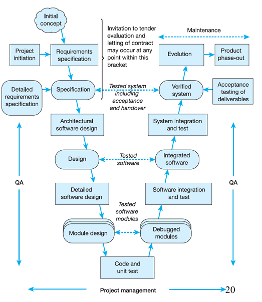
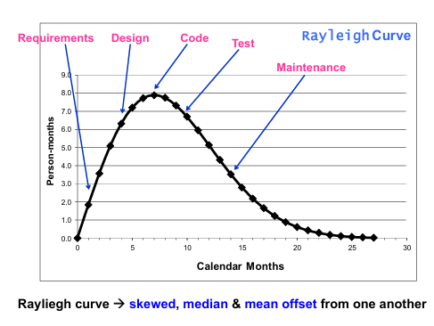

# 軟體工程管理筆記

## 第二章 軟體流程（The Software Process）

### 2.1 引言（Introduction）

* **流程（process）**：專案執行的結構化活動序列，確保可重複、可傳承
* 未文件化的流程易成為「口頭知識」，導致執行不一致、難以改進
* 軟體流程是組織之智慧資產，需透過文件化與度量持續優化

### 2.2 通用流程框架（Generic Process Framework）

* **階段（Phase）**：流程的主要步驟，如需求、設計、實現、測試、維護
* **活動（Activity）**：在每個階段中執行的具體工作，例如：

  * 撰寫需求規格（Requirement specification）
  * 系統架構設計（Architectural design）
  * 程式開發（Implementation）
  * 測試計畫與執行（Testing）
  * 部署與維護（Deployment & Maintenance）
* 常見階段：

  1. **規劃與需求（Specification）**：收集、分析使用者需求，產出需求文件
  2. **設計與實現（Design & Implementation）**：從系統架構到程式碼撰寫
  3. **驗證（Validation）**：單元測試（Unit Test）、整合測試（Integration Test）、系統測試（System Test）、驗收測試（Acceptance Test）、代碼審查(Code Review)、故障模式與影響分析(FMFA)、監管合規測試
    - 單元測試: 需要達到多少的代碼覆蓋率
    - 整合測試: 需要專注在模組間的接口和數據流
    - 系統測試: 模擬各種故障場景
  4. **演進／維護（Evolution / Maintenance）**：修正缺陷、功能增強、效能優化

### 2.3 主要目標：高品質（High Quality）

* **高品質 = 準時交付（Project Timeliness）**
* **減少返工（Rework）** → 降低成本、提升客戶滿意度
* **最佳實務**：早期缺陷偵測（Shift-left Testing）、持續整合（Continuous Integration）、自動化測試（Automated Testing）

### 2.4 線性序列模型（Linear Sequential Model；瀑布模型 Waterfall Model）

* **流程圖**：
  需求分析 → 系統設計 → 程式開發 → 單元測試 → 整合測試 → 系統測試 → 運維與維護
* **適用情境**：需求明確、變更少、團隊經驗豐富
  * 需求非常明確且穩定的專案（如軍事或航太系統）
  * 技術風險低且團隊擁有豐富經驗的情況
  * 契約型專案，需要明確的里程碑與交付物
  * 法規嚴格的領域，需要全面的文件記錄
* **優點**：易於管理與監控；里程碑（milestones）清晰
* **缺點**：缺乏迭代，對中途變更反應遲緩；後期修正成本高
* **補充交付物**：需求規格書、設計文件、測試報告、使用手冊
* **歷史應用**：瀑布模型在2000年之前被大量用於軟體開發，即使在2001年敏捷宣言發布後，瀑布模型仍在許多組織中使用至上一個十年
* **瀑布模型變種**：
  * **Sashimi模型**：允許相鄰階段重疊，減少等待時間
  * **增量式瀑布**：結合增量開發特性，每個增量內採用瀑布流程

### 2.5 V 模型（V-Model）

* **核心概念**：左右對應的「驗證（Verification）」與「驗收（Validation）」，強調每個開發階段對應的驗證活動。
* **架構圖**：

* **適用**：高可靠度（safety-critical）系統，如醫療、航空、嵌入式
* **限制**：無動態迭代、風險管理不足

### 2.6 螺旋模型（Spiral Model）

* **特色**：結合 **風險管理（risk management）** 的迴圈式開發
* **四象限流程**：

  1. 目標設定（Objectives, alternatives, constraints）
     ↓
  2. 風險評估與降低（Risk analysis & mitigation）
     ↓
  3. 開發與驗證（Development & validation）
     ↓
  4. 規劃下一迴圈（Plan next iteration） ↺
* **優點**：持續風險評估，適合大型專案和核心複雜度高的專案
* **缺點**：流程複雜，對小型專案過度

### 2.7 快速應用開發（RAD Model）

* **週期**：短迭代（60–90 天）
* **四階段**：

  1. 需求規劃（Requirements Planning）
  2. 使用者設計（User Design / 原型製作）
  3. 快速建構（Rapid Construction / 多次迭代）
  4. 移轉（Cutover / 上線部署）
* **特色**：高度使用者參與，工具支援原型快速成型
* **優點**：
  * 縮短產品交付時間、減少開發資源需求
  * 可以快速預覽產品
  * 有效利用現成工具和框架
  * 持續整合有助於發現問題並獲取客戶反饋
  * 持續客戶參與降低風險

### 2.8 原型方法（Prototyping Paradigm）

* **規格性原型（Specification Prototyping）**：快速拋棄式原型，用以驗證需求
* **演化性原型（Evolutionary Prototyping）**：原型逐步演化為最終系統
* **優點**：早期回饋、降低需求不確定性
* **缺點**：若管理不當，易衍生設計混亂

### 2.9 重用導向開發（Reuse-Oriented Development）

* **流程**：

  1. 元件分析（Component Analysis）—尋找可重用元件或 COTS（Commercial Off-The-Shelf）
  2. 需求調整（Requirements Modification）—配合現有元件
  3. 重用設計（System Design with Reuse）
  4. 整合與測試（Integration & Test）
* **優點**：降低開發成本、縮短時程
* **缺點**：元件相容性、授權風險

### 2.10 漸增式開發（Incremental Development）

* **概念**：將系統拆分為多個增量（increments），每次交付部分功能
* **流程圖**：
  增量 1 → 交付 → 增量 2 → 交付 → … → 最終整合
* **優點**：早期可運作、風險分散
* **缺點**：需於初期定義整體架構

### 2.11 敏捷方法（Agile Methods）
#### 敏捷方法關鍵實踐
  
* **敏捷測試策略**：
  * **持續測試**：開發過程中持續進行，而非僅在開發完成後
  * **測試驅動開發（TDD）**：先寫測試再寫代碼
  * **自動化測試**：單元、集成、系統層級的自動化測試

* **敏捷實踐的效益量化**：
  * 提高項目成功率30-35%
  * 縮短交付時間20-50%
  * 降低缺陷率60-90%
  * 提高團隊生產力25-40%
* **核心價值（Agile Manifesto）**：

  1. 個人與互動 > 流程與工具
  2. 可運行軟體 > 完整文件
  3. 客戶協作 > 合約談判
  4. 回應變更 > 遵循計畫
* **代表流程**：eXtreme Programming（XP）、Scrum、Kanban
* **實踐**：每日站立會（Daily Stand-up）、衝刺規劃（Sprint Planning）、迭代回顧（Sprint Review）
* **XP 實踐細節**：
  * 結對編程（Pair Programming）：兩名程序員坐在一起開發代碼
  * 測試先行（Test-First）：在編寫代碼前先編寫測試
  * 持續整合（Continuous Integration）：每天多次構建
  * 集體代碼所有權（Collective Code Ownership）：任何開發人員都可以修改任何部分的代碼
  * 簡單設計（Simple Design）：保持設計簡單且必要
  * 重構（Refactoring）：不斷改進現有代碼

### 2.12 DevOps

* **CI/CD 流水線**：持續開發 → 持續整合 → 持續測試 → 持續部署 → 持續監控
  * **持續整合（CI）伺服器**：如Jenkins、GitLab CI、Circle CI
  * **版本控制系統**：Git、SVN
  * **自動化測試框架**：Selenium、Jest、JUnit
  * **基礎設施即代碼（IaC）工具**：Terraform、Ansible、Chef
  * **容器化技術**：Docker、Kubernetes
* **CALMS 模型**：Culture（文化）、Automation（自動化）、Lean（精益）、Measurement（度量）、Sharing（分享）
* **DevOps 量化效益調查**：
  | 指標                        | 改善程度 |
  | --------------------------- | -------- |
  | 增加部門間協作              | 23%      |
  | 提升部署應用程式品質        | 22%      |
  | 增加使用軟體/服務的客戶數量 | 22%      |
  | 實現原本不可能的新軟體/服務 | 21%      |
  | 減少開發和部署所需員工數    | 21%      |
  | 縮短軟體/服務上市時間       | 20%      |
  | 增加收入                    | 19%      |
  | 擴展軟體/服務至更多平台     | 19%      |
  | 降低開發和運營支出          | 18%      |
  | 增加軟體/服務部署頻率       | 17%      |

* **DevOps成熟度模型**：
  * **初始級**：基本CI實踐，有限自動化
  * **管理級**：標準化流程，全面CI實踐
  * **定義級**：CD部署流程，多環境支持
  * **量化級**：監控與度量系統，有數據驅動改進
  * **優化級**：持續實驗與創新，自動故障修復

### 2.13 成熟度與標準（Maturity & Standards）

* **CMMI（Capability Maturity Model Integration）**：五級能力成熟度
  - 第1級 - 初始級 (Initial)
    - 流程具有不可預測性，缺乏控制和反應性
    - 沒有關鍵流程領域，屬於非正式且臨時性的階段

  - 第2級 - 已管理級 (Managed)
    流程已被規劃和執行，符合既定政策，並受到監控、控制及適當審查。

    **關鍵流程領域：**
    1. **需求管理 (Requirements Management)**
      - 管理需求並識別與計劃和產品之間的不一致

    2. **專案規劃 (Project Planning)**
      - 建立和維護專案活動的計劃

    3. **專案監控 (Project Monitoring and Control)**
      - 了解專案的進展，以便在績效出現明顯偏差時採取糾正措施

    4. **供應商協議管理 (Supplier Agreement Management)**
      - 管理從供應商獲取的產品及服務

    5. **測量與分析 (Measurement and Analysis)**
      - 建立測量能力以支持管理需求

    6. **流程與產品品質保證 (Process and Product Quality Assurance)**
      - 提供員工和管理層對流程和相關工作產品的客觀洞察

    7. **配置管理 (Configuration Management)**
      - 建立和維護工作產品的完整性

  - 第3級 - 已定義級 (Defined)
    流程被清晰定義，並在整個組織中標準化，比第2級更詳細和嚴謹。

    **關鍵流程領域：**
    1. **需求開發 (Requirements Development)**
      - 識別客戶需求、產品需求和產品組件需求

    2. **技術解決方案 (Technical Solution)**
      - 設計、開發和實施解決方案

    3. **產品整合 (Product Integration)**
      - 將產品組件組裝成完整產品

    4. **驗證 (Verification)**
      - 確保產品符合指定的需求

    5. **確認 (Validation)**
      - 確保產品滿足其預期的使用需求

    6. **組織流程焦點 (Organizational Process Focus)**
      - 規劃、實施組織的流程改進

    7. **組織流程定義 (Organizational Process Definition)**
      - 建立和維護一套可用的組織流程資產

    8. **組織培訓 (Organizational Training)**
      - 發展人員的技能和知識

    9. **整合專案管理 (Integrated Project Management)**
      - 根據組織調整的流程管理專案

    10. **風險管理 (Risk Management)**
        - 識別潛在問題並採取措施降低風險

    11. **決策分析與解決 (Decision Analysis and Resolution)**
        - 分析可能的決策並選擇方案

  - 第4級 - 量化管理級 (Quantitatively Managed)
    使用統計和其他量化技術控制流程，通過建立量化目標來預測流程績效。

    **關鍵流程領域：**
    1. **組織流程績效 (Organizational Process Performance)**
      - 建立和維護對組織流程績效的量化理解

    2. **量化專案管理 (Quantitative Project Management)**
      - 量化管理專案以達到既定的品質和績效目標

    3. **風險與機會管理(Risk and Opportunity Management)**
    4. **因果分析與解決(Causal Analysis and Resolution)**

  - 第5級 - 優化級 (Optimizing)
    持續改進流程績效，使用創新方法和技術對流程進行優化。

    **關鍵流程領域：**
    1. **組織績效管理 (Organizational Performance Management)**
      - 主動管理組織績效以滿足業務目標

    2. **原因分析與解決 (Causal Analysis and Resolution)**
      - 識別問題的原因並採取措施防止其再次發生

    3. **組織創新與部署(Organizational Innovation and Deployment)**

* **PSP（Personal Software Process）／TSP（Team Software Process）**：個人／團隊流程改進
* **IEEE 1074**、**ISO/IEC 12207**：國際標準化流程

### 2.14 選擇適合模型（Select an Appropriate SDLC Model）

* 考量因素：需求穩定度（Requirements volatility）、團隊經驗與規模（Team size & experience）、使用者參與度（Customer involvement）、專案風險（Risk profile）、時程與成本限制

### 2.15 流程導入與評估（Process Implementation & Assessment）

* **指定 vs 客製化**：流程標準化後，依組織需求作適度調整
* **度量指標（Metrics）**：任務效能（Task effectiveness）、工時分布（Effort by activity）、缺陷密度（Defect density）
* **持續改進**：透過回顧（retrospectives）與 PDCA（Plan-Do-Check-Act）循環

## 第三章 Software Project Management

### 3.1 軟體專案特性

* **規模（Size）**、交付期限（Delivery deadline）、預算與成本（Budget and costs）
* **應用領域（Application domain）**、實作技術（Technology to be implemented）
* **系統限制（System constraints）**、使用者需求（User requirements）
* **可用資源（Available resources）**

---

### 3.2 為何專案失敗？（Why Projects Fail?）

* 設定不切實際的期限（Unrealistic deadline）
* 客戶需求頻繁變更（Changing customer requirements）
* 工時估算過低（Underestimate of effort）
* 可預見或不可預見的風險（Predictable/Unpredictable risks）
* 技術困難（Technical difficulties）
* 團隊溝通不良（Miscommunication among project staff）
* 專案管理失誤（Failure in project management）

---

### 3.3 專案管理定義（What is Project Management?）

* 將**知識（Knowledge）**、**技能（Skills）**、**工具（Tools）**與**技術（Techniques）** 應用於專案活動
* 目的：滿足或超越利害關係人（Stakeholders）的需求與期望
* 利害關係人：因專案結果可能獲益或受損的任何人

---

### 3.4 利害關係人（Stakeholders）

* **高階經理（Senior managers）**：定義業務目標
* **專案經理（Project managers）**：計畫（Plan）、激勵（Motivate）、組織（Organize）、控制（Control）團隊
* **實作人員（Practitioners）**：提供技術執行
* **客戶（Customers）**：提出需求
* **最終使用者（End‐users）**：實際使用系統

---

### 3.5 管理關注點（Project Management Concerns）

* 人員配置（Staffing） → 成本估算（Cost estimation） → 排程（Scheduling）
* 進度監控（Monitoring） → 資源管理（Resources） → 客戶溝通（Communication）
* 風險評估（Risk assessment） → 產品品質（Quality） → 度量指標（Measurement）

---

### 3.6 專案經理的兩難（Project Manager's Dilemma）

* 「快（Fast）」、「便宜（Cheap）」、「優質（Good）」三者只能任選兩項

---

### 3.7 範疇確定（Scope Determination）

1. **範疇敘述（Narrative）**：界定問題邊界
2. **功能分解（Decomposition）**：建立功能模組化結構

---

### 3.8 管理活動（Management Activities）

* 提案撰寫（Proposal writing）
* 專案計畫與排程（Planning & scheduling）
* 成本估算（Costing）
* 人員配置（Staffing）
* 進度監控與檢討（Monitoring & reviews）
* 人員選拔與評估（Selection & evaluation）
* 報告撰寫與簡報（Reporting & presentations）

---

### 3.9 專案人員配置（Project Staffing）

* 理想人選受限於預算（Budget）、經驗（Experience）、組織需求（Skill development）
* 必須在這些條件下妥善調度資源

---

### 3.10 專案規劃（Project Planning）

* 最耗時的管理活動，從起始到交付皆需持續更新
* 支援計畫（Support plans）輔助主計畫（Schedule & budget plan）

---

### 3.11 4P 模型（The 4 P's）

* **人（People）**、**產品（Product）**、**流程（Process）**、**專案（Project）**

---

### 3.12 團隊管理（Managing People）

* 管理個人與群組的互動
* 溝通頻率（Communication channels）影響進度與品質
* 溝通失敗常導致軟體專案失敗

---

### 3.13 溝通問題（Communication Problems）

* N 人的團隊有 N(N−1)/2 條溝通渠道
* 人越多，溝通成本越高
* 增加人手不一定能加快進度（Brooks's Law）

---

### 3.14 軟體團隊組織（Software Teams）

* **MOI 模型**：動機（Motivation）、組織（Organization）、創新（Ideas）
* **常見結構（Pressman）**：

  * 民主去中心（DD, Democratic decentralized）
  * 受控去中心（CD, Controlled decentralized）
  * 受控中心（CC, Controlled centralized）
* 選擇依據：團隊規模、模組化程度、溝通需求

---

### 3.15 經典首席程式設計師團隊（CPT）

* 架構：首席程式設計師（Chief programmer）→ 備援（Back‐up）→ 秘書（Secretary）→ 程式員（Programmers）
* 特點：功能分工、階層管理
* 不可行之處：高階程式師＋管理者短缺、秘書工作效益低

---

### 3.16 協調與溝通技術（Coordination & Communication）

* 正式無人身：文件、里程碑、追蹤工具
* 正式人身：審查會議、Walkthrough
* 非正式：團隊會議、同地辦公（Collocation）
* 電子方式：電子郵件、論壇、視訊
* 人際網絡：非正式討論、跨部門諮詢

---

### 3.17 W5HH 原則（The W5HH Principle）

* **Why**：為何開發 → 商業價值
* **What**：做什麼 → 任務集
* **When**：何時完成 → 排程與里程碑
* **Who**：由誰負責 → 角色與職責
* **Where**：組織定位 → 部門、地點
* **How**：如何執行 → 技術與管理策略
* **How much**：資源需求 → 人力、工具、資料

---

### 3.18 進度追蹤與排程（Tracking & Scheduling）

* 專案分解：階段 → 步驟 → 活動
* 任務拆分後估算時間與資源
* 並行化以提升效率
* 最小化依賴以降低等待延遲
* 預留緩衝以因應估算誤差與意外

---

### 3.19 動機管理（Motivation）

* 滿足需求層次：生理（Basic needs）、安全、社交（Social）、尊重（Esteem）、自我實現
* 人格類型：任務導向（Task‐oriented）、自我導向（Self‐oriented）、互動導向（Interaction‐oriented）
* 平衡各種動機並強化團隊文化

---

### 3.20 群組運作與凝聚力（Group Working & Cohesiveness）

* 群組互動影響績效
* 組成需兼顧不同動機類型
* 凝聚力（Cohesiveness）：共同目標、互信、互助學習
* 培養方式：社交活動、建立團隊認同、資訊透明

---

### 3.21 人員選拔與留任（Choosing & Keeping People）

* 選拔：履歷（CV）、面試、推薦、測評
* 留任：提供成長機會、管理認可、歸屬感


# 第四章 Software Project Planning and Scheduling


## 4.1 計畫與估算（Planning and Estimating）

* 規劃必須貫穿開發各階段：最早在需求完成後啟動（Initial planning），並持續更新
* **估算（Estimation）**：預測人力（person-months）、成本（cost）、工期（schedule）

  * 需仰賴經驗（Experience）、歷史資料（Historical data）、勇於量化承諾

## 4.2 估算 vs 計畫 vs 排程

* **計畫（Plan）**：識別活動（activities），未指定起訖日期
* **估算（Estimating）**：決定每項活動的規模（size）與所需工期（duration）
* **排程（Schedule）**：將活動依關係（dependencies）分配具體起迄日期與資源

## 4.3 軟體專案計畫任務集（Project Planning Task Set）

1. 確定專案範疇（Scope）
2. 可行性分析（Feasibility）
3. 風險分析（Risk analysis）
4. 定義資源需求（Resources）

   * 人力（Human resources）
   * 可重用元件（Reusable software resources）
   * 環境資源（Environmental resources）
5. 成本與工時估算（Cost & effort estimation）

   * 拆解問題（Decompose the problem）
   * 多種方法估算、再進行校正（Reconcile estimates）
6. 建立排程（Schedule）

   * 任務網路（Task network）
   * 甘特圖（Time-line chart）
   * 追蹤機制（Tracking mechanisms）

## 4.4 活動網路圖與時間表

* **活動網路圖（Task/Activity Network）**：顯示依賴性、找出關鍵路徑（Critical Path）
* **時間表（Time-line Chart）**：標示每項活動起訖、可並行或資源負載

## 4.5 資源（Resources）

* 類型：人力（People）、硬體（Hardware）、支援軟體（Support software）
* 大型專案人力使用呈 Rayleigh 曲線：

* 共用資源（People/Hardware）需跨專案協調

## 4.6 專案計畫目標（Project Planning Objectives）

* 建立框架，讓管理者能合理估算所需資源與時間
* 早期估算需在有限時間內完成，並於專案持續更新

## 4.7 規劃步驟（The Steps）

1. 範疇界定（Scoping）
2. 估算（Estimation）
3. 風險管理（Risk analysis & mitigation）
4. 排程（Scheduling）
5. 管控策略（Control strategy）

## 4.8 專案範疇（Project Scope）

* 包含：功能與特性（Functions & features）、輸入輸出資料（Data I/O）、系統效能、限制、介面、可靠度
* 以專案範疇說明書（Project Scope Statement, PSS）固定邊界，減少範疇蔓延（Scope creep）

## 4.9 範疇界定技巧（Is/Is Not Technique）

* 針對每項目標列出「是」（Is）與「非」（Is Not），幫助團隊畫出明確邊界

## 4.10 排程需求（The Need for Schedules）

* 多項目承諾需排程管理，小任務可串行、大/複雜任務or資源衝突需更精細管理

## 4.11 排程案例：Word 1.0

* 原訂365 天，實際 1,887 天（5 年）
* 主要原因：

  * 過度樂觀（Wishful thinking）
  * 開發者流動（High turnover）
  * 功能「完成」謊報（Feature short-changing）

## 4.12 專案排程（Project Scheduling）

* 決定專案拆分為哪些任務、何時執行、由誰執行、所需資源
* 估算每項活動所需日曆時間與成本

## 4.13 敏捷規劃（Agile Planning）

* 迭代增量（Increments）交付，不預先排定所有功能，而依進度與客戶優先順位決定開發內容

## 4.14 排程估算技術（Schedule Estimation Techniques）

* **Delphi 方法（Expert judgment）**：匿名專家共識
* **黃金法則（Gamma rule）**：三點估算 t = (o + 4 m + p)/6
* **第一階估算（First-Order Estimation）**：功能點數（FP）^ 指數（0.39–0.48）

  **First-Order Estimation Power Parameter**
  | Kind of Software | Best in Class | Average | Worst in Class |
  | ---------------- | ------------- | ------- | -------------- |
  | Systems          | 0.43          | 0.45    | 0.48           |
  | Business         | 0.41          | 0.43    | 0.46           |
  | Shrink-Wrap      | 0.39          | 0.42    | 0.45           |
* **承諾式排程（Commitment-based）**：由開發者自行承諾日期
* **雙倍法則（Glenn's rule）**：自身估時 × 2，再加15–20％
* **立方根法則**：排程 ≈ 3 × (man-months)^(1/3)

### 專案估算方法比較

| 估算方法 | 優點           | 缺點             | 適用情境             |
| -------- | -------------- | ---------------- | -------------------- |
| 專家判斷 | 快速、經驗導向 | 主觀性強         | 小型專案、時間緊迫   |
| 類比估算 | 基於歷史數據   | 需要類似專案經驗 | 中型專案、有歷史數據 |
| 參數模型 | 客觀、可重複   | 依賴參數精確性   | 大型專案、標準化環境 |
| 三點估算 | 考慮不確定性   | 仍有主觀因素     | 風險較高的專案       |
| 自下而上 | 詳細準確       | 耗時費力         | 關鍵業務系統         |

## 4.15 呈報估算（Presenting Estimates）

* 加減範圍（± qualifiers）
* 風險量化（Risk quantification）
* 多案例（Best/Worst/Planned/Current cases）
* 信心水準（Confidence factors）

## 4.16 規劃與控制技術（Planning & Control Techniques）

* **工作分解結構（WBS, Work Breakdown Structure）**：分層拆解至可估算粒度
  * **WBS 創建原則**：
  * **100%原則**：確保WBS包含所有必要工作，不多不少
  * **可交付物導向**：以具體成果為中心，而非活動
  * **互斥性**：每個工作項僅出現在一個分支中
  * **適度分解**：通常2-4級最為合適
  * **工作包大小**：最低層級工作包應在8-80小時範圍內

* **WBS 字典要素**：
  * 工作包識別碼與名稱
  * 責任人與相關人員
  * 詳細描述與驗收標準
  * 前置任務與相依關係
  * 估算的工時與資源需求
  * 里程碑與交付日期
* **甘特圖（Bar/Gantt chart）**：直觀顯示活動時程與責任人
* **PERT 圖（Program Evaluation and Review Technique）**：計算最早/最晚時點、總浮時（Float）

## 4.17 長期專案 WBS

* 前 3 個月：細節至兩週內可完成任務
* 3 個月後：以更粗略層次規劃，並於執行後持續細化

## 4.18 排程考量（Scheduling Considerations）

* 多人分工不一定等於工期除人數（Brooks's Law）
* 資源可用率考量：長期預設每人每週僅有 4 天可用

## 4.19 專案里程碑（Project Milestones）

* 重要可交付物完成時設定，如：需求完成、驗收測試結束
* 數量宜適中，過多失去意義、過少失去管控

## 4.20 資源計畫（Resource Plans）

* 由排程衍生：何時需何種人員、硬體、工具、外部服務
* 可用於成本預算與採購流程安排
* **資源過載處理策略**：
  * **任務分割**：將大任務分割成可並行的小任務
  * **資源平滑**：在允許的浮動時間內調整任務開始時間
  * **優先級調整**：根據關鍵程度重新排列任務順序
  * **資源替代**：尋找替代資源或外包部分工作
  * **時間調整**：在必要時延長專案時程

* **資源平衡工具功能**：
  * 自動檢測資源衝突
  * 提供平衡建議與方案比較
  * 視覺化資源使用情況
  * 模擬不同資源分配的影響
  * 追蹤實際使用與計劃的差異

# 第五章 軟體大小估算（Software Size Estimation）

## 5.1 引言（Introduction）

* 專案排程前首要任務：**大小估算（size estimation）** → 決定工期（schedule）與成本（cost）
* 不同產出物可估：需求文件、設計文件、程式碼、測試案例

## 5.2 估算原則（Estimation Principles）

* 缺乏歷史資料 → 憑直覺估算（gut instincts）、計畫失真、程式員超時工作
* 收集並運用過去任務執行時間 → 類比估算（analogy）：以相似任務平均值推算新任務

## 5.3 CMM 與估算（CMM and Estimation）

* SEI CMM Level 2 KPA: Software Project Planning

  * 目標 1：將**估算**文件化，用於專案規劃與監控
  * 能力 4：參與估算與計畫之人員需接受培訓

## 5.4 大小量測（Size Measurement）

* **大小（size）** 作為獨立變數 → 輸入至工期與成本估算
* 例：透過閱讀章節所需時間資料，估算新章節閱讀時間

## 5.5 大小度量範例（Examples of Size Measures）

* 程式行數（LOC, Lines of Code）
* 功能點（FP, Function Points）

  1. **識別功能類型**：功能點分析將應用程式的功能分為五種基本類型：
    - 內部邏輯檔案(Internal Logical Files, ILF)
    - 外部介面檔案(External Interface Files, EIF)
    - 外部輸入(External Inputs, EI)
    - 外部輸出(External Outputs, EO)
    - 外部查詢(External Inquiries, EQ)

  2. **評估複雜度**：每種功能根據其複雜度（低、中、高）被賦予不同的權重值。複雜度通常基於:
    - 資料元素類型(DET)的數量
    - 記錄元素類型(RET)或檔案類型參照(FTR)的數量

  3. **計算未調整功能點數(UFP)**：將每種功能類型的數量乘以其對應的複雜度權重，然後加總。

  4. **應用系統複雜度調整因子(VAF)**：根據14個一般系統特性(GSC)評估系統的整體複雜度，並計算值調整因子。

  5. **計算最終功能點**：將未調整功能點乘以值調整因子，得到最終的功能點數。

  ## 估算過程中使用的關鍵元素

  - **資料元素類型(DET)**：指用戶可識別、非重複的欄位。
  - **記錄元素類型(RET)**：指內部邏輯檔案或外部介面檔案中的子結構或邏輯群組。
  - **檔案類型參照(FTR)**：指被交易功能（EI、EO、EQ）處理或參照的檔案數。

* 資料流程圖氣泡數（DFD bubbles）
* 實體關係圖實體數（ERD entities）
* 結構圖方塊數（PSPEC/CSPEC boxes）
* 文件量（pages of documentation）
* 物件圖中物件、屬性與服務數
* * **COSMIC功能點**：
  * 國際標準ISO/IEC 19761
  * 基於數據移動（進入、退出、讀取、寫入）
  * 不受技術實現影響
  * 適用於實時與嵌入式系統

* **Use Case點數（UCP）**：
  * 基於用例複雜度與技術因素
  * 計算公式：UCP = UUCP × TCF × EF
    * UUCP：未調整用例點數
    * TCF：技術複雜度因子
    * EF：環境因子
  * 常用於面向對象的軟體專案

* **敏捷故事點（Story Points）**：
  * 相對大小測量，通常使用斐波那契數列（1,2,3,5,8,13...）
  * 考慮複雜性、工作量、風險和不確定性
  * 與團隊速度（Velocity）配合使用預測工期
  * 通過規劃撲克（Planning Poker）等技術估算

## 5.6 程式行數（LOC）

* 定義：非註解、非空行的程式文字行數
* NCLOC（Non-Commented LOC）＝有效行數（ELOC）
* 優點：易量化
* 缺點：對不同語言、不同程式風格敏感；不反映功能或複雜度

## 5.7 McCabe 迴圈複雜度（Cyclomatic Complexity）

* 定義：控制流圖中判斷節點數量所代表的獨立路徑數
* 計算方式：V(G)=e–n+2 （e＝邊數，n＝節點數）或「封閉區域＋1」
* 指標：V(G)>10 需加強測試，V(G)>20 需警戒
  接近警戒值或超過警戒值的測試策略應該要包含以下:
  - 詳細的單元測試，覆蓋所有獨立路徑
  - 基於路徑的測試（Path testing）
  - 代碼審查（Code review）和走查（Walkthrough）
  - 整合測試與系統測試的嚴格規劃
* 工具：Visual Studio、SonarQube、McCabe IQ …

### 代碼複雜度度量工具比較

| 工具名稱      | 支援語言                  | 主要功能               | 整合性        | 適用情境        |
| ------------- | ------------------------- | ---------------------- | ------------- | --------------- |
| SonarQube     | Java, C#, JS, Python等20+ | 代碼質量、安全、複雜度 | CI/CD, IDE    | 企業級持續集成  |
| CodeClimate   | Ruby, JS, PHP, Python等   | 質量監控、趨勢分析     | GitHub        | 開源項目        |
| Visual Studio | C#, C++, VB               | 內建複雜度分析         | .NET生態系統  | Windows開發環境 |
| PMD           | Java, JavaScript, Apex等  | 靜態代碼分析           | Maven, Gradle | Java專案        |
| Understand    | C, C++, Java, Ada等15+    | 深度依賴分析           | 獨立工具      | 安全關鍵系統    |

## 5.8 Halstead 度量（Halstead Metrics）

* 基本度量：µ₁（不同運算子數）、µ₂（不同運算元數）、N₁（運算子出現次數）、N₂（運算元出現次數）
* 衍生度量：

  * 程式詞彙量 µ=µ₁+µ₂
  * 程式長度 N=N₁+N₂
  * 容量 V=N×log₂µ
  * 難度 D=(µ₁/2)×(N₂/µ₂)
  * 工作量 E=V×D
  * 時間 T=E/β（β＝Stroud number，每秒心智判別次數）
* 優點：跨語言；量化複雜度
* 缺點：需完整程式碼；對設計階段預測價值有限

## 5.9 功能點（Function Points, FP）

* 測量系統功能而非程式長度
* 五類資訊元件：輸入（EI, External Input）、輸出（EO, External Output）、查詢（EQ, External Inquiry）、內檔（ILF, Internal Logical File）、外介面（EIF, External Interface File）
* 計算流程：

  1. 計算**未調整功能點數（UFC）**：依複雜度權重加總
  2. 應用**技術複雜度因子（TCF）**：14項一般系統特性加權
    - 每項加權0到5，0代表not relevant to the system, 5代表the component is essential
    - TCF 公式:
      $TCF = 0.65 + 0.01 \sum_{i=1}^{14} F_i$
  3. FP = UFC × TCF
* 優點：語言無關；貼近使用者價值
* 缺點：主觀性高；需專業認證
* 功能點分析法:
  總功能點/每人每月的功能點處理量
* **功能點計數標準化**：
  * IFPUG 4.3標準 - 最廣泛使用
  * NESMA標準 - 荷蘭標準，支持估算FP
  * COSMIC標準 - 適用於實時系統
  * MARK II標準 - 英國標準

* **功能點分析常見挑戰與解決方案**：
  * **挑戰**：識別邏輯文件時的主觀性
    * **解決方案**：使用數據模型與業務流程文檔交叉驗證
  * **挑戰**：現代GUI界面的計數困難
    * **解決方案**：將相關功能分組，基於業務功能計數
  * **挑戰**：敏捷環境中需求變更頻繁
    * **解決方案**：採用增量式FP計數，定期重估新功能

## 5.10 其他大小度量（Other Measures）

* 物件點（Object Point）、用例點（Use Case Point）
* 重用規模：計算重用程式碼的新增、修改與刪除比例
* 文件、GUI 元件…

## 5.11 選擇最佳度量技術（Appropriate Sizing Techniques）

* 遵循組織標準；依熟悉度、可靠度、客戶需求而定
* 較小專案可採專家判斷（Delphi）、大專案宜結合多種方法

# 第六章 軟體成本分析與估算（Software Cost Analysis and Estimation）

## 6.1 成本分析（Cost Analysis）

* 定義：針對軟體系統未來成本進行預測與量化的分析工作，既是藝術（Art）也是科學（Science）
* 目的：將需求與功能轉換為預算要求，提供可執行工作的成本基礎

## 6.2 軟體成本估算（Cost Estimation）

* 核心：預測開發所需的人力（Effort）與時間（Schedule）
* 模型：運用數學演算法，將系統規模（Size，如 LOC、FP）與複雜度（Complexity，如 Cyclomatic complexity）轉換為成本

## 6.3 軟體成本要素（Software Cost Components）

* **硬體與軟體成本（Hardware & Software）**：伺服器、授權費
* **轉換與安裝成本（Conversion & Installation）**：資料轉換、部署作業
* **旅費與訓練成本（Travel & Training）**
* **人力成本（Effort Costs）**：工程師薪資、社保與保險

  * 另須考慮辦公場地、水電、網路、共用設施等間接開銷

## 6.4 成本元素結構（Cost Element Structure, CES）

* 類似 WBS，建立分層樹狀結構，避免重複計算
* 可在不同層級彙總與解析預算
* 範例：

  ```
  1. 人力成本  
     1.1 需求分析  
     1.2 設計與實作  
     1.3 測試  
  2. 基礎設施  
     2.1 硬體  
     2.2 網路  
  3. 其它  
     3.1 培訓  
     3.2 差旅  
  ```

## 6.5 估算方法（Estimation Techniques）

* **Bottom-Up（自下而上）**：從最低層元件估算後加總；精準但易漏算整合/文件成本
* **Top-Down（自上而下）**：依整體功能分配成本；納入系統級活動但可能低估低階技術難題
* **Parkinson's Law**：工作量會填滿可用時間 → Effort = 人數 × 時間
* **專家判斷（Expert Judgment）**：多位領域專家迭代共識（如 Delphi）；成本低廉但需經驗豐富
* **類比法（Analogy）**：以過去類似專案平均成本推估；精準度取決於相似度與資料庫維護情況
* **Make/Buy 決策（Make/Buy Decision）**：自建 vs 採購 vs 修改 COTS；可結合決策樹分析
* **參數化/演算法式（Parametric / Algorithmic）**：如 COCOMO、SLIM，以統計回歸模型自動計算

## 6.6 SLIM（Putnam's Software Life-cycle Model）

* 概念：依 Rayleigh 分布模擬人力投入曲線
* 公式：
  
  $m(t) = 2 \cdot a \cdot K \cdot t \cdot e^{-a \cdot t^2}$
  
  * K：總人力（staff-years）
  * a：技術常數（technology constant）
  * td：峰值時間（time of delivery）
* 優點：強調風險控制與長期維護；適合大型專案
* 缺點：對專案規模與時程壓縮高度敏感

## 6.7 COCOMO 基本模型（COCOMO Basic）

* 三種模式：

  * **Organic**（簡單專案）
  * **Semidetached**（中等複雜度）
  * **Embedded**（高複雜度嵌入式）
* 公式：

  $\text{Effort(人月)} = a \cdot (\text{KLOC})^b$

  $\text{Duration} = c \cdot (\text{Effort})^d$

  * a, b, c, d：回歸得出常數

## 6.8 COCOMO 中介模型（COCOMO Intermediate）

* 加入 15 項「成本驅動因子（Cost Drivers）」
* 計算環境調整因子（EAF, Effort Adjustment Factor）
* Effort = a·(KLOC)^b × EAF

## 6.9 COCOMO 詳細模型（COCOMO Detailed）

* 在元件層級套用中介模型，並分階段（Requirements, Design, Code & Test, Integration）調整因子
* 更細緻地分配 Effort 與 Schedule

## 6.10 COCOMO II

* 三大子模型：

  1. **Application Composition**（應用組成）—以物件點（Object Points）估算
  2. **Early Design**（早期設計）—A·Size^B·M（7 項乘子）
  3. **Post-Architecture**（後架構）—17 項乘子＋5 項尺度因子（Scale Factors）
* **Reuse Model**：估算自動生成或重用程式碼整合 Effort

## 6.11 校準與調整（Tailoring）

* 可依組織歷史資料重新校準係數 a、b 或成本驅動因子
* 建議至少 5–10 個專案以確保可靠性

## 6.12 敏捷環境下的估算（Agile Estimation）

* 強調持續校正（Continuous Refinement）
* 早期使用類比法，後期以實際 Burn-down Data 做 Build-up
* 目的：管理不確定性、漸進交付價值